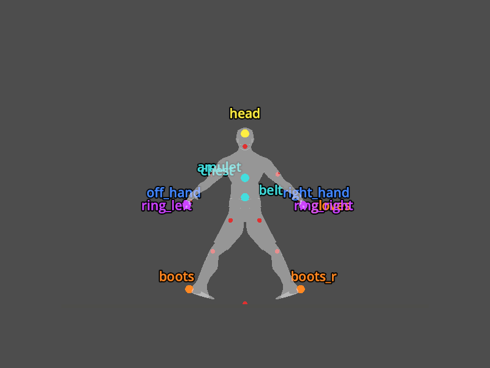
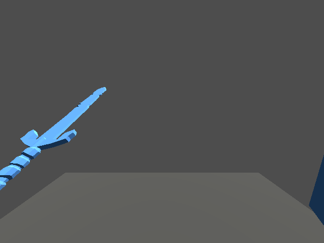
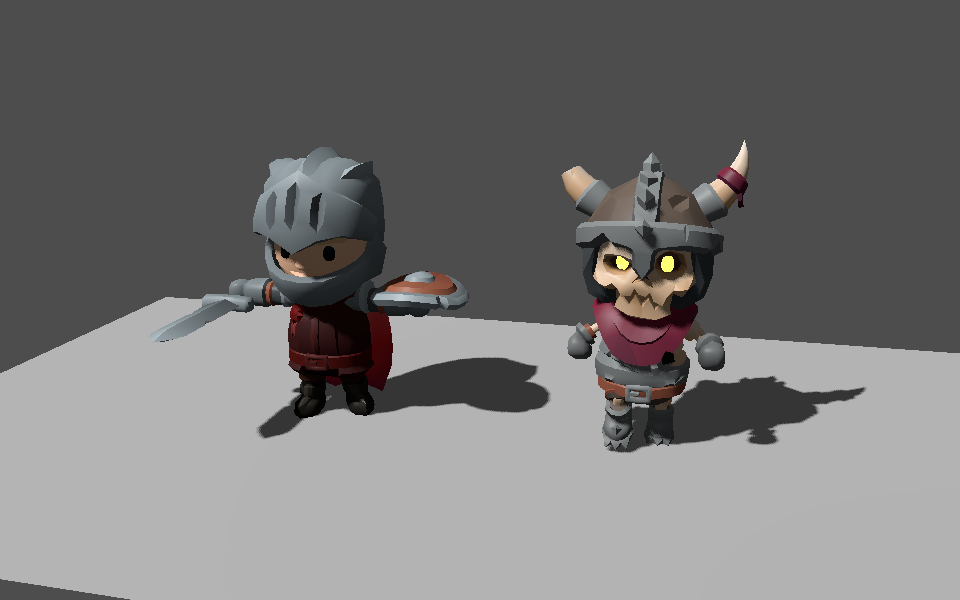

# v469 As-Built — Art Baseline and KayKit Verification (ADR-0018 P0)

Date: 2026-09-28
Status: Complete (focused verification; `make ci` blocked locally, see Validation)
Commit: pending

Spec: [`v469_spec-art-baseline-and-kit-verification.md`](../specs/v469_spec-art-baseline-and-kit-verification.md) ·
Plan: [`v469_2026-09-28-art-baseline-kit-verification.md`](../plans/v469_2026-09-28-art-baseline-kit-verification.md) ·
Findings: [`v469_kaykit-p0-findings.md`](../researchs/v469_kaykit-p0-findings.md) ·
ADR: [ADR-0018](../adr/0018-art-direction-and-kit-based-visuals.md)

## What shipped

Nothing player-visible changed. This slice is tooling, evidence and decisions.

### Screenshot harness you can trust

- **Dry-run fixed.** `regen_screenshots --dry-run` no longer creates directories. The ~69 empty
  timestamp folders under `.artifacts/screenshots/` came from the dry-run test.
- **GDScript errors now fail a capture.** `render_focus.py` clears the Godot log before each run
  and fails on any `SCRIPT ERROR`. Previously Godot saved a frame of the half-built scene and the
  batch counted it as "ok".
- **Two broken focuses fixed.** That gate exposed `town` and `stairs`, which had been saving blank
  or partial frames since `ba083f77` moved their factories into `TownNodeFactory`. Both are fixed,
  and `visual_capture.gd` went from 1,237 to 1,235 lines (baseline lowered).
- **New `scenes` suite:** `town`, `monsters`, `chests`, `stairs`, `eye-view`, `heal-rain`, plus a
  new **`dungeon-room`** focus for every biome palette (3 today: shallow_cave, sundered_halls,
  deep_vault).
- **`dungeon-room` uses the real runtime lighting.** `surface_material_room_capture.gd` now drives
  `DungeonDepthLighting` and `DungeonTorchLights` instead of its own lights. It is dispatched as a
  separate script, so the grandfathered `visual_capture.gd` did not grow.
- **First recorded full run: 220/220 captures OK in 6m30s** (Godot 4.7.2, Forward+, Metal, Apple
  M4 Pro).

### Shared GLB reader and kit inspector

- **`tools/assets/glb_reader.py`**, stdlib only:
  - reads `.glb` and `.gltf` with external or `data:` buffers
  - node tree, world transforms, triangle counts, extents (bind pose for skinned meshes)
  - skins, animation summaries, PNG/JPEG image sizes
- **`validate_assets.py` now uses the reader.** Its two ad-hoc parsers were replaced, and the
  malformed exception return `["?", [0.0]]` became `[("?", [0.0])]`. Validation still passes
  198/198 checks.
- **`tools/assets/inspect_kit.py`** (`make inspect-kit KIT=…`) writes `report.json` and
  `report.md`. The report includes rig-group comparison, a clip list, and unsupported-format gaps.

### Wall-grid audit

- **`TestDungeonWallGridAudit`** is skipped by default. It is enabled with
  `ARPG_WALL_GRID_AUDIT_OUT`, or `make wall-grid-audit [EXTRA_TILES=…]`.
- Two runs produce byte-identical reports, and `determinism-lint` passes.

### KayKit staged and verified

- **Three CC0 GitHub packs** (Dungeon Remastered 1.0, Adventurers 1.0, Skeletons 1.0) are staged
  under `.artifacts/kaykit/`, pinned by commit and sha256. No kit file is under `client/`.
- **A throwaway Godot probe** loaded the kit Knight and Skeleton at runtime and proved four things:
  - embedded clips play
  - `handslot` accessory toggling equips exactly one sword and one shield
  - per-part tinting works
  - the socket bones resolve
- **Findings doc and ADR-0018 updated:** all six P0 checklist items are resolved.

## Key results (details in the findings)

| Check | Result |
|-------|--------|
| License | CC0 on all three staged packs |
| Rig | One 41-joint rig shared by 5 Adventurers and 4 Skeletons; **76 and 95 clips embedded**, so the Character Animations pack is optional |
| Sockets | `handslot.r` / `handslot.l` / `head` / `chest`; first-person anchor `head` |
| Tints | Mechanism 1 (per-part `material_override`). Gloves reach whole arms, boots whole legs; belt has no own region |
| Dungeon | 100% of 22,312 wall edges on a 0.5 grid, 91.6% on 1.0. Environment at XZ ×0.5 → **P2 is client-only** |
| Budgets | Characters 4.6k–7.0k tris; 1024² atlases; dungeon pieces up to 3,499 → D8 prop budget raised to 4k |
| Gaps | No bow in Adventurers 1.0; beasts and demons have no KayKit 1.0 equivalent |

## Baseline ("before") gallery

These are the ADR-0018 D9 before-reference captures, from run `20260928-233618`. `scenes-town`
was downscaled to 600 px to fit the 400 KB limit.

| | |
|---|---|
|  |  |
|  |  |
|  |  |
|  |  |

Also committed: `gear-{barbarian,ranger,rogue,sorcerer}.png`,
`scenes-dungeon-room-sundered_halls.png`, `scenes-{chests,stairs,heal-rain}.png`.

**Visible problems the baseline records:**
- The dungeon-room water pool renders as pale streaks on a wall face.
- Monsters render untextured white.
- Heroes wear mismatched attached armor.

## Found and filed outside scope

**Dungeon generation fails on about 2% of floors.** The audit hit 4 of 200 seed/level pairs that
fail with `could not place room-corridor layout after 96 attempts`. `Sim.ensureDungeonLevel`
returns that error, so the affected floor is unreachable for that session seed. A separate
follow-up task was filed; it is not fixed here.

## Validation

```bash
.venv/bin/pytest tools/test_regen_screenshots.py tools/test_showme.py tools/assets/test_glb_reader.py \
  tools/assets/test_inspect_kit.py tools/assets/test_validate_assets.py tools/test_validate_codemap.py -q
.venv/bin/python tools/assets/validate_assets.py        # 198 checks OK
.venv/bin/python -m tools.showme.regen_screenshots      # 220/220 captures ok, 6m30s
cd server && go vet ./internal/game/ && go run ./cmd/determinism-lint ./internal/game/...
cd server && go test ./internal/game/ -run '^TestDungeonWallGridAudit$'   # SKIP by default
ARPG_WALL_GRID_AUDIT_OUT=… go test ./internal/game/ -run '^TestDungeonWallGridAudit$'  # x2, identical
```

`make` could not run on this machine: `/usr/bin/make` refuses to run until the Xcode license is
accepted (`sudo xcodebuild -license`). The focused commands above are the underlying commands of
the make targets. **`make ci` and `make maintainability` are still owed** before this slice counts
as CI-green.

## Deferred

- **Kit import into `client/`**, manifest entries, and the budget data file plus enforcement: the
  first importing slice.
- **Owner downloads before P3:** itch.io Adventurers 2.0 (Ranger, bow) and Character Animations
  1.1. Then re-run `make inspect-kit` to confirm they use the 1.0 rig.
- **Vertical scale proposal** (characters ×0.77, environment Y ×0.75): confirm with P2 and P3
  captures.
- **Next phase:** ADR-0018 P1 render baseline (spec-exempt).
