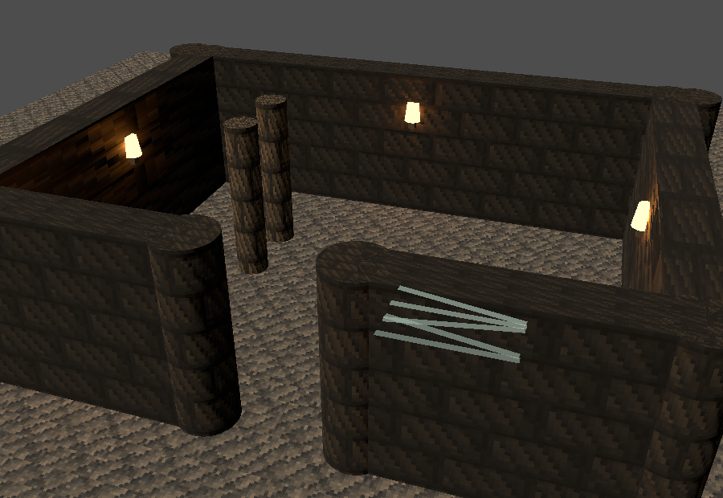
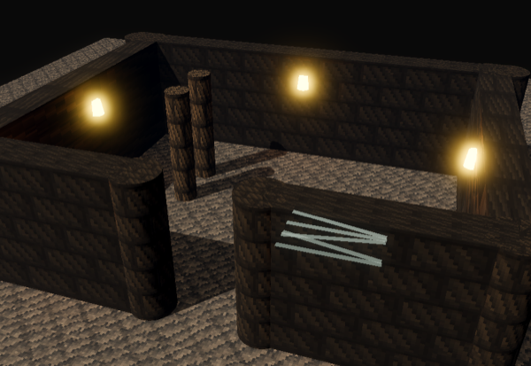
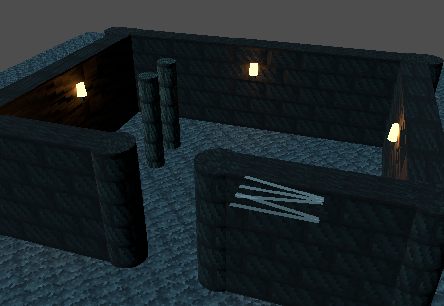
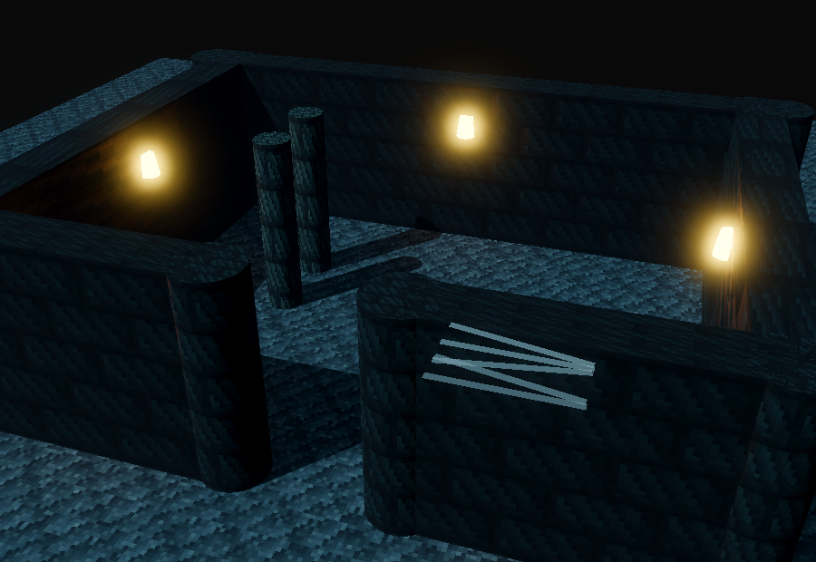
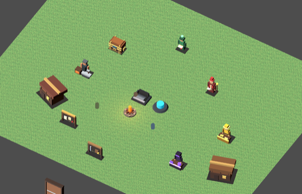
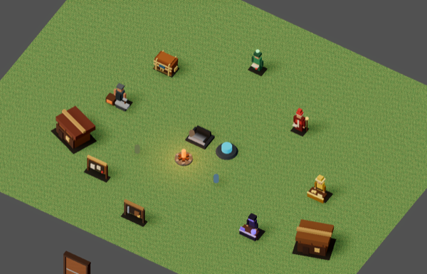
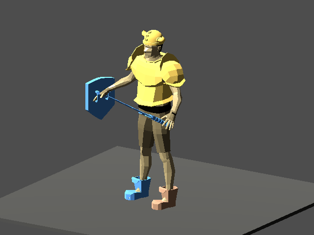
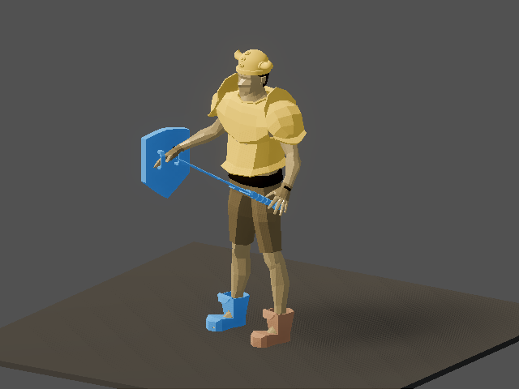

# v470 As-Built — Render Baseline (ADR-0018 P1)

Date: 2026-09-29
Status: Complete (focused verification; `make ci` owed, Xcode license blocks `/usr/bin/make`)
Commit: pending

- **ADR:** [ADR-0018](../adr/0018-art-direction-and-kit-based-visuals.md) D7.
- **Spec gate:** exempt under the CLAUDE.md client-presentation exemption. This slice changes no
  protocol, server state, shared rules or golden fixtures; it adds one client-only
  `shared/assets/` presentation catalog.
- **Before reference:** [v469 baseline](v469_art-baseline-kit-verification.md#baseline-before-gallery).

## What shipped

**A new presentation catalog, `shared/assets/render_presentation.v0.json` (+ schema).** It owns:
- **Key-light rig:** rotation, shadows, shadow distance, blur, bias, opacity.
- **Three lighting contexts** (`town`, `town_night`, `dungeon`), each with a tonemap
  (**AgX**, exposure, white), **SSAO**, **glow**, **fog** and color adjustments.
- **Quality tiers** matching the v347 Graphics Quality setting:
  - `balanced`: MSAA 4×, shadows, SSAO, glow, fog.
  - `performance`: no MSAA, FXAA, no shadows, no SSAO, no fog; glow stays.

Light color and energy stay where they were: `DungeonDepthLighting` (town profile, town night,
biome palettes). Nothing was duplicated.

**`RenderPresentationLoader`** is the static `ensure_loaded()` loader for the catalog. It also
provides `context_for_level`, which mirrors `DungeonDepthLighting`'s town / town-night / dungeon
selection.

**`RenderEnvironmentPresentation`** applies the catalog. It sets the tonemap, SSAO, glow, fog and
adjustments on the `Environment`, sets key-light shadows, and sets the viewport's `msaa_3d` and
`screen_space_aa`. Each expensive feature is the context value **AND** the quality-tier value.

**`SceneLightingRig`** is an extraction from `main.gd`. It owns the key light and
`WorldEnvironment`, and `sync()` runs depth lighting and then the render baseline.

**`main.gd` changes:**
- `_build_scene` and `_sync_fog_and_dungeon_lighting` use the rig.
- Changing Graphics Quality now re-applies lighting immediately.
- The file went from 6,772 to **6,765 lines**, exactly its baseline, which satisfies touch-to-shrink.
- The hardcoded key-light rotation moved into the catalog.

**Captures use the runtime lighting path (ADR-0018 D9):**
- `surface_material_room_capture.gd` (`dungeon-room`) uses the rig and gained a `--quality` flag.
- `visual_capture.gd`'s shared `_add_light` (19 callers) now uses the rig in the town context,
  instead of a bespoke 2.2-energy capture light. The file stays at 1,235 lines.

**`client/project.godot`** now pins `renderer/rendering_method="forward_plus"` explicitly. Headless
CI still overrides it with `--rendering-method gl_compatibility`.

## Before → after

| Before (v469) | After (v470) |
|---|---|
|  |  |
|  |  |
|  |  |
|  |  |

Also in `assets/v470/`: `scenes-dungeon-room-sundered_halls.png`, `scenes-monsters.png`,
`scenes-eye-view.png`.

**What changed visibly:**
- Real key-light shadows: columns and walls cast them.
- Torch glow and bloom.
- Dungeon fog swallows the background.
- Contact AO in wall corners and under town buildings.
- Anti-aliased edges.
- AgX's softer highlight roll-off.

**What did not change** (later phases):
- Procedural pixel textures (P2).
- The water-pool streak bug (P2 replaces the renderer).
- Untextured white monster GLBs (P4).
- Mismatched hero armor (P3).

## Validation

```bash
godot --headless --rendering-method gl_compatibility --path client --script res://tests/test_render_environment_presentation.gd  # 5 checks
GODOT=godot CLIENT_UNIT_ONLY=1 ./scripts/client_smoke.sh      # [client-unit] PASS (new test registered)
.venv/bin/python tools/validate_shared.py                     # 2199 checks OK
.venv/bin/python tools/assets/validate_assets.py              # 198 checks OK
.venv/bin/python -m pytest -q tools                           # 226 passed
./scripts/check-file-size-ratchet.sh                          # passed; grandfathered 37 files, 68,257 lines (v469: 68,264)
python3 ./scripts/check-extraction-coupling-ratchet.py        # 0 coupled helper injections
.venv/bin/python -m tools.showme.regen_screenshots --suite scenes --suite gear   # 14/14 captures ok
```

The unit test derives every expectation from the loaded catalog: context and tier gating, tonemap
and fog values, key-light rotation, and the rig preserving `DungeonDepthLighting` energy. It pins no
tuning literals.

## Owed and known limits

- **`make ci`**, plus the **ADR-0018 D7 performance floor** (the v347 dungeon benchmark with 24
  monsters at Balanced). Both need `make` and the server/DB stack, which are blocked locally until
  the Xcode license is accepted. SSAO, MSAA 4× and shadows have a real cost, so run the benchmark
  before calling Balanced final. `performance` disables all three.
- **Headless CI renders with `gl_compatibility`**, so SSAO, glow and AgX are only exercised in the
  real-window captures above.
- **In-game tuning was judged on focused captures, not a live session.** The fog-of-war overlay
  darkens on top of this in real play. If dungeons read too dark live, raise
  `contexts.dungeon.tonemap.exposure` in the catalog. No code change is needed.
- **Torch shadows stay off.** A per-tier torch shadow budget is deferred.
