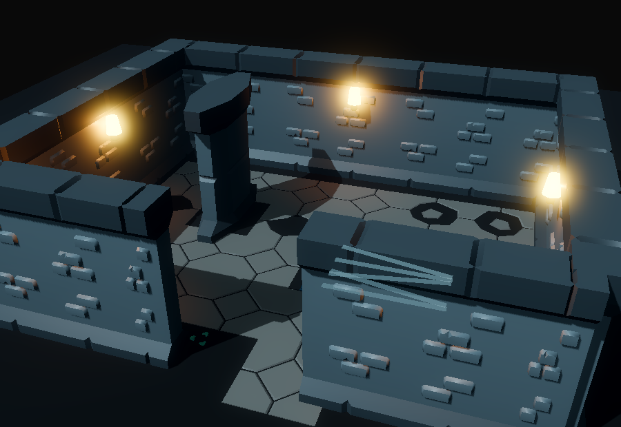

# v471 As-Built — Dungeon Kit Walls and Floors (ADR-0018 P2)

Date: 2026-09-29
Status: Complete (`make ci` green, 9m46s)
Commit: pending

Spec: [`v471_spec-dungeon-kit-walls-floors.md`](../specs/v471_spec-dungeon-kit-walls-floors.md) ·
Plan: [`v471_2026-09-29-dungeon-kit-walls-floors.md`](../plans/v471_2026-09-29-dungeon-kit-walls-floors.md) ·
ADR: [ADR-0018](../adr/0018-art-direction-and-kit-based-visuals.md) D2/D6/D8

## What shipped

**First kit import.** Eight CC0 **KayKit Dungeon Remastered 1.0** pieces are now vendored under
`client/assets/environment/kaykit_dungeon/`, together with the pack's `LICENSE.txt`:
- `wall`, `wall_half`, `pillar`
- floor tiles: `floor_tile_small` plus broken A/B, weeds, and decorated variants

Each piece has a manifest entry with the new `type: environment` and provenance: pack version,
commit `b0ca9bd96a80`, source URL, `CC0-1.0`, and sha256.

**Asset budgets are now enforced (ADR-0018 D8).**
- The data lives in `assets/manifests/asset_budgets.v0.json`, with a schema.
- The check lives in `tools/assets/asset_budgets.py` and runs as validator step [8].
- Over-budget assets fail unless they have a named exemption.
- Stale exemptions also fail, so the list can only shrink.
- Four assets are exempt today:

| Exempt asset | Reason |
|--------------|--------|
| Two AI-generated monsters | P4 replaces them |
| Two ring meshes | D5 drops ring world visuals |

**Kit catalog and cross-check.**
- New catalog `shared/assets/dungeon_kit_presentation.v0.json` (with schema) holds:
  - enable flag and minimum depth
  - wall and pillar asset ids
  - weighted floor variants, tile surface height, and ground base color
  - flags that disable the legacy v462/v463 presentations
- Validator step [9] checks that every kit asset id in the catalog resolves to an `environment`
  asset.
- Piece dimensions are measured from the imported mesh AABB at runtime; they are not stored in data.

**New client scripts.**

| Script | Role |
|--------|------|
| `KitPieceLibrary` | Manifest `asset_id` → cached `PackedScene`, mesh, and bounds |
| `DungeonKitWallBuilder` | See the wall bullet below |
| `DungeonKitFloor` | Deterministic 2 × 2 tile grid over the perimeter-bounded floor; skips cells under walls, columns, holes, and water; weighted variant and quarter-turn chosen by cell hash; one `MultiMeshInstance3D` per variant |
| `DungeonKitPresentationLoader` | Static loader for the kit catalog |

`DungeonKitWallBuilder` handles walls and columns:
- **Walls:** each server wall rectangle is tiled along its long axis with 4 m full pieces and 2 m
  half pieces. The final remainder is a stretched half piece; slivers under ¼ of a half piece are
  absorbed into the previous piece.
- **Thick walls:** a wall deeper than one kit piece is built from parallel rows.
- **Columns:** each column becomes a kit pillar scaled to the rectangle.
- **Scale:** pieces render at **kit scale 1.0**. They are natively 4 tall × 1 deep, which matches
  `ceiling_height` and `wall_thickness`, so the bricks keep their authored proportions. This
  overrides the v469 findings' ×0.5 proposal.

**`WallRenderer` integration** (549 lines, under the 600 cap).
- On kit levels only the visual changes. Each wall keeps its `StaticBody3D` + `BoxShape3D`, its
  `wall_id` / `source` / `kind` metadata, and its per-wall occlusion registration.
- Occlusion now tracks a list of meshes per wall. Fading an imported-material kit mesh fades a
  private duplicate, so the shared material stays opaque.
- The kit floor is added to the walls root.
- Under the kit, the v462 rounded corners and the v463 surface decals are skipped.
- The dungeon ground becomes a plain catalog `base_color`, so tile gaps read as cracks instead of
  showing the pixel-noise texture.
- The town, holes, water, rocks, palisades, and ceiling are unchanged.

**Why per-wall tiling instead of the ADR's global auto-tiler:** it keeps the per-wall identity that
occlusion, picking, and debug state are keyed on, and it needs no junction solver. v469's audit
already showed that walls meet on a 0.5 / 1.0 grid.

## Found and fixed: the client unit gate was hiding failures

`client/tests/test_factories.gd`'s `_finish` called `quit(1)` without a `return`, then printed the
PASS sentinel and called `quit(0)`. `run_gate` only greps for the sentinel, so failing assertions
passed CI.

Fixes:
- **Test:** `test_factories` now returns after `quit(1)`.
- **Gate:** `scripts/client_smoke.sh` `run_gate` now also fails on any `[gdtest] FAIL` line in the
  log.

The hardened gate exposed three **pre-existing** failures in `test_coop_client.gd`. I verified
they also fail on a clean `HEAD` worktree:
- **Two wall-count assertions** (`snapshot wall nodes`, `delta wall nodes replaced`) pinned the
  total `walls_root` child count, which breaks whenever presentation nodes are added. They now
  count wall bodies (nodes with `wall_id` meta).
- **One tooltip assertion** expected `"Skill: Rage"`. Since v392 the tooltip is the class
  feature-line text, so it now checks for `"Rage"`.

**Also:** `render_focus.py` now has a hard `--timeout` (90 s default) for screenshot mode. A
capture script that fails to compile never calls `quit()`, which left a frozen Godot window during
this slice; now the run is killed and the GDScript errors are printed.

Legacy procedural wall, ground, and decal tests are kept as **kit-disabled fallback** coverage
(`enabled_override = "off"`) in `test_factories.gd` and `test_item_visuals.gd`. The kit paths are
covered by the new `test_dungeon_kit.gd`.

## Before → after

| v470 (render baseline) | v471 (kit walls/floors) |
|---|---|
|  |  |
|  |  |

Also in `assets/v471/`: `scenes-dungeon-room-sundered_halls.png`.

## Validation

```bash
godot --headless --rendering-method gl_compatibility --path client --script res://tests/test_dungeon_kit.gd   # 9 checks
GODOT=godot CLIENT_UNIT_ONLY=1 ./scripts/client_smoke.sh   # [client-unit] PASS (hardened gate)
.venv/bin/python tools/assets/validate_assets.py            # 260 checks OK (budgets + kit ids)
.venv/bin/python -m pytest -q tools                         # 231 passed
.venv/bin/python -m tools.showme.regen_screenshots --suite scenes   # 9/9 captures ok
make ci                                                     # CI OK in 9m46s
```

## Known limits and follow-ups

- **Torches and props are unchanged.** Torches, doors, chests, stairs, and barrels still use
  procedural meshes; they are P2b.
- **Per-biome identity comes from lighting only.** Kit walls keep their grey atlas in every biome;
  a per-biome kit tint is a follow-up.
- **The water-pool streak bug is unchanged** (a presentation bug from v469). Water and hole art are
  deferred.
- **No junction or corner pieces yet.** Perpendicular walls overlap at their corners; add
  corner/T pieces only if in-game captures show seams.
- **The v347 performance floor has not been re-checked.** A 100–120 m perimeter wall is about 30
  pieces, plus about 1–2k floor instances per level through MultiMesh.
