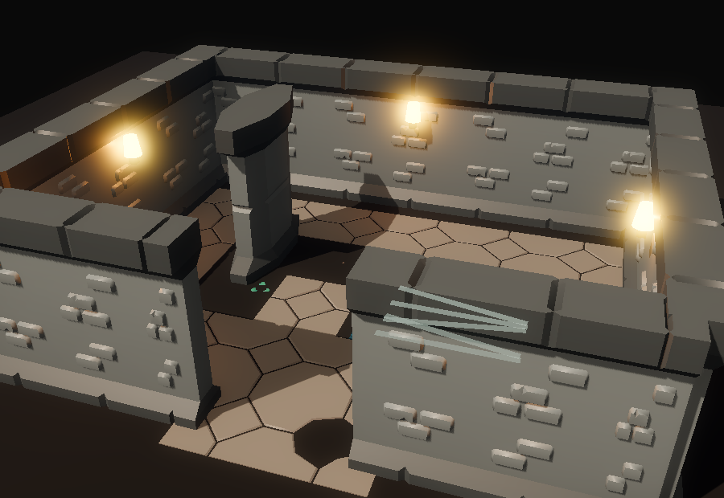
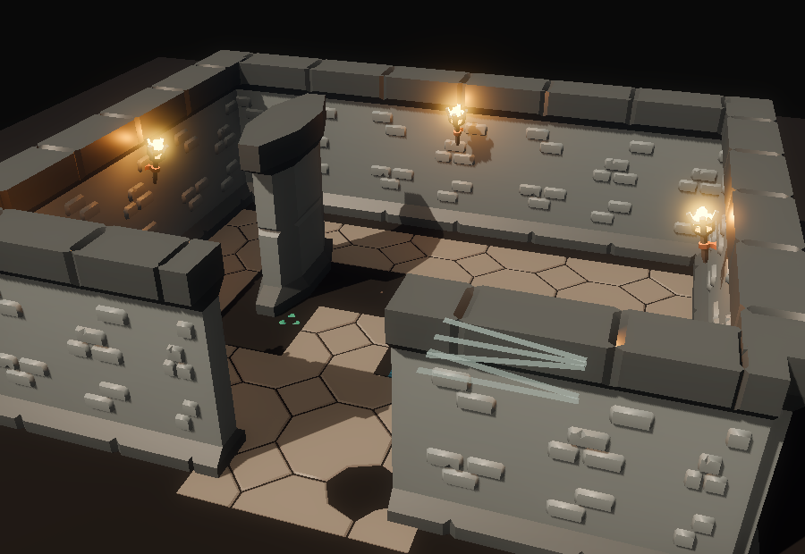
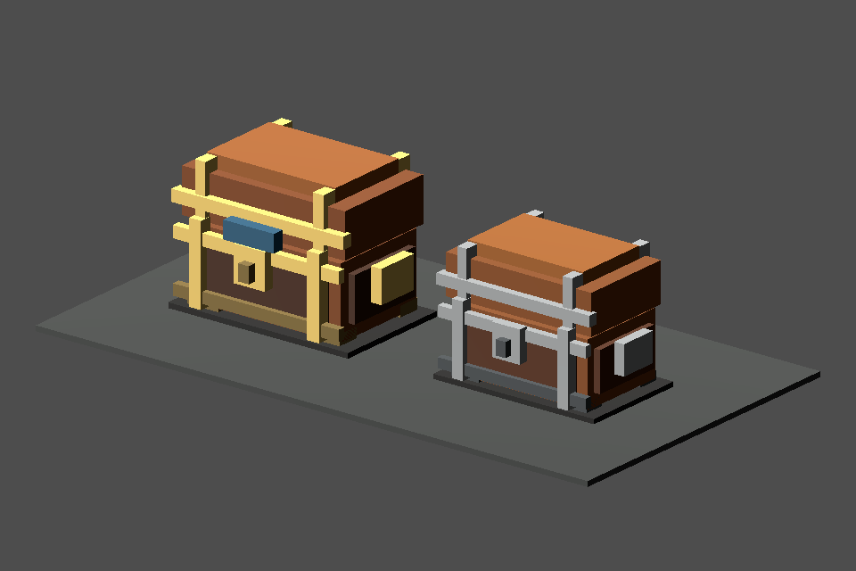
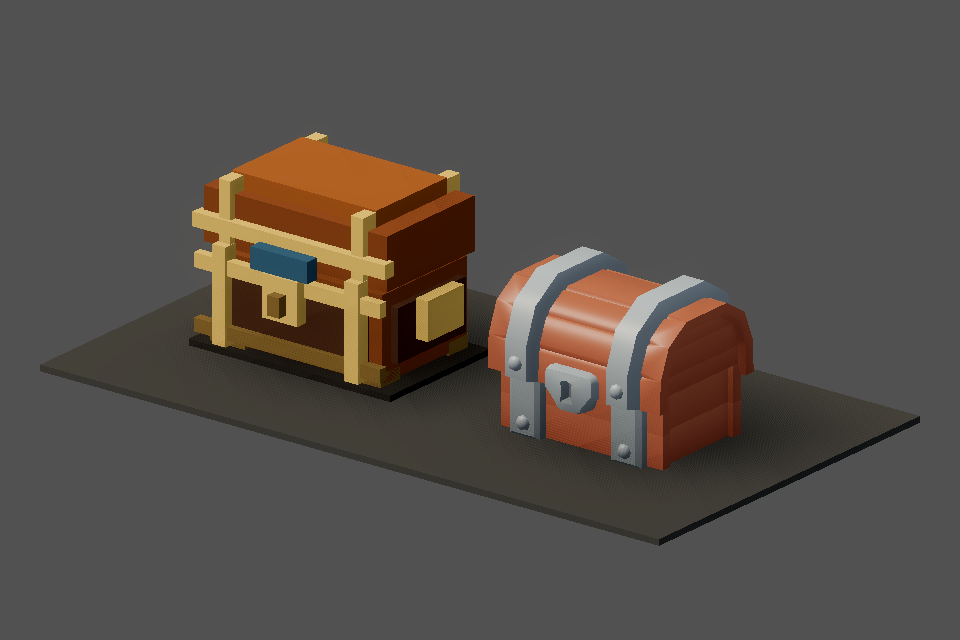

# v473 As-Built — Dungeon Kit Torches and Treasure Chests (ADR-0018 P2b)

Date: 2026-09-29
Status: Complete (`make ci` green, 10m26s)
Commit: pending

Spec: [`v473_spec-dungeon-kit-props.md`](../specs/v473_spec-dungeon-kit-props.md). The spec was
written during implementation; there is no separate plan file. ADR:
[ADR-0018](../adr/0018-art-direction-and-kit-based-visuals.md) P2b.

## What shipped

- **Three more CC0 KayKit Dungeon Remastered 1.0 pieces**, vendored as `environment` assets with
  provenance: `torch_mounted`, `chest` and `chest_gold`. They are within the D8 budgets. The
  catalog gained a `torch` block and a `chest` block, and validator step [9] checks their ids.
- **`DungeonKitProps`** builds the kit torch body and the kit treasure chest.
- **`DungeonTorchPlacement.mounts_from_walls`** returns `{position, facing}`, with facing pointing
  from the wall into the room. `placements_from_walls` is now derived from it, so the positions
  used for the fog-of-war torch holes are unchanged.
- **`DungeonTorchLights`**:
  - On kit levels it spawns an oriented `KitTorch` body instead of the procedural bracket.
  - The emissive flame and `OmniLight3D` stay: moved to the catalog flame offset and scaled, still
    configured by `dungeon_torch_presentation`.
- **`TownNodeFactory.make_chest_node`** routes `treasure_chest` to the kit chest; elite-objective
  chests use `chest_gold`. The town stash and unique chests keep the procedural model.
- **The kit chest keeps the existing contract**:
  - `TreasureChest` root name
  - `ChestLidPivot`: the kit lid node, which already sits on the hinge, so the existing −68° X
    tween opens it with no change to `InteractableStatePresentation`
  - hidden `ChestInnerGlow`
  - objective and quest markers
- **Lid node names come from the catalog, per variant:** `chest_lid` for the plain chest and
  `chest_gold_lid` for the gold one. The unit test caught that the gold variant uses a different
  name.

## Before → after

| v471 | v473 |
|---|---|
|  |  |
|  |  |

## Validation

```bash
godot --headless --rendering-method gl_compatibility --path client --script res://tests/test_dungeon_kit_props.gd   # 7 checks
GODOT=godot CLIENT_UNIT_ONLY=1 ./scripts/client_smoke.sh   # [client-unit] PASS
.venv/bin/python -m pytest -q tools                         # 231 passed
.venv/bin/python tools/assets/validate_assets.py            # 272 checks OK
make ci                                                     # CI OK in 10m26s
```

## Not done / follow-ups

- **Doors:** the kit has no door model.
- **Stairs:** the kit stairs are 5 m ascending flights, a poor fit for the stair interactable.
- **Town stash and unique chests** still use the procedural model.
- **No free-standing dressing:** it would not block movement, because the server doesn't know
  about it.
- **The flame offset and scale were tuned from one capture.** If flames look detached in live play,
  adjust `torch.flame_offset` in the catalog.
