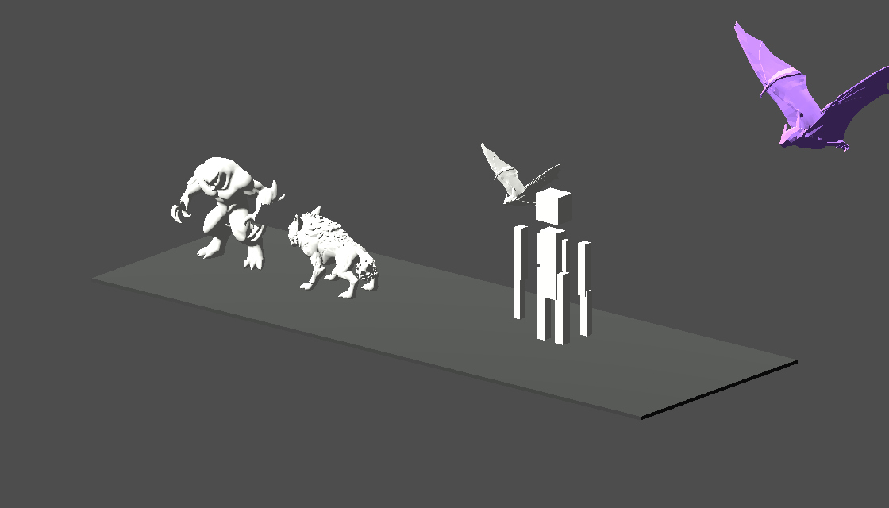
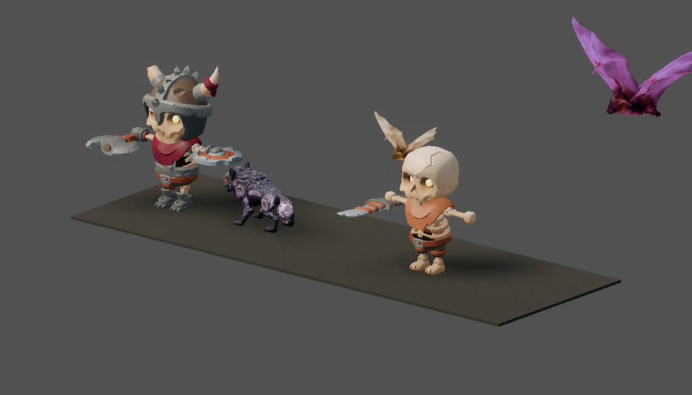

# v474 As-Built — KayKit Skeleton Monsters and Monster Asset Purge (ADR-0018 P4a)

Date: 2026-09-29
Status: Complete (`make ci` green, 6m02s)
Commit: pending

Spec: [`v474_spec-kit-skeleton-monsters.md`](../specs/v474_spec-kit-skeleton-monsters.md), written
before implementation. There is no separate plan file. ADR:
[ADR-0018](../adr/0018-art-direction-and-kit-based-visuals.md) P4.

## What shipped

**Fixed: monster textures had never rendered.**
- `main._apply_model_tint` used to swap every mesh material for a flat, untextured
  `StandardMaterial3D`.
- It now goes through the new `ModelTint.tinted_material`, which duplicates the mesh's own material
  and sets `albedo_color`, so the texture survives.
- This fixes every GLB monster, not just the new ones. The fox and bat textures show for the first
  time; they were the "untextured white" monsters in the v469 baseline.
- `main.gd` stays at exactly its 6,765-line baseline.

**KayKit Skeletons 1.0 monsters.** These are CC0 and share the 41-joint rig with 95 embedded clips.

| Monster def | Kit model | Weapons |
|-------------|-----------|---------|
| `dungeon_mob` | Skeleton_Warrior | axe + small shield |
| `dungeon_archer` | Skeleton_Rogue | crossbow |
| `dungeon_undead` | Skeleton_Minion | blade |

- All three render at catalog scale 0.8.
- Each has a scene `monster_kit_skeleton_<name>.tscn`, whose root script is `KitMonsterVisual`.

**`KitMonsterVisual`** runs on `_ready`, which happens before main builds the
`AnimationController`. It does two things:
- **Clip aliases:** it maps the logical clips (`idle`, `walk`, `attack`, `hit`, `death`, `pounce`)
  to kit clips, following a catalog clip profile. Each alias is a **copy**, so looping `idle`/`walk`
  never changes the kit clip itself.
- **Weapons:** it mounts catalog weapons on `handslot.*` bones through `BoneAttachment3D`.

**Catalog.** New file `shared/assets/kit_monster_presentation.v0.json` (with a schema) holds the
`clip_profiles` (melee / ranged) and each monster's asset, profile and attachments. This is the
first piece of the ADR-0018 D4 clip catalog. Validator step [10] checks that every scene, profile
and attachment id resolves to a `monster` asset.

**Converter.** New `tools/assets/gltf_to_glb.py` packs the kit's `.gltf` + `.bin` + shared PNG
weapons into single-file GLBs, as ADR-0006 D1 requires. It is stdlib-only and deterministic, and
has its own tests. The four weapons are vendored this way, each 38–47 KB.

**Purge (ADR-0018 D2):**
- **`dark_purple_monster` and `crocodile_archer` are gone**, both of unconfirmed license:
  - runtime GLBs, texture sidecars, source GLBs
  - scenes and `.tres` animation libraries
  - manifest entries, and dark_purple's budget exemption
  - schema enum values in `monster_visuals` and `boss_templates`, preview-catalog entries (the
    catalog was regenerated), and `main`/loader scene tables
  - `tools/assets/rig_monster_glbs.py` and its test (they only rigged these two), plus that
    `gen-assets` line
- **Three unused source GLBs are deleted:** `rock_demon`, `goblin_warrior` and `shadow_spirit`.
- **Net repository change:** about **−36.7 MB** removed, about **+14 MB** added (the three skeletons
  are about 4.8 MB each because of their embedded clips).

**Tests.**
- `test_animation.gd` scene checks now cover the kit scenes: aliased clips, a looping walk, a
  non-looping death, handslot bones, and mounted weapons.
- New `test_kit_monsters.gd` covers the tint fix, every catalog scene, and alias copies.

## Before → after

| v469 baseline | v474 |
|---|---|
|  |  |

The capture builds monsters through the real entity factory but never starts an animation, so kit
skeletons stand in their T-pose rest pose. In game, `AnimationController` plays the `idle` alias.

## Validation

```bash
godot --headless --rendering-method gl_compatibility --path client --script res://tests/test_kit_monsters.gd   # 4 checks
godot --headless --rendering-method gl_compatibility --path client --script res://tests/test_animation.gd      # PASS
GODOT=godot CLIENT_UNIT_ONLY=1 ./scripts/client_smoke.sh   # [client-unit] PASS
.venv/bin/python -m pytest -q tools                         # 233 passed
.venv/bin/python tools/assets/validate_assets.py            # 295 checks OK
make ci                                                     # CI OK in 6m02s
```

## Not done / follow-ups (P4b and later)

- **Beasts still use unconfirmed-license models.** `dungeon_wolf` (fox), `companion_black_wolf`
  (wolf) and `dungeon_bat` (tiny flyer) have no KayKit equivalent. P4b needs a style-matched CC0
  source, for example Quaternius. The fox budget exemption stays until then.
- **The procedural `ArcherBowMarker` still renders on the kit rogue**, next to its crossbow. It is
  semantic state for the bot (`has_bow_marker`), so hiding it for kit archers would be a small
  follow-up.
- **The showme `monsters` focus doesn't play `idle`**, so captures show the T-pose.
- **Skeleton_Mage is unused.** It is a candidate for a caster or boss variant.
