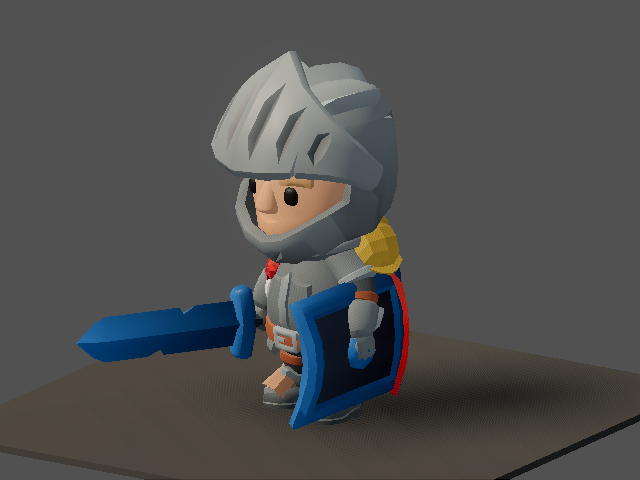
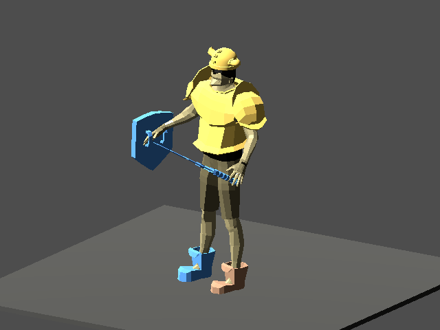
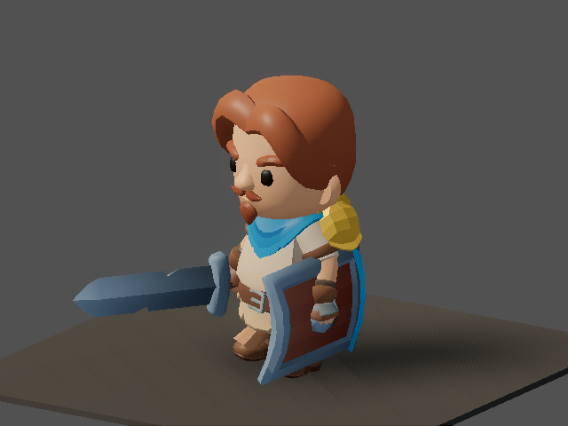

# v475 As-Built — KayKit Heroes, Rig_Medium Clips, Rig-Native Weapons (ADR-0018 P3a)

Date: 2026-09-29
Status: Complete (`make ci` green, 6m19s)
Commit: pending

- **Spec:** [`v475_spec-kit-heroes.md`](../specs/v475_spec-kit-heroes.md), written before implementation.
  There is no separate plan file.
- **ADR:** [ADR-0018](../adr/0018-art-direction-and-kit-based-visuals.md) P3.
- **Inventory:** [kaykit-asset-inventory.md](../researchs/kaykit-asset-inventory.md).

## What shipped

**Heroes are now KayKit Adventurers 2.0 models**, each at scale 0.8:

| Class | Model |
|-------|-------|
| paladin | Knight |
| barbarian | Barbarian |
| sorcerer | Mage |
| rogue | Rogue |
| ranger | Ranger |

**Animation comes from Character Animations 1.1 `Rig_Medium`.**
- `KitHeroClips` builds one cached `AnimationLibrary` per catalog profile
  (`shared/assets/kit_hero_presentation.v0.json`). It collects the clips from four vendored clip
  GLBs: General, MovementBasic, CombatMelee and CombatRanged.
- Each logical clip the game already plays (`idle`, `walk`, the five attack variants, `hit`,
  `death`) is a copy of a kit clip. `idle` and `walk` loop.
- The clip tracks target `Rig_Medium/Skeleton3D:<bone>`, the same path the hero GLBs import with,
  so no retargeting is needed.

**The library swap is centralized.** `character_visual.gd` swaps the library in inside
`refresh_gear_sockets()`. All six model-swap sites (main, showme ×3, the gear-fit probe,
test_animation) already call it, so none of them needed editing. Non-kit models get their original
`character_anims.tres` back.

**Sockets.**
- `gear_sockets.v0.json` defaults now point at kit bones: `handslot.r/l`, `head` (+0.6 offset),
  `chest`, `hand.r/l`, `hips`, `foot.l/r`.
- A new per-socket `fallback {bone, offset, rotation}` keeps the legacy 17-bone `base_human` working.
  It is still used for unknown classes and hero corpses until P3c.
- Socket names are unchanged.

**Weapons: 16 rig-native kit weapons.**
- 12 are Adventurers accessories.
- 4 come from FantasyWeaponsBits: hammer, mace, spear, halberd.
- All 33 main-hand and off-hand `item_visuals` entries are remapped by family, with an identity
  transform and `rig_native: true`.
- **Transforms:** every kit weapon uses the same convention, grip at the origin and +Y toward the
  business end. This was measured from the GLB bounds and confirmed with a probe. So no per-item
  tuning was needed.
- **Scaling:** `rig_native` skips the legacy world-meter scale multiplier and the `ModelRoot` scale
  compensation.
- **Tint:** the rarity tint preserves the texture, through `ModelTint` scaled by a new data value,
  `equipment_display.rig_native_rarity_tint_strength` (0.25).
- **Fixed:** `holy_scepter` pointed at a nonexistent `main_hand_socket`.

**Manifest and validation.**
- New asset type `animation`, used for the clip GLBs, with a D8 budget of ≤ 8k triangles, since the
  clip files carry a preview mannequin mesh.
- Heroes declare their socket bones in `required_nodes`.
- Validator rule [5] now takes the hand-mount bones from `gear_sockets` (kit bone or fallback bone)
  instead of hardcoding `hand_r` / `hand_l`.

**First person.** The `camera_presentations` `chest_view` values were retuned for the kit's
oversized head: `chest_forward_offset −0.45`, `eye_height 1.50`, `eye_height_from_socket −0.05`.
The camera was inside the head.

**Rig gate.** `client/tools/inspect_rig.gd`, a CI gate, now also checks the kit Knight's socket
and deform bones.

**Tests were migrated to data-derived expectations.**
- `test_animation`: socket bones come from `gear_sockets` (kit or fallback bone). Motion is checked
  by walking up the rig from the socket bones. Clips and loop modes are checked, and the scale comes
  from `class_presentations`.
- Probes (`equipped_gear_fit_probe`, `item_visual_scale_probe`, `item_visual_equipment_probe`),
  `test_model_viewer` and `smoke.gd` now resolve asset ids through `item_visuals`, the new
  `EquipmentVisualResolver.asset_id_for()`, or the merged `item_presentations`, instead of
  hardcoded legacy ids.
- The golden `item_visual_resolution.json` now expects the kit sword. This is an intentional
  presentation remap.

## Before → after

| v469 baseline | v475 |
|---|---|
|  |  |
|  |  |

- **Class lineup:** [`classes.png`](assets/v475/classes.png). It shows the rest T-pose because that
  focus plays no clips.
- **Other gear shots:** `gear-{sorcerer,barbarian,rogue}.png`.
- **FantasyWeaponsBits on `handslot.r` at identity:**
  [`fwb-weapons-probe.png`](assets/v475/fwb-weapons-probe.png).
- **First person:** [`eye-view.png`](assets/v475/eye-view.png).

## Validation

```bash
GODOT=godot CLIENT_UNIT_ONLY=1 ./scripts/client_smoke.sh   # [client-unit] PASS (incl. kit rig gate)
.venv/bin/python -m pytest -q tools                         # 233 passed
.venv/bin/python tools/assets/validate_assets.py            # 396 checks OK
.venv/bin/python tools/validate_shared.py                   # 2205 checks OK
make ci                                                     # CI OK in 6m19s
```

## Known limits and follow-ups

- **P3b: armor as tints and headgear.** The legacy procedural armor boxes (helm, mail, boots,
  gloves, belt) still mount on kit sockets and look wrong, for example the gold lump on the
  shoulder. Also: ground-loot models still use the legacy `item_presentations` `3d_model`, and
  there is more FantasyWeaponsBits variety to add.
- **P3c: retire the legacy hero pipeline.** That covers `base_human`, the five legacy class GLBs
  (still manifested but unused), `class_body_morph.py`, `rig_hero_glbs.py`,
  `rig_canonical_hero.py`, `canonical_skeleton.py`, the character clips in
  `build_animations.gd`, `character_anims.tres`, and their tests. The hero-corpse and
  unknown-class fallback should move to a kit model.
- **Remote players and mercenaries** use the same class-model path, so they show kit heroes too.
  They were not visually verified in a live session.
- **First person is functional but bare.** You see the weapon tip ahead. A proper FP presentation
  (hidden head, visible hands) is a follow-up.
- **The showme `gear` focus mounts only a hardcoded `ITEM_SLOT` item list**, so spear, hammer and
  similar items can't be previewed there.
- **Attack timing** (`attack_animation_scaling`) now runs on kit clip lengths. It needs a live combat
  feel check.
