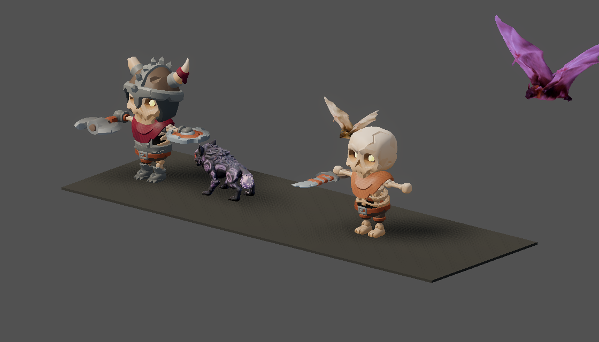
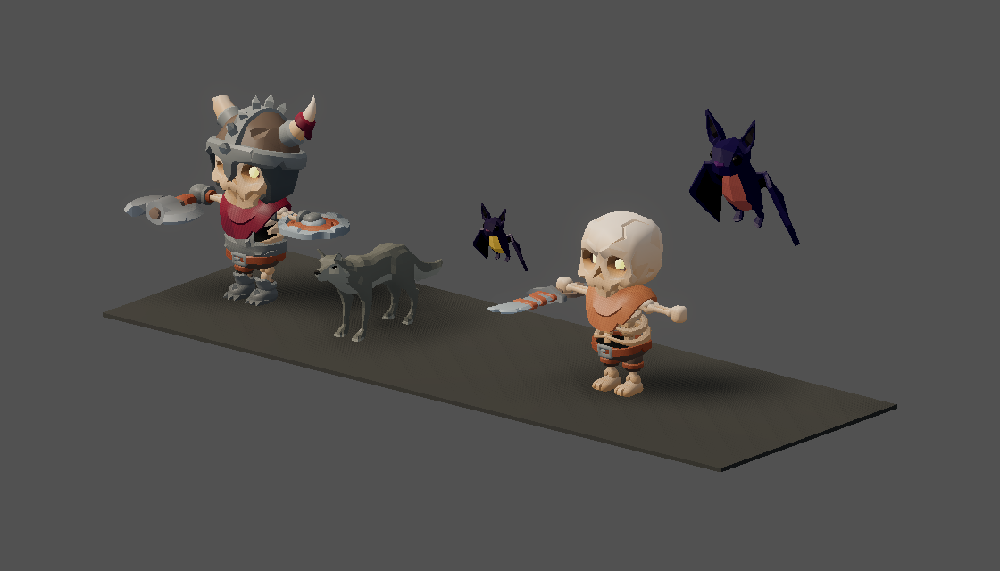
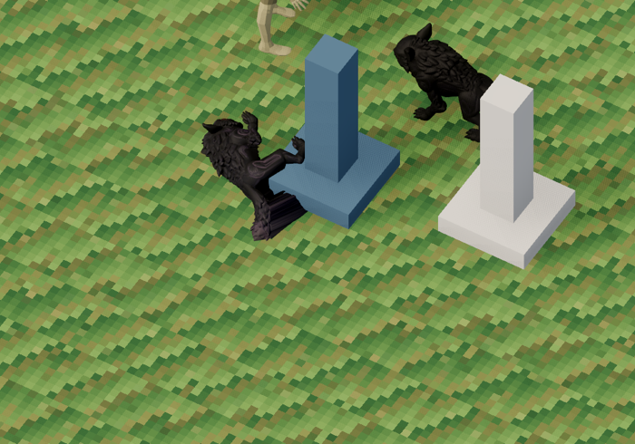
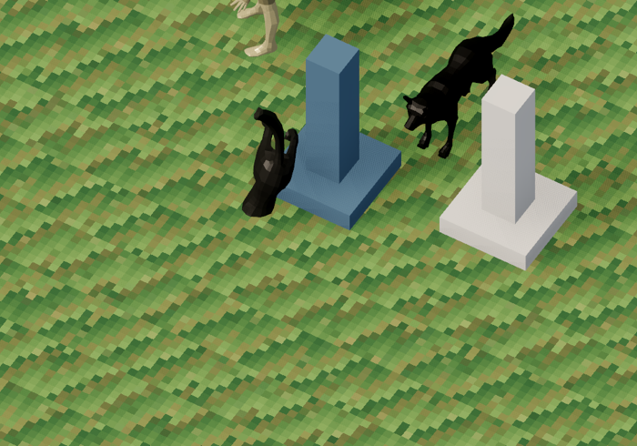

# v476 As-Built — CC0 beasts: Quaternius wolf and bat (ADR-0018 P4b)

Date: 2026-09-29
Status: Complete (`make ci` green)
Commit: pending

Spec: [`v476_spec-cc0-beasts.md`](../specs/v476_spec-cc0-beasts.md), written before implementation.
There is no separate plan file. ADR: [ADR-0018](../adr/0018-art-direction-and-kit-based-visuals.md)
P4b.

## What shipped

**The last three unconfirmed-license assets are gone.** Every manifest asset is now CC0-1.0.

| Monster def | Scene key (unchanged) | Before | After |
|-------------|-----------------------|--------|-------|
| `dungeon_wolf` (Cave Wolf) | `monster_quadruped` | evil fox, 39.2k tris, 2048² texture, budget exemption | Quaternius Wolf, 1,962 tris |
| `companion_black_wolf` + skill wolf companions | `monster_wolf` | user-provided wolf | same Quaternius Wolf GLB |
| `dungeon_bat` (Cave Bat) + Cave Warden boss model | `monster_tiny_flyer` | Sketchfab low-poly bat | Quaternius Bat, 1,046 tris |

- **Source.** Quaternius on Poly Pizza (CC0 1.0): Wolf `P1gU3Qkr9r` from the Animated Animal Pack,
  Bat `hNO9XvjlKa`. The raw downloads are staged in `.artifacts/quaternius/` (not in git). The Fox
  was downloaded for the style check but is not vendored.
- **Owner decision.** The enemy and the companion share one wolf GLB. The existing companion tint
  (`101014`/`202028`) and `visual_scale` data tell them apart.
- **Scenes.** Each scene root is now a `KitMonsterVisual`, following the v474 recipe, with the GLB
  as `ModelRoot`. The wolf is at 0.35 scale and the bat at 0.2, which undoes the pack's 100× armature
  scale. Both noses already face +Z like the kit rigs, so no yaw correction is needed.
- **Clip profiles** in `kit_monster_presentation.v0.json` map the logical clips to native clips:
  - `quaternius_wolf`: Idle / Walk / Attack / Idle_HitReact_Left / Death, with **pounce =
    Gallop_Jump**
  - `quaternius_bat`: Bat_Flying for idle and walk, Bat_Attack, Bat_Hit, Bat_Death, with **dive =
    Bat_Attack2**
- **No server, protocol, rules, golden or bot-scenario changes.** Keeping the three scene keys made
  that possible.

**New tool: `tools/assets/bake_material_palette.py`** (stdlib only, deterministic, 5 tests).
- **Why.** Quaternius colours each primitive with its own untextured material (wolf: 4, bat: 6). The
  client tint (`ModelTint`) and the hit flash (`ModelReactionController`) set one
  `material_override` per mesh. That works for KayKit's single-atlas models, but it flattened these
  beasts. The first capture showed a grey-white wolf and a bat that was a single flat purple.
- **What it does.** The bake writes each material colour, sRGB-encoded, into a 4-px block of a small
  palette PNG. It gives every primitive a constant `TEXCOORD_0` at its block's centre and collapses
  the model to one KayKit-style material (metallic 0, roughness 0.5). Constant UVs have zero
  derivatives, so mip 0 is always sampled and colours don't bleed.
- **Result.** Both runtime paths work unchanged: the tint multiplies the texture, so the Cave
  Warden's purple now tints the bat instead of replacing its palette.
- `gltf_to_glb.py` gained a shared `write_glb()` helper that the bake reuses.

**License gate.** `assets.v0.schema.json` now limits `provenance.license` to `CC0-1.0`, `CC-BY-3.0`
and `CC-BY-4.0` (ADR-0018 D2). A new validator test rejects `unconfirmed-user-provided`.

**Purge.**
- runtime GLBs, texture sidecars and source copies for the fox, the old wolf and the old bat (about
  24 MB)
- `monster_quadruped_fox_anims.tres`, `wolf_anims.tres`, `monster_tiny_flyer_anims.tres`
- `rig_quadruped_monster_glbs.py` with its test and `gen-assets` line
- `_wolf_clips` / `_build_node_root` in `build_animations.gd`
- the dead `monster_tiny_flyer_glb()` in `gen_glb.py`
- the fox budget exemption and the stale READMEs

**Server whitelist.** The boss `model_pool` whitelist in `rules.go` no longer lists the models purged
in v474 (`monster_dark_purple`, `monster_crocodile_archer`). v474 missed it. No live data used
them.

**Showme fix.** The `companions` focus called `main._sync_camera_to_player()`, which v329 removed.
It now calls `_camera_controller.sync_to_player()`.

## Visuals (ADR-0018 coherence rule)

`monsters` focus, with the KayKit skeletons as the style reference. Before: the fox wolf and the old
bats. After: the Quaternius wolf and bat, colours preserved, and the boss bat tinted rather than
flattened.

`companions` focus, cropped: the black companion wolf, plus a dead Cave Wolf at left.

**Style verdict.**
- The bat matches KayKit's chunky, chibi read.
- The wolf is flat-shaded with realistic proportions. It sits next to KayKit acceptably at
  isometric distance, but it is the least coherent asset on screen. Reject it here if it doesn't
  pass the owner's eye.

## Known gaps

- **Corpses stand on end (pre-existing, not introduced here).** `ModelReactionController.enter_death`
  leans every root about 77°, on top of the authored `death` clips that every kit model now plays.
  The old fox corpse had the same problem. Kit skeletons and heroes are affected too, so the fix is
  a separate slice.
- **Duplicate clips.** Each wolf clip ships twice (bare and `AnimalArmature|`-prefixed), about
  0.5 MB. The profile uses the bare names.

## Validation

- `pytest tools/assets/test_bake_material_palette.py tools/assets/test_gltf_to_glb.py
  tools/assets/test_validate_assets.py`
- `make validate-assets`: 396 checks, no orphans, no unconfirmed license
- Godot `test_animation` (new beast rig and clip checks), `test_kit_monsters`, `test_model_viewer`,
  `test_coop_client`, `test_look_and_feel_polish`
- `make ci`
