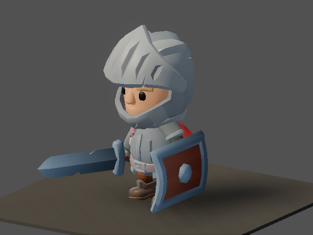
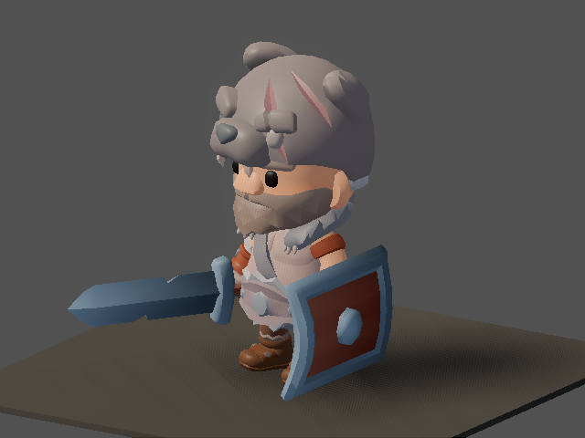
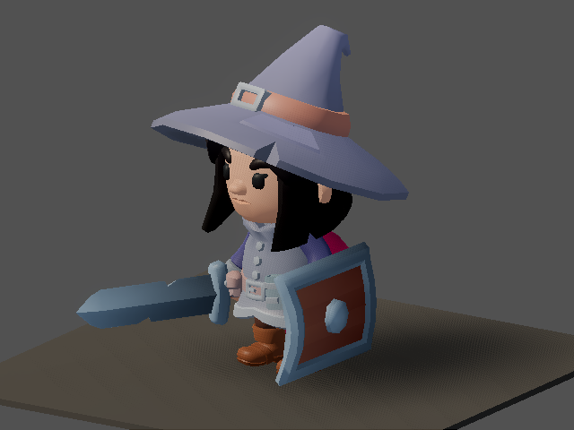
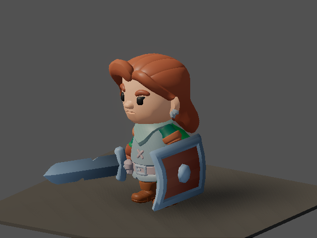
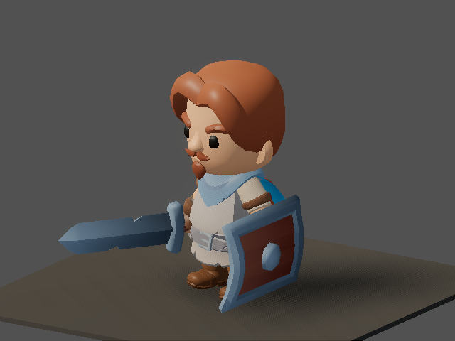

# v483 As-Built — Armor look: tints on the kit hero's own body parts, headgear toggle (ADR-0018 P3b)

Date: 2026-09-29
Status: Complete (`make ci` green)
Commit: pending

Spec: [`v483_spec-armor-look.md`](../specs/v483_spec-armor-look.md), written before implementation.
There is no separate plan file. ADR: [ADR-0018](../adr/0018-art-direction-and-kit-based-visuals.md)
D5, P3b.

## What shipped

**Equipped armor no longer mounts the legacy procedural boxes.** It recolours the hero's own
KayKit body parts:

| Slot | Look |
|------|------|
| chest | `*_Body` tint |
| belt | `*_Body` tint **only when no chest item is worn** (`body_precedence: [chest, belt]`) |
| gloves | both arms |
| boots | both legs |
| head | shows the class's own headgear (Knight helmet and visor, Barbarian bear hat, Mage hat) tinted by the item; an empty head slot hides it |
| rings, amulet | no world visual |
| weapons | unchanged (v475 rig-native meshes) |

**The mechanism is the material detail layer.**
- `albedo_color` multiplies the texture, so it can only darken the already-coloured kit atlas:
  brown over a blue tunic comes out muddy blue.
- `ArmorLook` instead sets `detail_albedo` to a cached 1×1 texture holding the colour, with
  alpha = strength and blend mode Mix. That lerps the atlas toward the armor colour and keeps
  details such as the belt buckle and emblem.
- `albedo_color` remains owned by the class body tint, the rarity tint and
  `ModelReactionController`. Both sides edit the mesh's current `material_override` in place, so
  the hit flash and death darken no longer erase gear. That was the risk the research flagged: the
  controller captures colours once and would have overwritten any later `albedo_color` tint.
- Applying is idempotent: every refresh recomputes all regions from the equipped set.

**Data: `shared/assets/armor_look.v0.json`** (+ schema).
- `regions` maps a region to mesh-name suffixes, so one table serves every kit hero.
- `slots` maps a slot to its region and mode.
- `body_precedence`, `no_world_visual_slots` and `default_strength` (0.6).
- `items` gives every armor template a material colour. The item templates had none: leather
  brown, steel grey, robes purple, plate near-white; belts use a lower strength (0.4).

**Code.**
- New `client/scripts/armor_look.gd`, a `class_name` static loader plus presenter.
- `EquipmentVisualResolver` (534 → 483 lines):
  - routes the tint, headgear and none slots through `ArmorLook`;
  - reports `kind: mesh | tint | headgear | none` per slot, plus an `armor_look` block in its
    debug state;
  - drops the boots mirror mount and the armor procedural fallbacks.
- `item_visuals.v0.json` keeps only the 33 weapon and off-hand entries; 31 armor and jewelry entries
  were removed.

**Validation.**
- New `tools/validate_armor_look.py`, called by `validate_shared` and tested directly, requires:
  - every region, precedence slot and item colour to be valid;
  - every equippable item to be covered by `item_visuals`, by `armor_look`, or by a no-visual
    slot.
- The client coverage check in `test_item_visuals.gd` follows the same rule.
- The showme `floor-item` suite now enumerates armor items from `armor_look`, so ground-loot
  captures still cover armor.

## Visuals

The showme `gear` focus (helm, mail, boots, long sword, shield) for all five classes. Before (v475):
[`gear-paladin`](assets/v475/gear-paladin.png) and the other per-class captures in
`assets/v475/`.

| Class | After |
|-------|-------|
| paladin |  |
| barbarian |  |
| sorcerer |  |
| rogue |  |
| ranger |  |

- **Paladin.** The gold shoulder lump is gone. Mail reads as steel on the torso, boots as brown
  legs, and the helm shows the Knight helmet.
- **Sorcerer.** A steel helm tints the Mage's own hat.
- **Rogue and Ranger.** They show body and leg tints and no helm, by design (see below).

## Known gaps

- **Headgear is hidden by default.** A hero with no head item shows no class hat or helmet. That is
  ADR-0018 D5's "toggle" rule, but it removes the Mage's and Barbarian's iconic silhouettes at game
  start. If that reads worse in play, a `headgear_when_empty` flag in the catalog is a one-line data
  change plus a presenter branch.
- **Rogue and Ranger head items have no visual.** Those kit heroes have no headgear mesh. The only
  standalone kit headgear is the Skeletons-pack helmets, which are sized for skeleton heads.
- **Remote players and mercenaries show no gear.** They didn't before either: the snapshot protocol
  carries no equipment for other entities, so this needs a protocol slice.
- **Ground loot** still uses the legacy `item_presentations` `3d_model` GLBs. The fallback armor
  manifest entries and GLBs stay for it.
- **Hit flash on tinted parts is softer.** The flash brightens `albedo_color`, and the detail Mix is
  applied after it, so flash visibility on a tinted part scales with 1 − strength.
- **Stale research docs.** `docs/researchs/kaykit-asset-inventory.md` and the v469 findings §4 still
  describe the 1.0 mesh names; the 2.0 names are `<Class>_Body`, `Knight_Helmet`,
  `Barbarian_BearHat`, `Mage_Hat` and so on.

## Validation

- `pytest tools/test_validate_armor_look.py tools/test_regen_screenshots.py`
- `make validate-shared`
- Godot `test_armor_look` (63 checks, all five classes):
  - region tints, and the face never tinted;
  - unequip clearing, belt precedence and the headgear toggle;
  - the tint surviving a hit flash, a re-gear and death darken.
- Godot `test_item_visuals`, including the rewritten full-loadout probe and the weapon-only fit
  probe.
- `make ci`
