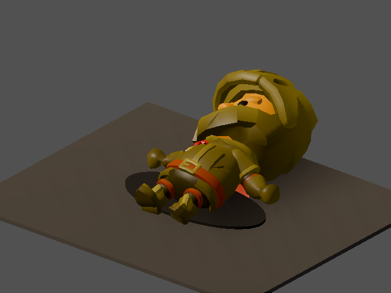
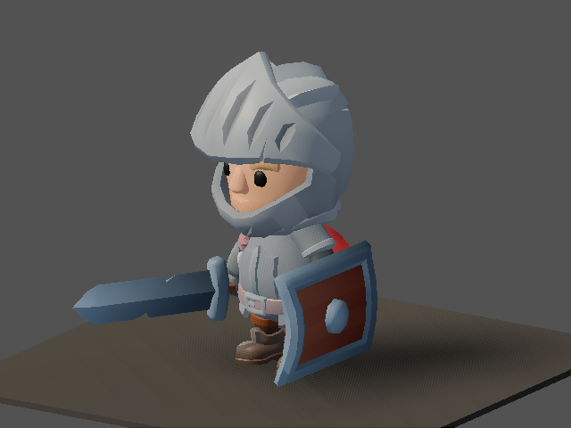
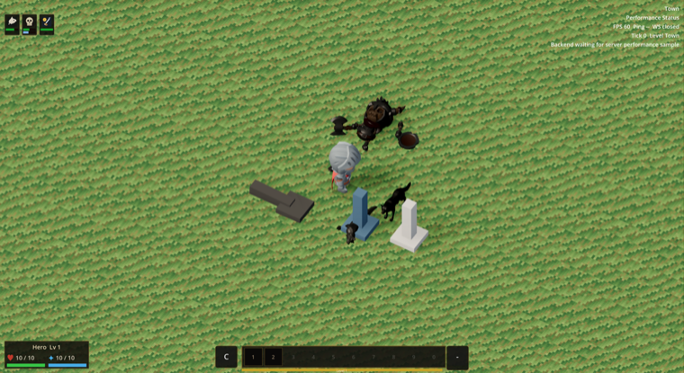

# v484 As-Built — Retire the legacy 17-bone hero pipeline (ADR-0018 P3c)

Date: 2026-09-29
Status: Complete (`make ci` green)
Commit: pending

Spec: [`v484_spec-retire-legacy-hero.md`](../specs/v484_spec-retire-legacy-hero.md), written
before implementation. There is no separate plan file. ADR:
[ADR-0018](../adr/0018-art-direction-and-kit-based-visuals.md) D4, P3c.

## What shipped

**The kit fallback hero replaces the `base_human` mannequin everywhere.**
- `class_presentations.v0.json` has a new required `fallback_class` (`paladin`, checked by
  `validate_shared`). `ClassPresentationsLoader.resolve()` of an empty or unknown class returns that
  class's kit model and `kaykit_hero` clips.
- `character.tscn` now embeds the fallback kit hero (Knight, scale 0.8) with an empty
  `AnimationPlayer`. `CharacterVisual._ready` installs the kit clip library as well as the sockets.
- So every bare instance animates as a kit hero:
  - remote co-op players until their class arrives (v485 now sends it);
  - the boss `current_humanoid_player` model;
  - `smoke.gd`, the model viewer and the class-less showme captures.
- The model-viewer test used to pass only on legacy clip *names* whose tracks didn't bind to the kit
  rig. It now gets real kit clips, and `test_animation` proves the bare scene's `walk` moves a leg.

**Hero corpse** (`client/scripts/hero_corpse_visual.gd`, extracted from `main.gd`).
- Old: the mannequin rotated −88° onto its side.
- New: the fallback kit hero frozen at the end of its authored `death` clip (`Death_A`).
- `_center_on_torso` slides the fallen body so its spine lies over the corpse origin. Without it, the
  clip lands it a body-length behind the shadow and pick box.
- The gold tint, shadow, label and pick box are unchanged.

**`ClassBodyTint` is retired** (ADR D4). The script, its test, the smoke gate, `body_tint` in the data
and schema, and the validator requirement are all gone.
- It multiplied every kit texture toward a class colour.
- Its skin colour, and the near-black `REMOTE_PLAYER_TINT` (`#202934`, now deleted), were the
  reaction base tint. Status tints flatten every mesh to that base, which would have rendered a
  textured kit co-op partner as a dark silhouette.
- Player base tints are now white, so kit heroes render as authored.

**The 17-bone socket fallbacks are removed.** The 12 `fallback` blocks in `gear_sockets.v0.json` and
their schema are gone, along with the fallback branches in `character_visual.gd` and two test
helpers. `validate_assets` defaults to `handslot.r`/`handslot.l`, and its fixtures use kit bone names.

**Other hidden legacy dependencies fixed.**
- The showme skeleton focus uses kit bones (`upperleg.*`, `foot.r`).
- The rig gate no longer checks `base_human`.
- `build_animations.gd` keeps only the monster-dummy clips.

**Deleted:**
- **Heroes:** `base_human`, plus the five unused legacy class GLBs, their manifest entries, texture
  sidecars and source folders (`assets/characters/`).
- **Clips:** `character_anims.tres`.
- **Python:** `class_body_morph.py`, `rig_hero_glbs.py`, `rig_canonical_hero.py`,
  `canonical_skeleton.py`, `fix_skeleton.py`, `base_human_mesh.py`, `skin_blend.py`, the humanoid
  builders in `gen_glb.py`, and six test files.
- **Build targets:** the `gen-assets` lines, and the `rig_hero_glbs` file-size baseline row.

The Poly Pizza equipment importer still needed five GLB helpers from `rig_hero_glbs.py`. They moved
verbatim to `tools/assets/glb_mesh_io.py` (tested), so re-imported GLBs stay byte-identical.

**Ratchet.** `main.gd` dropped from 6,765 to 6,722 lines; its baseline was lowered to match.

## Visuals

| Capture | After |
|---------|-------|
| `corpse`: kit hero lying on its back, gold tint, over the shadow |  |
| `gear` with no class: the fallback Knight instead of the mannequin |  |
| `companions`: the local hero is a kit Knight; skeleton and wolf companions |  |

## Known gaps

- **Remote co-op players** get their own class since v485 (merged to main just before this slice):
  player entities carry `character_class`, and `RemotePlayerClassSync` swaps the model. The kit
  fallback now covers only the gap before the first class-bearing delta, and entities without a
  class.
- **Corpses are always the fallback hero.** Corpse interactables carry no class, and adding one needs
  protocol, store, migration and replay changes.
- **The fallback Knight shows its helmet.** The armor look (v483) runs only for the local player's
  resolver, so bare instances keep all headgear visible.

## Validation

- `pytest tools`: 227 passed, including the new `test_glb_mesh_io.py` and the kit-bone
  `test_validate_assets.py`.
- `make validate-shared` (including `fallback_class`) and codemap; `validate_assets`: 335 checks, no
  orphans.
- Godot:
  - `test_animation`: kit fallback resolution, the bare scene binding kit clips, and sockets on kit
    bones;
  - `test_item_visuals`, `test_armor_look`, `test_model_viewer`, `test_coop_client` (remote tint
    now white), `test_death_pose_ownership`;
  - the rig gate.
- `make maintainability`
- `make ci`
