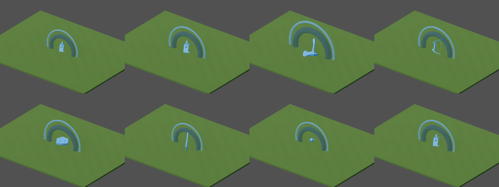
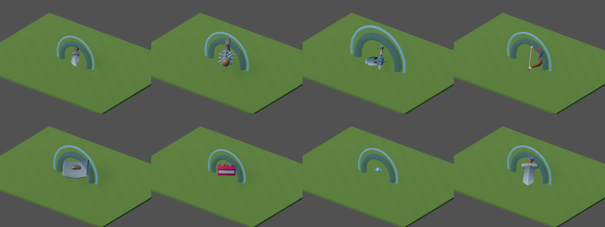
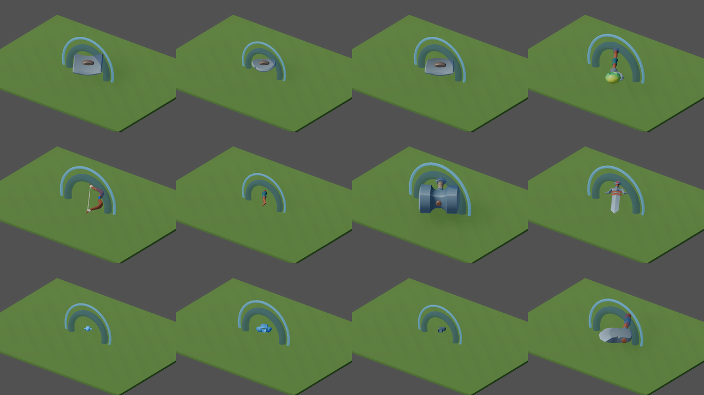

# v487 As-Built — Kit ground loot (ADR-0018 P3 follow-up)

- **Date:** 2026-09-30
- **Spec:** [`v487_spec-kit-ground-loot.md`](../specs/v487_spec-kit-ground-loot.md) ·
  **Plan:** [`v487_2026-09-30-kit-ground-loot.md`](../plans/v487_2026-09-30-kit-ground-loot.md)
- **Scope:** client presentation and shared presentation data only. No protocol, server, rules or
  golden change.

## What shipped

**Dropped weapons and off-hands now show the kit model the hero wields.**
- Before: `LootNodeFactory` took ground models from the `3d_model` field of the presentation
  *family*, which still pointed at the pre-kit GLBs. Daggers, maces, hammers and spears rendered as
  the legacy rusty sword; halberds and war hammers as the starter axe; the spellbook as a staff.
  Every model was also flattened to one solid rarity colour.
- Now: hand items (`main_hand`/`off_hand`) resolve through `item_visuals.v0.json`, the canonical
  item → asset link the equipped hero already uses. Armor and jewelry keep their family
  `3d_model` fallback GLB (KayKit armor is a body tint, not a mesh).
- The 13 hand families (sword, greatsword, dagger, axe, war_hammer, hammer, mace, spear, halberd,
  staff, book, bow, shield) no longer carry `3d_model`. `validate_item_presentations.py` now fails if
  a hand family sets one, so the two mappings cannot drift again.

**One loader for `item_visuals.v0.json`.** New `ItemVisualsLoader` (static, agent rule 7) is
read by both `EquipmentVisuals` and `LootNodeFactory`.

**Ground pose is data** (`shared/assets/equipment_display.v0.json` → `ground_pose`, schema-backed):
- `default` keeps the previous code literals for legacy GLBs (origin at 0.12 m, rotation 90/35/0).
- `rig_native` (kit models): same lie-flat rotation, `max_extent: 1.1` m (caps long polearms
  without equalising small weapons), `rest_on_floor: true` (centre the posed bounds on the loot
  root and sit them on the floor; kit weapons have a grip origin, so polearms were off-centre).
- `assets` overrides: the bow (authored flat, `x: 0`), the closed spellbook (`z: 90` roll) and the
  three kit shields (`scale: 0.75`; flat and wide, they sit under the length cap).

**Texture-preserving tint.** Ground models tint through `ModelTint` (duplicate of the mesh's own
material). Kit models blend toward the rarity colour at `rig_native_rarity_tint_strength`, the same
strength equipped kit weapons use; untextured fallbacks keep the full rarity tint.

## Proof

| Check | Result |
|-------|--------|
| `godot --headless --path client --script res://tests/test_loot_node_factory.gd` | PASS (180). Every hand `item_visuals` entry → `GroundModel_<asset_id>`, pose contract (rotation, floor rest, centring, `max_extent`), armor fallback, kit texture kept + tint strength. Red on the old factory. |
| `godot … res://tests/test_item_visuals_loader.gd` (new gate) | PASS (73). Loader vs catalog, hand-slot filter, pose layering. |
| `godot … res://tests/test_item_visuals.gd` | PASS (catalog-derived ground model and pose). |
| `.venv/bin/pytest -q tools/test_validate_item_presentations.py` | PASS (3). A hand family with `3d_model` fails; the old data fails. |
| `make validate-shared` | PASS; an unknown `ground_pose` key is rejected by the schema. |
| `make client-unit` | PASS |
| `make bot-client SCENARIO=click_to_kill HEADLESS=1`, `SCENARIO=inventory_lab_drop_item` | PASS (loot spawn, drop and pickup unchanged; pick colliders are fixed-size per entity type). |
| `make regen-screenshots SUITE="floor-item"` (60 captures) | Reviewed before/after, below. |
| `make maintainability` | PASS |

Visual gate (ADR-0018 D9), representative captures (dagger, mace, halberd, bow / shield,
spellbook, helm, long sword):

| Before | After |
|--------|-------|
|  |  |

Wider after sheet (shields, staff, war bow, wand, warhammer, great sword, armor fallbacks, axe):

## Scope limits and follow-ups

- Armor and jewelry drops still use the small untextured generated fallback GLBs (no kit armor
  meshes). They are visibly weaker than the weapons now.
- Gold, potions and quest items keep their primitive shapes. Dungeon Remastered has `coin`,
  `coin_stack_*` and `bottle_*` props; vendoring them (licence, `gltf_to_glb`, manifest, budgets) is
  the natural follow-up slice.
- Legacy weapon GLBs (`weapon_rusty_sword_v0` …) are no longer used for ground loot but remain for
  `EquipmentVisuals` fallbacks, the model viewer and asset-catalog tests. Purge is a separate cleanup.
- Headless `gl_compatibility` bots cannot judge the kit look; the visual gate is the human-reviewed
  capture set above.
