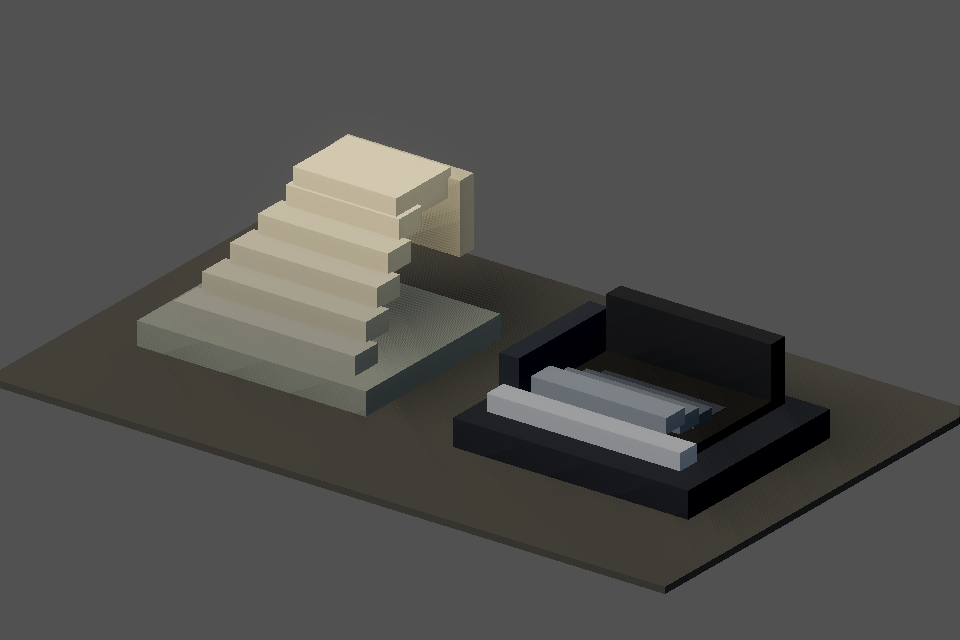
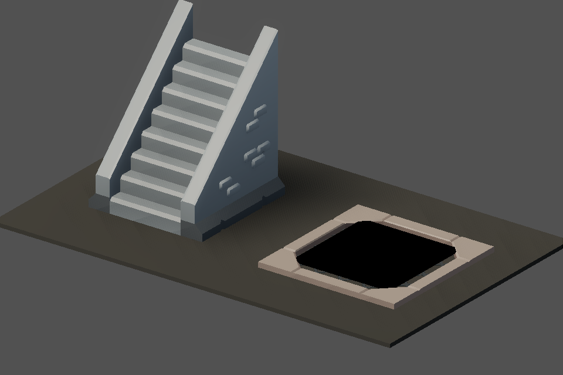

# v489 As-Built — Kit stairs (ADR-0018 P2 follow-up)

- **Date:** 2026-09-30
- **Spec:** [`v489_spec-kit-stairs.md`](../specs/v489_spec-kit-stairs.md) · **Plan:** [`v489_2026-09-30-kit-stairs.md`](../plans/v489_2026-09-30-kit-stairs.md)
- **Scope:** client presentation + asset/presentation data only.

## What shipped

- Two more CC0 KayKit Dungeon Remastered 1.0 pieces vendored as `environment` assets with
  provenance and sha256: `kaykit_dungeon_stairs_narrow_v0`, `kaykit_dungeon_floor_tile_big_grate_open_v0`
  (both within the D8 environment budget).
- New `KitStairs` module. `stairs_up` is the kit narrow flight (scaled, yawed so the steps face the
  camera, footprint centred on the entity). `stairs_down` is the kit open-grate hatch framing an
  unshaded dark pit face, because the kit has no descending stair and the kit floor hides anything
  below floor level.
- Interactable state (ready vs locked/disabled) tints the kit meshes through `ModelTint` (texture
  kept) with catalog colours, replacing the base-box recolour for kit stairs.
- Data: `dungeon_kit_presentation.v0.json` → `stairs` (asset ids, scales, yaw, lift, pit colour and
  inset, state tints), schema-backed; validator step [9] resolves both ids.
- The procedural stairs remain the fallback when the kit or the `stairs` block is disabled, or an
  asset fails to load.

## Proof

| Check | Result |
|-------|--------|
| `godot … res://tests/test_kit_stairs.gd` (new gate) | PASS (12): catalog pieces and scales, pit inside the hatch footprint with catalog colour, locked/ready tints keep the texture, disabled kit falls back |
| `test_item_visuals.gd` (stair probe now kit-aware) | PASS |
| `make validate-assets` / `make validate-shared` | PASS (343 asset checks) |
| `make client-unit`, `make maintainability` | PASS |
| `make bot-client SCENARIO=dungeon_wall_rendering`, `SCENARIO=surface_material_kit` | PASS |

| Before | After |
|--------|-------|
|  |  |

## Scope limits

- No kit door (the kit has none); teleporters and waypoints stay procedural.
- The up flight is 1.5 m tall at `up_scale 0.3`; retune `stairs.up_scale` if it reads too large in
  live play.
