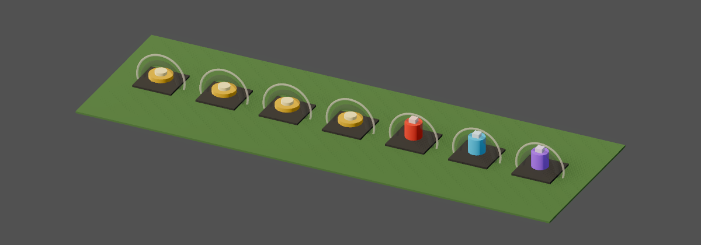
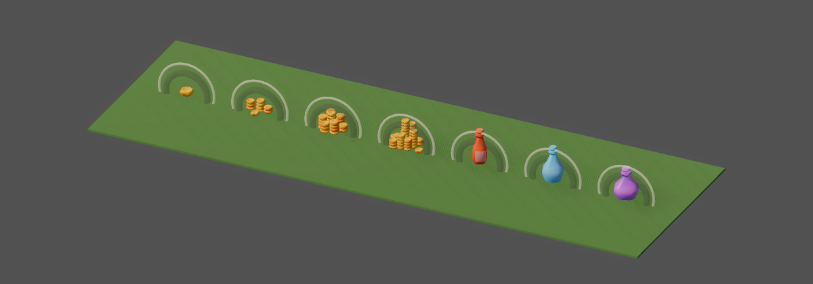

# v490 As-Built — Kit coins and potions

- **Date:** 2026-09-30
- **Spec:** [`v490_spec-kit-coins-potions.md`](../specs/v490_spec-kit-coins-potions.md) · **Plan:** [`v490_2026-09-30-kit-coins-potions.md`](../plans/v490_2026-09-30-kit-coins-potions.md)
- **Scope:** client presentation + presentation data only.

## What shipped

- Seven CC0 KayKit Dungeon Remastered 1.0 props vendored as `environment` assets (provenance,
  sha256, within D8 budgets): `coin`, `coin_stack_small|medium|large`, `bottle_A_labeled_brown`,
  `bottle_B_brown`, `bottle_C_brown`.
- **Gold** picks its ground model by drop amount from the gold family's `ground_model_tiers`
  (1 → coin, 20 → small stack, 100 → medium, 500 → large). The highest tier with
  `min_amount ≤ amount` wins; below the first tier the primitive stays.
- **Potions** (health, mana, rejuvenation) use kit bottles through the family `3d_model`, coloured
  by a new family `ground_tint` through the material detail layer (lerp toward the colour, shading
  kept) instead of the flat rarity tint.
- **`ModelDetailTint`**: the detail-layer helpers moved out of `ArmorLook` (171 → 127 lines) into a
  shared module that ArmorLook and `LootNodeFactory` both use.
- Coins and bottles stand upright, rest on the floor and are size-capped through
  `equipment_display.v0.json` `ground_pose.assets` (v487 pose contract).
- `validate_item_presentations.py` checks that tier assets resolve and ascend strictly.

## Proof

| Check | Result |
|-------|--------|
| `test_loot_node_factory.gd` | PASS (198): every catalog gold tier chosen at its `min_amount`, held just below the next tier, primitive below the first tier; each `ground_tint` potion uses its bottle with the catalog detail colour (8-bit tolerance) and keeps its texture; v487 weapon checks unchanged |
| `test_armor_look.gd` (after the extraction), `test_item_visuals.gd` | PASS |
| `pytest tools/test_validate_item_presentations.py` | PASS (5): unknown tier asset and non-ascending tiers fail |
| `make validate-shared`, `make validate-assets` (364 checks), `make client-unit` | PASS |
| `make bot-client SCENARIO=click_to_kill HEADLESS=1` (gold drop + pickup) | PASS |

Gold ×3 / ×30 / ×150 / ×900, then health, mana, rejuvenation potions:

| Before | After |
|--------|-------|
|  |  |

## Scope limits

- Quest items, keys and badges keep primitive shapes.
- The kit has only brown/green bottles; potion identity comes from the detail tint.
