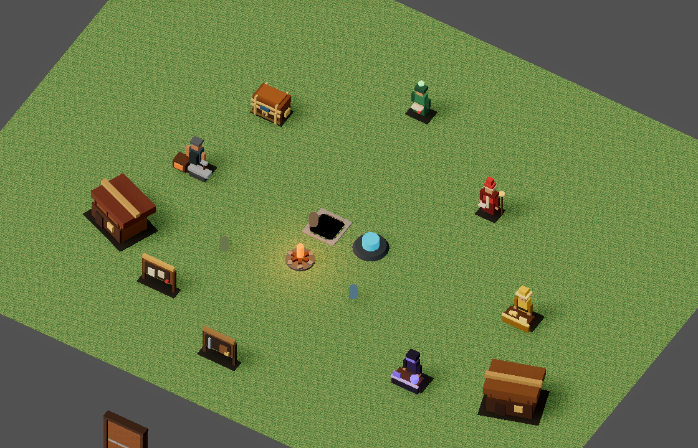
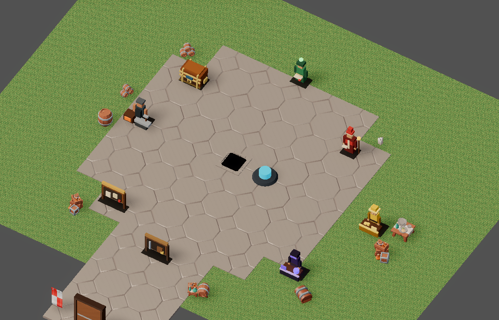
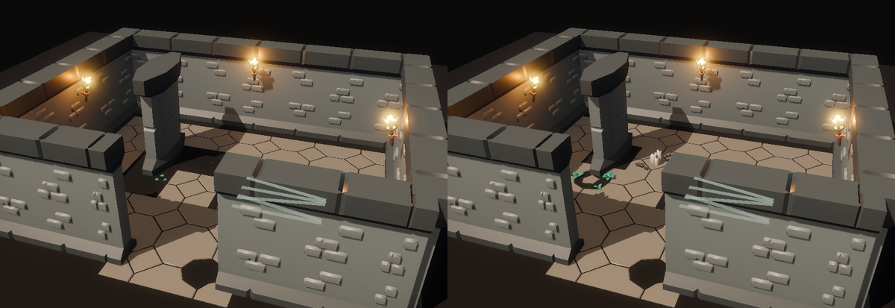

# v491 As-Built — Town look pass

- **Date:** 2026-09-30
- **Spec:** [`v491_spec-town-look-pass.md`](../specs/v491_spec-town-look-pass.md) · **Plan:** [`v491_2026-09-30-town-look-pass.md`](../plans/v491_2026-09-30-town-look-pass.md)
- **Scope:** client presentation + presentation data only.

## What shipped

- **Paved plaza and road.** `TownDressing` lays KayKit floor tiles (MultiMesh) inside a 7.5 m disc
  around the town centre (the stairs down) and a 4 m road to the gate. Data:
  `town_presentation.v0.json` → `dressing.plaza`, reusing the existing `center` / `gate_position`.
- **Kit dressing.** Eight CC0 Dungeon Remastered props vendored (banner, barrels, crates, keg, stall
  table, trunk, candles); eleven placements sit behind the services, listed in `dressing.props`. The
  sword-and-shield rack and shield banner were tried and dropped (wall mounts float free-standing).
- **One code path for live and capture.** `TownDressing.sync(ground_node, level)` attaches a
  world-aligned root in town and removes it on every other level. The town preview capture now builds
  the same dressing; the preview-only cabins and campfire (never in the live town) are deleted.
- **Bugs fixed on the way:**
  - `TownAmbientLife` parented its silhouettes to the translated ground plane at raw town coordinates,
    so they rendered ~50 m outside the fence and followed the ground into the dungeon. Now visible,
    they were flat-coloured capsule placeholders, so they are **retired** (ADR-0018 D10) rather than
    shown.
  - **Dungeon floor (v471):** every tile variant was seated by its own bounds top. Decorated and weeds
    tiles carry props above the slab, so they sank 0.62 m / 0.15 m under the floor and showed as dark
    gaps. All variants are now seated by the plain tile's slab top (`DungeonKitFloor.tile_transform`,
    pure and shared with the plaza).
- `TownPresentationLoader` no longer drops every key except `night_lighting`; it exposes the centre,
  gate, radius and dressing.

## Proof

| Check | Result |
|-------|--------|
| `test_town_dressing.gd` (new gate) | PASS: world-aligned root in town (ground offset cancelled), prop at its catalog world position, removed on a dungeon level, every plaza cell inside disc ∪ road, road reaches the gate, centre paved |
| `test_dungeon_kit.gd` slab check | PASS; **red on the old seating** (heights −0.03 / −0.653 / −0.1755) |
| `test_item_visuals.gd` (preview = live dressing, prop count = catalog) | PASS |
| `pytest tools/test_town_dressing.py` | PASS: every prop ≥ 1.2 m from each world-preset interactable/monster/spawn, off the road, inside the fence; centre and gate match the preset |
| `make validate-assets` (404), `make validate-shared`, `make client-unit` | PASS |
| `make bot-client SCENARIO=town_night_perimeter / dungeon_wall_rendering / account_stash_panel` | PASS |
| `make ci` | PASS on rerun (6m32s). The first run failed only `paladin_class_foundation`, which then passed 3/3 in isolation (strict gate) and in the verbose rerun: an intermittent protocol-pack flake unrelated to this client-only slice (quiet mode kept no failure message) |

Town (the "before" is the old preview, which also showed cabins and a campfire the live town never
had):

| Before | After |
|--------|-------|
|  |  |

Dungeon floor, before/after the slab fix (decorated/weeds tiles no longer buried):

## Follow-ups

- **Trees, cottages, real stalls:** download CC0 **KayKit Forest Nature Pack** and **KayKit Medieval
  Hexagon Pack** into `.artifacts/kaykit/itch/`; a follow-up slice can dress the grass beyond the
  plaza and replace the service boxes.
- The grass itself is still the pixel-noise texture; a terrain shader belongs with the nature pack.
