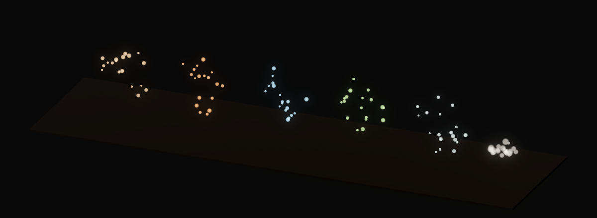
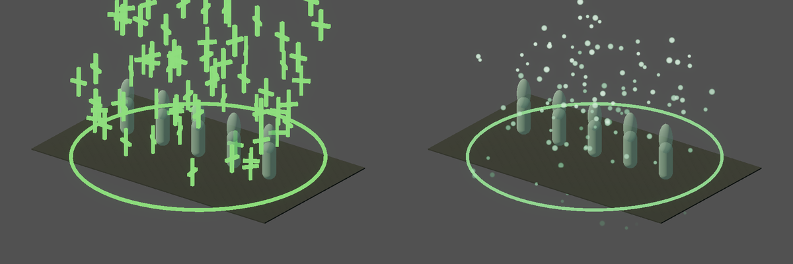

# v492 As-Built — Combat VFX foundation (ADR-0018 P5)

- **Date:** 2026-09-30
- **Spec:** [`v492_spec-combat-vfx-foundation.md`](../specs/v492_spec-combat-vfx-foundation.md) · **Plan:** [`v492_2026-09-30-combat-vfx-foundation.md`](../plans/v492_2026-09-30-combat-vfx-foundation.md)
- **Scope:** client presentation + presentation data only; `main.gd` untouched.

## What shipped

- **First shader and particle system in the client.** `client/shaders/vfx_soft_glow.gdshader`
  (additive, unshaded, camera-facing, radial falloff tinted by the particle colour and boosted for
  the render baseline's glow) and `CombatVfx`, which builds one-shot `GPUParticles3D` bursts from
  `shared/assets/vfx_presentation.v0.json` (schema-backed: amount, lifetime, explosiveness, spawn
  height, spread, velocities, gravity, damping, sizes, start/end colours, glow energy). Bursts free
  themselves on `finished`.
- **Hit sparks** on every hit reaction (monster and player, through the existing
  `GameplayFeedbackPresentation.play_entity_reaction`), sprayed away from the attacker and coloured by
  the event's `damage_type` (`force`, `fire`, `cold`, `poison`, `lightning`; unknown → the effect's
  own colours).
- **Death burst** (grey dust) on death reactions. Both are added to the entity's parent, so they
  outlive the node.
- **Heal rain** rebuilt on particles: soft glow motes falling over the heal radius (prewarmed with
  `preprocess`) plus the fading ground ring. It keeps the `HealRainEffect` class, `setup(radius)` and
  its 3 s lifetime, so main.gd and the heal tests are unchanged.
- **Quality scaling:** `render_presentation.v0.json` quality tiers gain `particle_scale` (performance
  0.5). `SceneLightingRig.sync` hands the active tier to `CombatVfx`.

## Proof

| Check | Result |
|-------|--------|
| `test_combat_vfx.gd` (new gate) | PASS (25): burst amount/lifetime/gravity from the catalog, glow shader, self-free; catalog colour per damage type and fallback; reaction burst on the parent, sprayed away from the source, at spawn height; death → death burst; performance tier scales the amount; heal rain has particles + ring |
| `test_coop_client.gd`, `test_status_effect_presentation.gd` (heal rain spawn rules) | PASS |
| `make validate-shared`, `make client-unit` | PASS |
| `make bot-client` `11_combat_feedback`, `model_reaction_polish`, `click_to_kill` | PASS |
| `make ci` | PASS |

Hit sparks (force, fire, cold, poison, lightning) and the death burst, a few frames in:

Heal rain, before/after:

## Scope limits and follow-ups

- **Death dissolve** needs the monster node kept alive past `entity_remove` (removal-flow change):
  its own slice, with an in-repo dissolve shader.
- Per-skill projectile/impact VFX, rim/outline highlight, screen effects.
- Headless bots cannot see particles (`gl_compatibility` dummy); the visual gate is the capture set.
- Perf: bursts are small (≤ 24 particles, one draw each), but many simultaneous hits add draw calls;
  the performance tier halves counts. Watch the draw-call budget from the v486 review.
