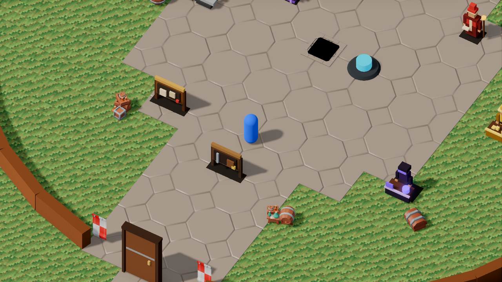
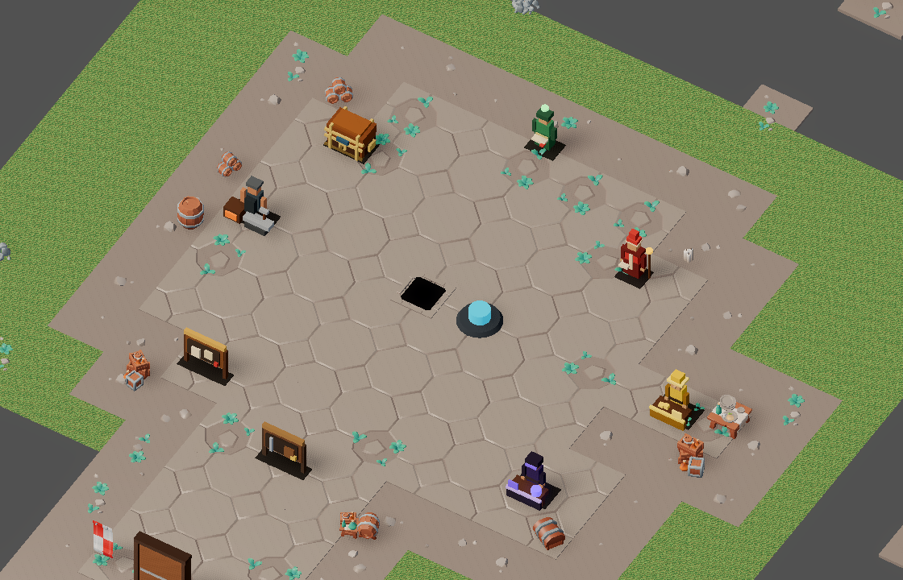
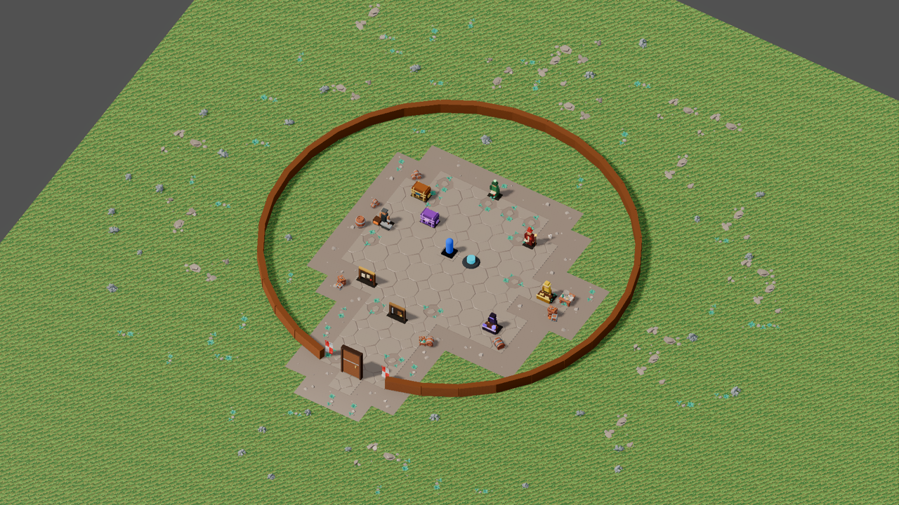
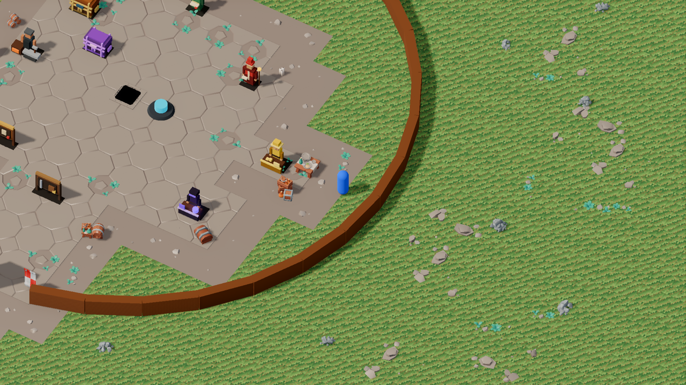
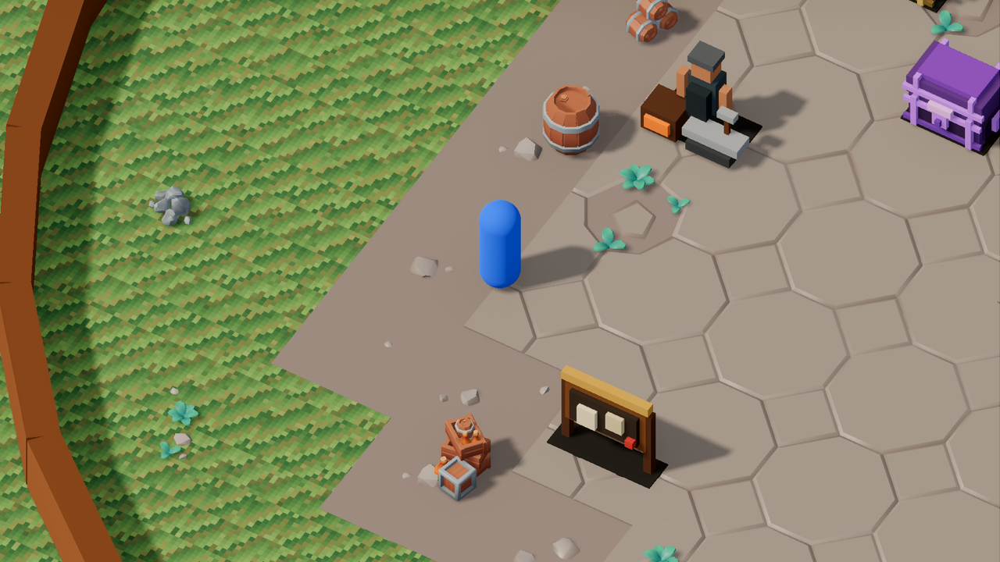
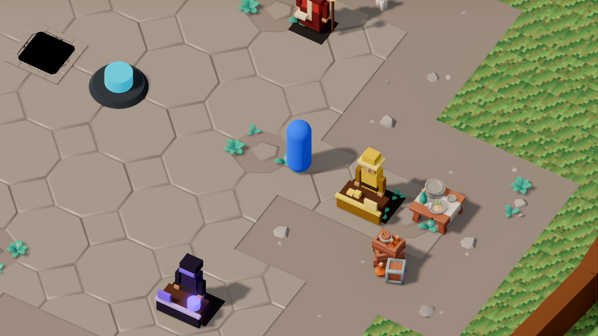

# v493 As-Built — Town floor detail

- **Date:** 2026-09-30
- **Spec:** [`v493_spec-town-floor-detail.md`](../specs/v493_spec-town-floor-detail.md) · **Plan:** [`v493_2026-09-30-town-floor-detail.md`](../plans/v493_2026-09-30-town-floor-detail.md)
- **Scope:** client presentation + presentation data + nine vendored CC0 KayKit assets. No server,
  protocol or gameplay change.

## What shipped

- **Planner + builders in one module.** `client/scripts/town_ground_detail.gd` (364 lines) turns
  `town_presentation.v0.json` → `dressing` into tile layers (core / rim / edge), service path
  capsules and a deterministic scatter, then builds one `MultiMeshInstance3D` per distinct asset per
  layer. The planner takes explicit `frame` data, so it is unit-tested without a scene.
  `TownDressing` (`town_dressing.gd`, 140 → 94 lines) now only syncs the root and places props.
- **Stone rim** around the plaza with weedy wear tiles (weights 5 plain : 2 weeds).
- **Dirt edge band**, one tile wide, outside the rim (`dressing.edge.enabled`). This is a real data
  flag: the planner tests run on a forced-on copy of the dressing, so `edge.enabled = false` (or
  `scatter.enabled = false`, `plaza.rim.width_m = 0`, an empty `scatter.rocks`) keeps
  `make client-unit` green; the shipped data is only checked for flag consistency.
- **Stone service path to the vendor** (capsule from the plaza to the service anchor, 3 m wide so
  diagonal paths stay connected). The mystery-seller path is redundant for connectivity (plaza
  radius 7.5 m + path half-width 1.5 m already reaches 8.6 m) but kept: it puts a stone pad under
  the seller, who otherwise stands on edge-band dirt.
- **Grass scatter** of rocky dirt patches, weed patches and stone chunks on a jittered 3 m grid,
  excluded around gameplay anchors, props, the plaza and the fence ring. `scatter.radius_m` = 28
  (see tuning below).
- **Nine assets vendored and registered**, CC0 KayKit, within the ADR-0018 D8 budgets: seven
  Dungeon Remastered floor pieces (`floor_dirt_small_A/B/C/D`, `floor_dirt_small_weeds`,
  `floor_dirt_large`, `floor_dirt_large_rocky`) and two Resource Bits pieces
  (`Stone_Chunks_Small`, `Stone_Chunks_Large`).
- **Data-driven throughout:** every distance, weight, jitter and scale is in the `dressing` block;
  the new `anchors` key (14 world-preset gameplay points) lets the client avoid gameplay positions
  without reading the server's world preset.
- **Deviations from the spec text, on purpose:**
  - `width_m` distances are Chebyshev between cell centres; `path_width_m` is 3.0 (connected
    diagonals).
  - `anchors` is a new data key, and `service_paths.targets` is a list of anchor ids resolved
    through `dressing.anchors`, not the spec's `{interactable_def_id, position}` objects.
  - `scatter.jitter_fraction` became a data key (it was a planner constant in the plan).
  - No new `TownPresentationLoader` accessors: the planner reads the existing `dressing()`, and the
    loader pin test guards that the new keys survive its merge.
  - The rim uses only plain + `floor_tile_small_weeds_A` (the decorated variant was dropped at the
    visual gate: candles and rubble read as dungeon debris).
  - Scatter patches exclude `floor_dirt_large` (buried slab, only specks; see limits).
  - The scatter extends past the palisade (the planner excludes the fence ring), contrary to the
    spec's fence-risk note, which assumed an inside-only scatter.
  - The criterion "changing one catalog weight changes the result" is proven by
    `occupancy_percent` driving the count and by a patch-weight test (a dominant weight makes every
    patch that asset, and the converse).

## What it proved

| Check | Result |
|-------|--------|
| `test_town_ground_detail.gd` (new) | PASS (64): frame/cell maths, layer partition, path connectivity to the vendor, scatter exclusions (anchors, props, plaza, fence ring), determinism, patch-weight sensitivity, rock seating (`rock_transform`) and patch seating (`tile_transform`), loader pin, shipped-flag consistency; invariants run on a forced-on copy |
| `test_town_dressing.gd`, `test_item_visuals.gd` | PASS unchanged behaviour: root attaches only in town, removed on dungeon levels, `TownPlaza` name kept |
| `.venv/bin/pytest tools/test_town_dressing.py tools/assets` | 56 passed (anchors == world preset, path targets, manifest ids, fence clearance) |
| `make validate-shared` / `make validate-assets` | OK (2204 checks / 435 checks) |
| `make client-unit` | PASS |
| `make bot-client SCENARIO=15_town_vendor_shop_panel / 23_account_stash_panel / 07_town_teleporter_auto_approach` (HEADLESS=1) | PASS ×3 (4.6 s / 4.7 s / 5.7 s): picking and approach in town are unaffected by the extra ground nodes |
| `make maintainability` | PASS; grandfathered 35 files / 66 115 lines; `town_dressing.gd` 94, `town_ground_detail.gd` 364 |
| `make ci` | PASS first run, 7m09s, no flake (`paladin_class_foundation` included) |

## Outcome vs spec (honest)

- **The soft-edge goal is NOT met.** The KayKit dirt tiles are the same taupe as the stone tiles, so
  the edge band reads as more pavement with a hard, stair-stepped outline (bigger than v491's
  octagon), not as a transition into grass. Net effect on the plaza silhouette: roughly neutral. A
  real blend needs a terrain shader or a nature pack (spec non-goals). The band is kept enabled as
  a neutral-to-marginal choice; `dressing.edge.enabled = false` removes it.
- **Service path to the vendor is the clear win**: the plaza is no longer an isolated disc.
- **Rim wear and weed/pebble detail add life** close up.
- **Grass variation is only partly delivered.** The scatter is sparse, and the grass ring *inside*
  the palisade is still almost empty (the fence clearance and the plaza leave a thin ring): spec
  problem 3 is not fully solved.
- **Scatter radius tuning:** `scatter.radius_m` went 13 → 22 → 28. At 13 the inside-fence ring held a
  single placement; 22 suffices at the default zoom; at max zoom (about 32 m visible from the fence)
  22 visibly thinned out; at 28 the scatter fills the max-zoom view from the east/north fence and
  stays on the 140×90 ground plane (the view itself can still exceed the plane; see limits). The
  scatter deliberately extends past the palisade.
- **Edge decision is the owner's (R4).** `edge.enabled` is genuinely a data flag now. The band is
  neutral to marginal: it adds a stone → packed earth → grass layering but no soft edge. Decide after
  looking at `town-overview-after.png`; flipping it off needs no code or test change.

Play-camera evidence (same camera before/after; the palisade is a box stand-in in the scratch
capture):

| Before | After |
|--------|-------|
|  |  |

| Overview | Max zoom |
|----------|----------|
|  |  |

| Edge close-up | Vendor path close-up |
|---------------|----------------------|
|  |  |

## Measurements

One-shot headless script (not committed) calling `TownGroundDetail.build(TownPresentationLoader.dressing())`:

| Layer | `MultiMeshInstance3D` | Instances |
|-------|-----------------------|-----------|
| `TownPlaza` (core) | 1 | 26 |
| `TownPlazaRim` | 2 | 37 |
| `TownPlazaEdge` | 5 | 47 |
| `TownScatter` | 4 | 84 |
| **Total** | **12** | **194** |

Build time: 50.9 ms cold (first call, includes loading the glb meshes), 3.4 ms on a second call,
on a developer laptop in headless (dummy renderer) mode. The 12 multimesh nodes are the draw-call
floor for the ground detail (one per distinct asset per layer); the GPU cost was not profiled
(headless).

## Files

- New: `client/scripts/town_ground_detail.gd`, `client/tests/test_town_ground_detail.gd`,
  nine `.glb` under
  `client/assets/environment/kaykit_dungeon/` and `kaykit_resource_bits/` (with `LICENSE.txt`) and
  their entries in `assets/manifests/assets.v0.json`, `docs/as-built/assets/v493/*.png`.
- Extended: `shared/assets/town_presentation.v0.schema.json` (existed on main; 217 → 483 lines).
- Changed: `client/scripts/town_dressing.gd` (delegates; 140 → 94 lines),
  `client/scripts/town_node_factory.gd` (preview ground sized from data),
  `shared/assets/town_presentation.v0.json` (`anchors`, `plaza.rim`, `edge`, `service_paths`,
  `scatter`), `tools/test_town_dressing.py`, `tools/assets/validate_assets.py`,
  `client/tests/test_town_dressing.gd`, `scripts/client_smoke.sh`, `docs/CODEMAP.md`.

## Known limits and follow-ups

- **Dirt tiles are not a terrain blend** (see outcome). Needs a terrain shader or the KayKit Forest
  Nature pack.
- **R5: `kaykit_dungeon_floor_dirt_large_v0` is vendored and registered but unused by data.** Its
  slab is buried at `surface_y` 0.0 (only specks show) and a revealed slab is a pasted 4 m square, so
  no current tuning uses it. The reviewer argues for removal; it is deferred to a follow-up cleanup,
  not forgotten (the spec acceptance criterion listed nine entries).
- The "buried slab" look of the dirt patches depends on `scale_min >= 0.8` at `surface_y` 0.0 and is
  not guarded by a test.
- Weed leaves from rim/edge tiles poke through the vendor / quest-giver / stash bases (cosmetic).
  The stone chunks' grey clashes mildly with the beige kit stone.
- `TownDressing.plaza_cells` / `in_plaza` are dead in production now (kept only for
  `test_town_dressing.gd`).
- **showme's `town` focus** is an overview camera (no palisade), not the play camera. Its preview
  ground was a fixed 28×22 m, so scatter floated over the void; it is now sized from data
  (`TownNodeFactory.preview_ground_size()`: a square reaching max(`scatter.radius_m`, fence radius)
  + 4 m around the town centre, UVs scaled to keep the old grass density, camera framing
  unchanged), so nothing floats. The v493 evidence images still come from an uncommitted scratch
  capture with the real play camera; a play-camera showme focus is a follow-up.
- **Ground plane:** void past the 140×90 plane is visible from the west/north fence at max zoom
  (v491 issue, not this slice).
- **Next: v494**, random kit props on every dungeon floor (separate spec).
