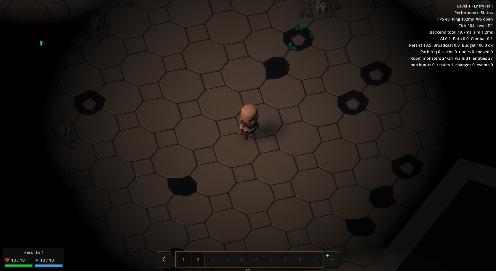
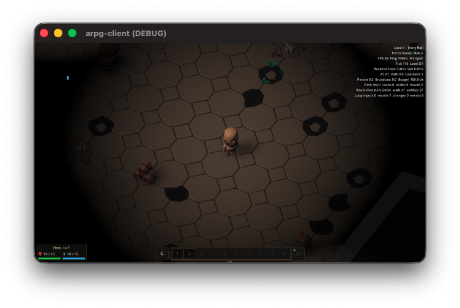
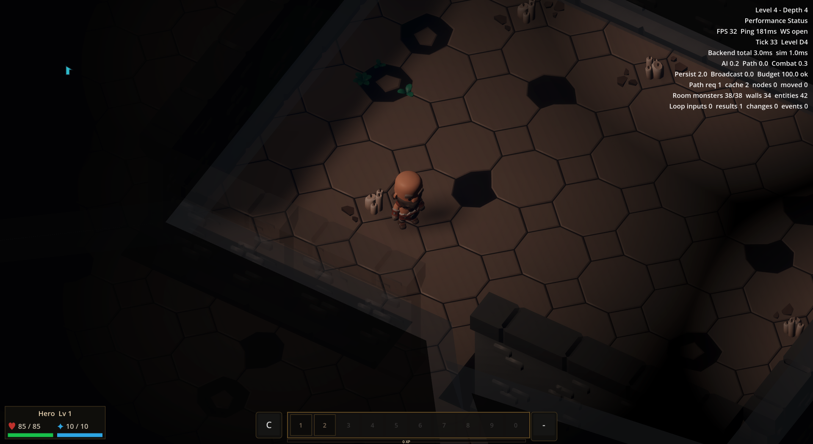
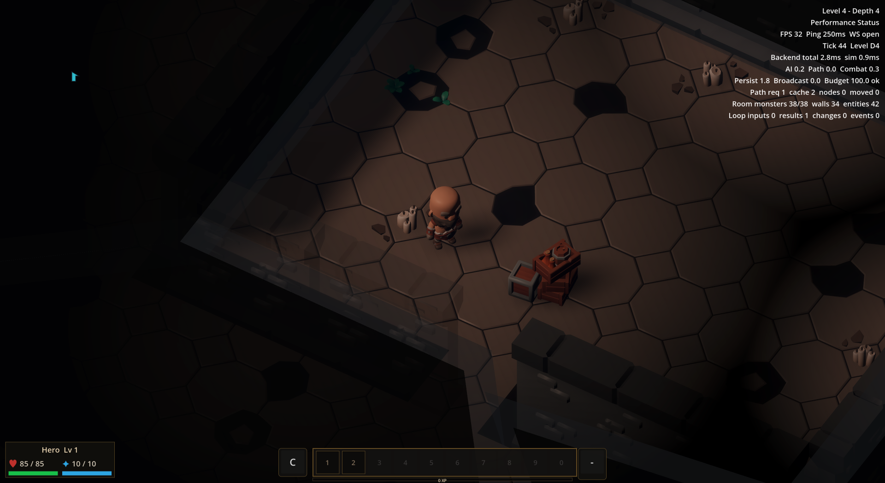
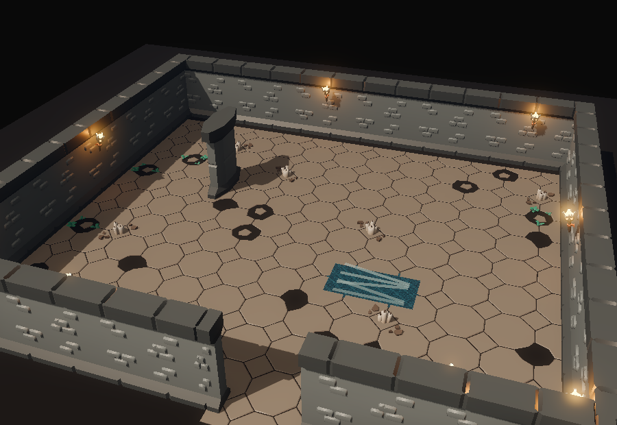
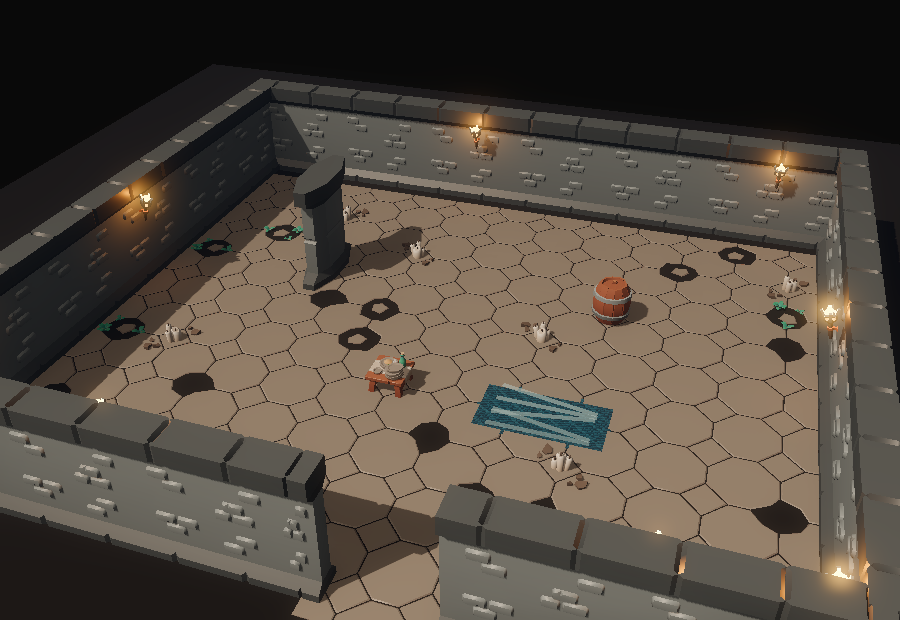
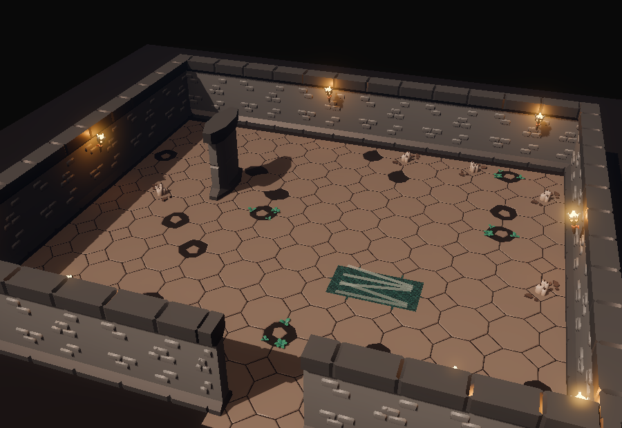
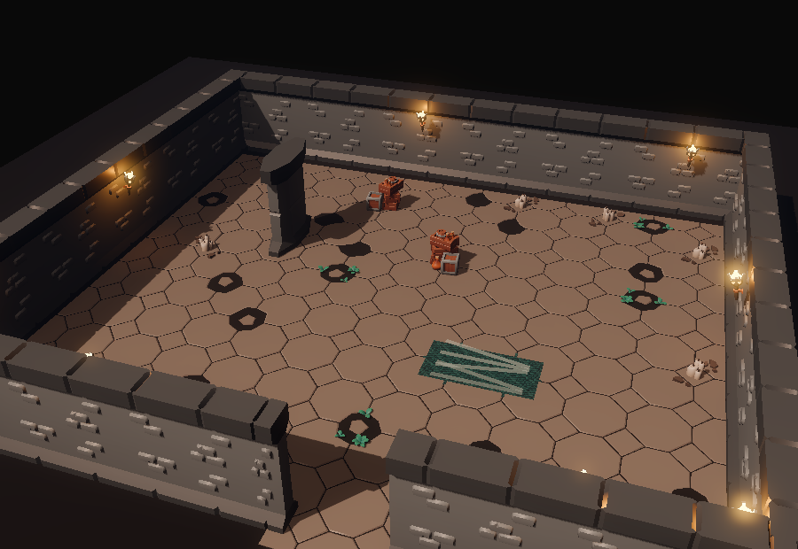
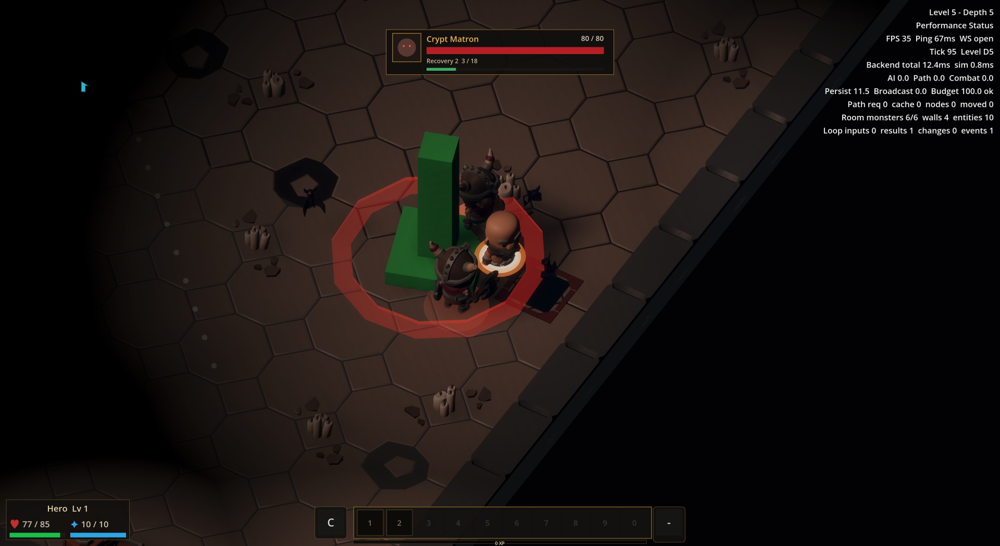

# v494 As-Built — Dungeon room dressing

- **Date:** 2026-09-30
- **Spec:** [`v494_spec-dungeon-room-dressing.md`](../specs/v494_spec-dungeon-room-dressing.md) · **Plan:** [`v494_2026-09-30-dungeon-room-dressing.md`](../plans/v494_2026-09-30-dungeon-room-dressing.md)
- **Scope:** generated dungeon presentation and capture/test tooling. No server-authored blockers, collision, loot, protocol, or gameplay-rule changes. The additional `dungeon_dressing_deep_lab` world is test data for a generated depth-4 floor.

## Implementation

`DungeonRoomDressing.plan` ranks stable floor cells using the session seed and level, excludes wall and column margins, stair/door/chest interaction margins, straight-line routes from the up stair to other anchors, and spacing around other props. It chooses a density band, weighted asset, scale, and yaw from the schema-backed `dressing` catalog. A floor with no safe cell returns `reason=no_safe_candidate`; a disabled catalog or non-dungeon level creates no dressing. The generated up stair is the stable spawn anchor.

`DungeonRoomDressing.build` groups placements into one `MultiMeshInstance3D` per selected KayKit asset. It adds no collision. `WallRenderer` owns the dressing root, clears it with the wall layout, and rebuilds it only at snapshot or wall-layout boundaries. During a normal level delta, walls replace immediately and dressing fills after the same update batch supplies static interaction anchors. The `client.seed|level` key makes re-entry reproducible. All four assets were already vendored and registered; no dependency or plugin was added.

The shipped catalog sets 18 instances at depths 1–3 and 32 at depths 4+, with a global 32-instance cap. Tunable clearances, grid pitch, density, weights, yaw, and scale live in `shared/assets/dungeon_kit_presentation.v0.json`. Asset validation checks each dressing ID against the environment manifest.

## Renderer evidence

Matched live runs used the same scenario and seed with only `dressing.enabled` switched between runs. The counters are Godot's real renderer draw calls, measured after the floor settled. The catalog was restored to enabled after each baseline capture.

| Generated floor | Baseline | Dressed | Delta | Placed / safe candidates |
|---|---:|---:|---:|---:|
| Depth 1, `wall_floor_dungeon_rollout` | 86 | 92 | +6 | 18 / 797 |
| Depth 4, `dungeon_room_dressing_deep` | 136 | 142 | +6 | 32 / 1460 |

Both floors meet the plan's maximum increase of eight draw calls and 32 instances. The depth-4 run has 38 live monsters, so its draw-call baseline is higher than the shallow run. These are draw-call counts, not matched frame-time benchmarks; v495 owns the first-spawn hitch.

Real play-camera frames show open floor around the hero and a visible prop without a forced passage. The sparse pair used different game-window sizes, so it is qualitative; the deep pair is matched at 1920×1050.

| Sparse before | Sparse after |
|---|---|
|  |  |

| Deep before | Deep after |
|---|---|
|  |  |

The isolated room capture uses the same Godot renderer with a fixed 900×620 view. It supplements the play-camera evidence by making the table/barrel silhouettes and clear passage easier to inspect. Shallow sample: 77→82 draw calls, two props. Deep sample: 77→79 draw calls, two props. `make regen-screenshots SUITE=scenes` produced all 9/9 scene captures, including shallow cave, sundered halls, and deep vault variants; each inspected dungeon sample has two props and an open passage.

| Shallow room before | Shallow room after |
|---|---|
|  |  |

| Deep room before | Deep room after |
|---|---|
|  |  |

A separate depth-5 boss-floor inspection kept the enemy silhouettes, health bar, and red attack telegraph readable near the hero. The visible edge prop remains outside the telegraph area. This frame is qualitative; combat changes during the run, so its draw-call count is not used for the budget.

## Verification

| Check | Result |
|---|---|
| Focused `test_dungeon_room_dressing.gd` | PASS, 5 groups: repeatability/depth variation, catalog controls, exclusions, no-safe-cell result, MultiMesh batching and teardown |
| Existing `test_dungeon_kit.gd` | PASS, 10 checks |
| Existing `test_coop_client.gd` | PASS, 283 assertions after preserving immediate wall replacement |
| `make validate-shared` | PASS, 2206 checks and CODEMAP validation |
| `make validate-assets` | PASS, 439 checks |
| `make maintainability` | PASS, file-size and coupling ratchets |
| `make regen-screenshots SUITE=scenes` | PASS, 9/9 captures; dungeon variants visually inspected |
| `make bot-client SCENARIO=wall_floor_dungeon_rollout HEADLESS=1` | PASS, generated depth-1 floor |
| `make bot-client SCENARIO=surface_material_kit HEADLESS=1` | PASS, stair navigation from depth 1 to 2 |
| `make bot-client SCENARIO=combat_threat_readability HEADLESS=1` | PASS, dungeon monster aggro and threat text |
| `make bot-client SCENARIO=dungeon_room_dressing_deep HEADLESS=1` | PASS, generated depth-4 floor and 32-prop cap |
| `make client-unit` | PASS after level-delta timing correction |

Visual replay: `make bot-visual scenario=wall_floor_dungeon_rollout` for the sparse floor, or `make bot-visual scenario=dungeon_room_dressing_deep` for depth 4. Both scenarios remain in the extended tier; the CI pack was not enlarged.

## Limits and handoff

The placement filter reserves a conservative straight route between static anchors and margins around walls. It can omit otherwise usable space. Props are nonblocking, so a rare visual overlap with a route does not alter server navigation. The live frames confirm open space near the hero, and the boss-floor inspection covers an active telegraph. A dedicated shot with props and dropped loot together was not captured. The combat scenario proves aggro rendering, but these views do not exhaust every encounter layout.

The v494 work was integrated with v495–v500 on `main`. The lifecycle index and `PROGRESS.md` are current, and the final combined `make ci` passed in 11m13s.
