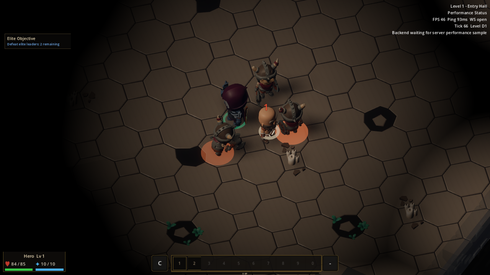
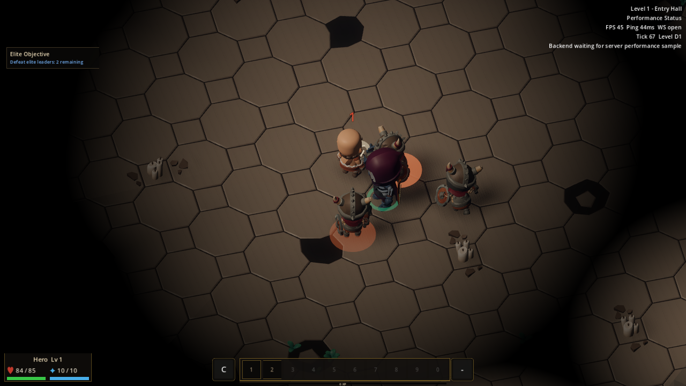
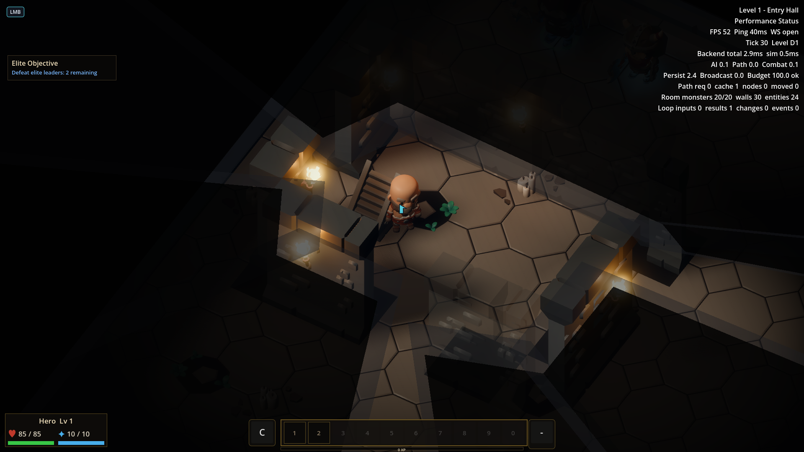
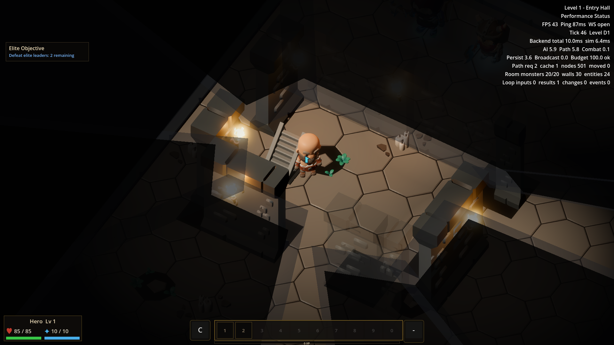

# v498 As-Built — Dungeon light and readability

- **Date:** 2026-09-30
- **Spec:** [`v498_spec-dungeon-light-readability.md`](../specs/v498_spec-dungeon-light-readability.md) · **Plan:** [`v498_2026-09-30-dungeon-light-readability.md`](../plans/v498_2026-09-30-dungeon-light-readability.md)
- **Scope:** client presentation only. No monster visibility rule, combat result, geometry, or default tier change.

## Implementation and visual finding

The shared fog presentation catalog changes isometric explored-space ambient suppression from directional/ambient `0.35/0.12` to `0.50/0.22`, while preserving unexplored darkness and the distinct deep palettes. Balanced and Performance retain their existing effect differences. Captures of an engaged enemy show a brighter floor with the nearby enemy and player still distinct.

A real camera capture uncovered a separate lifecycle defect: `DungeonTorchLights` had placed its flame meshes and lights under `StaticWalls`, which `WallRenderer` clears when the layout changes. The debug mount count still reported planned placements. The torch root now lives under the scene instead; level teardown clears it explicitly. The debug state reports **actual rendered nodes** and the bot requires at least two before capture. The final shallow torch route rendered 32 torch nodes and visibly shows flame meshes and warm pools in both tiers. A speculative mount-inset/height trial did not help and was reverted.

| Balanced engaged enemy, old | Balanced engaged enemy, tuned |
|---|---|
|  |  |

| Torch view, Balanced | Torch view, Performance |
|---|---|
|  |  |

Additional real-renderer frames in `assets/v498/` cover shallow loot, depth-5 boss warning, and depth-8 deep vault in both tiers. The shallow scenario obtains and drops an actual sword, asserts a loot entity before capture, and shows it with fog and HUD. The boss line and health context remain legible. The depth-8 palette remains cooler than shallow and depth-5 scenes. Earlier baseline frames are saved alongside them, but different live ticks and animations mean they are qualitative comparisons rather than pixel-aligned A/B images.

## Matched performance budget

The pre-tuning budget in the plan was at most `max(0.5 ms, 5%)` added to frame/process p95, `max(10 calls, 5%)` added draw calls, and `max(20 ms, 10%)` added first-spawn cost. The final A/B compared the old and tuned ambient values with the torch lifecycle fix and v497 floor setting present on **both** sides. Three interleaved valid runs per side and tier used the same `dungeon_frame_pacing_probe` seed, level −1, 31 walls, 24 monsters, 2 interactables, stationary isometric camera, Forward+ Metal, 1920×1080, vsync, Godot 4.7.2, and Apple M4 Pro. Each run retained more than 1,500 steady frame intervals and a consecutive first-spawn trace. Values are medians of per-run p95 or per-run spawn wall times.

| Tier / metric | Old ambient | Tuned ambient | Budget result |
|---|---:|---:|---|
| Balanced frame interval p95 | 19.51 ms | 19.07 ms | pass |
| Balanced process p95 | 22.80 ms | 22.75 ms | pass |
| Balanced draw calls | 108 | 108 | pass |
| Balanced first-spawn process | 454.414 ms | 349.007 ms | pass; control spread was large |
| Performance frame interval p95 | 18.18 ms | 18.14 ms | pass |
| Performance process p95 | 21.24 ms | 21.42 ms | pass, +0.18 ms |
| Performance draw calls | 68 | 68 | pass |
| Performance first-spawn process | 339.185 ms | 338.128 ms | pass |

The Balanced controls' first-spawn times ranged 332–465 ms, so their median difference is not a claimed optimization. The tuned catalog has no measured material regression against the preset budget. Raw reports, client/server counters, and per-frame spawn traces are under `.artifacts/v498-matched/{balanced,performance}/{before1,after1,before2,after2,before3,after3}/` in the integration worktree. Vsync, OS/GPU caches, and scene animation remain confounders; this host is not the requested lower-end target.

## Verification and limits

Focused integrated torch placement/viewpoint, engaged-enemy subject, bot, town, and trace tests pass. `make validate-shared` and `make maintainability` pass after integration; the combined `make ci` is reserved for the owner's single final gate. Windowed replay: `make bot-client SCENARIO=dungeon_light_readability_torch HEADLESS=0` and `make bot-client SCENARIO=dungeon_light_readability_engaged_enemy HEADLESS=0`. The boss, loot, shallow, and deep capture scenarios remain extended-tier, so the CI pack did not grow.

The torch frame proves visible mounts and pools at one selected shallow viewpoint; it does not exhaust every possible wall arrangement. Some distant enemies correctly remain obscured beyond explored fog. A matched depth-8 moving-combat recording is still broader evidence than these still frames and remains a useful follow-up.
