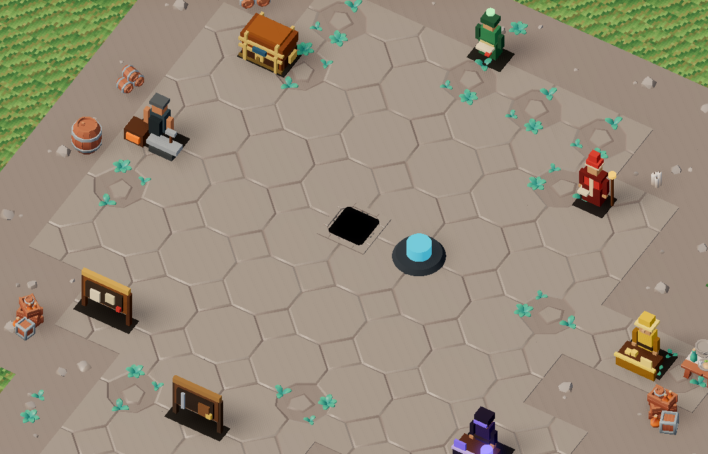
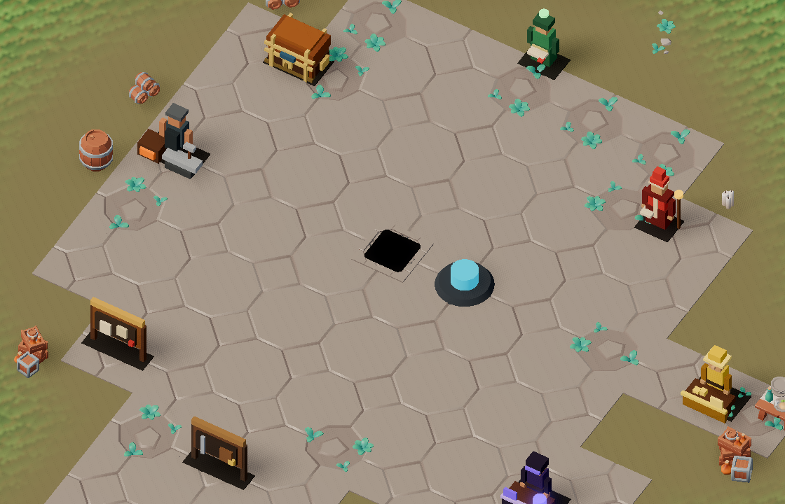
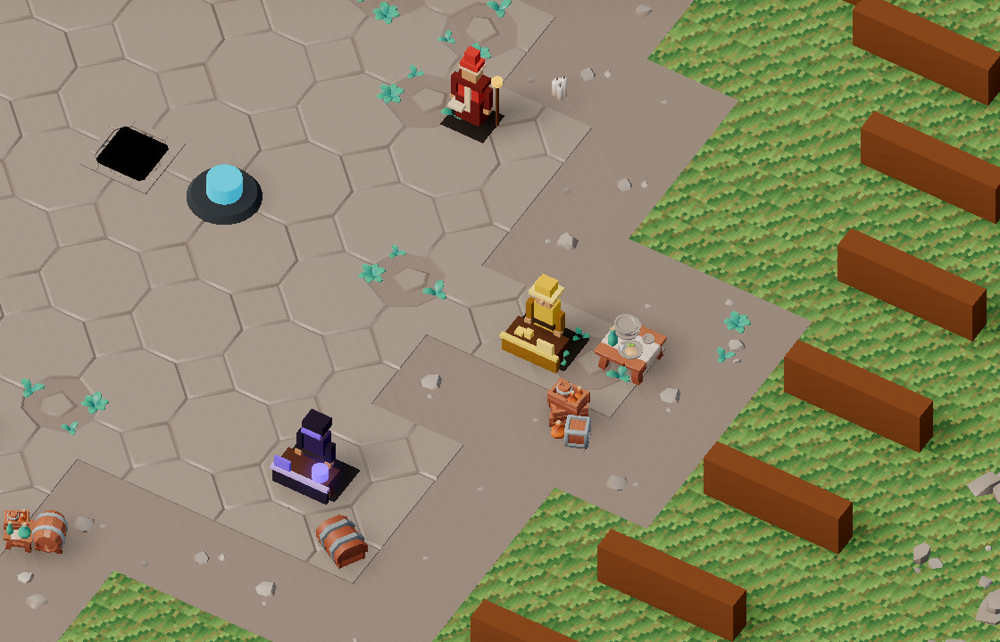
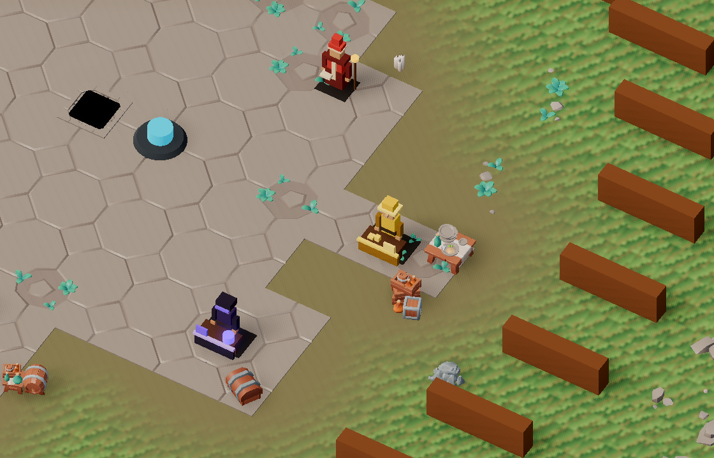
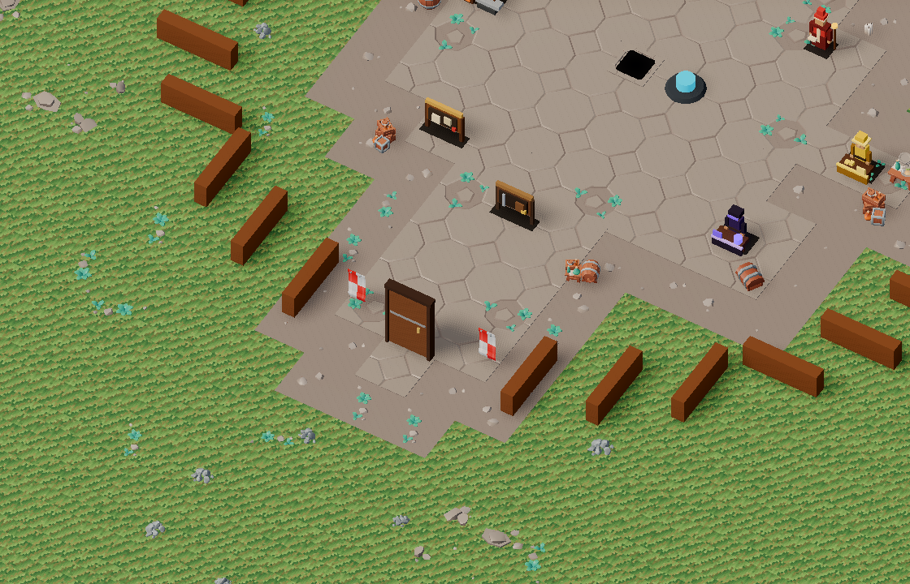
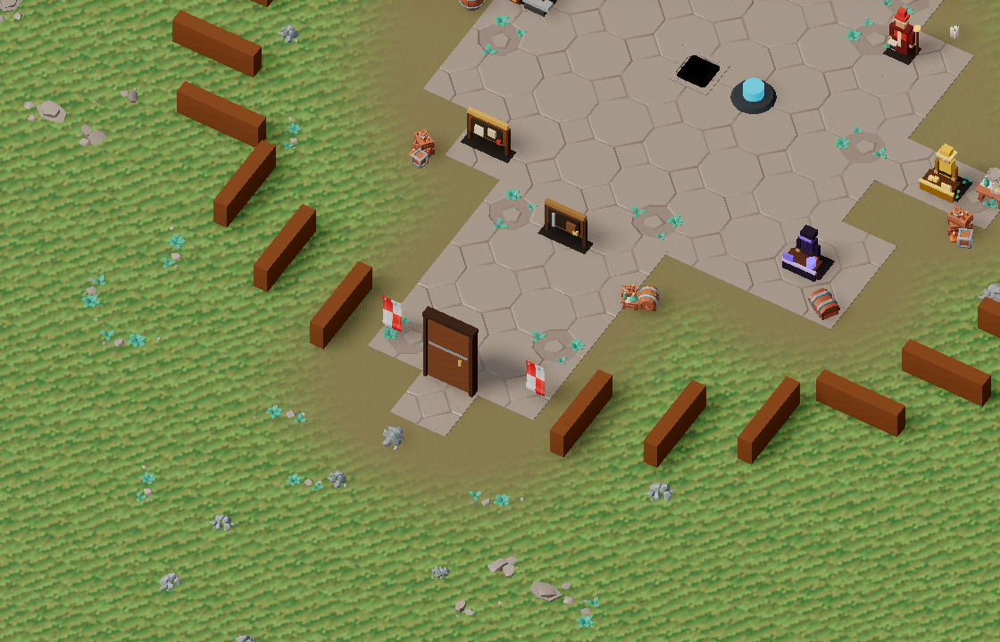
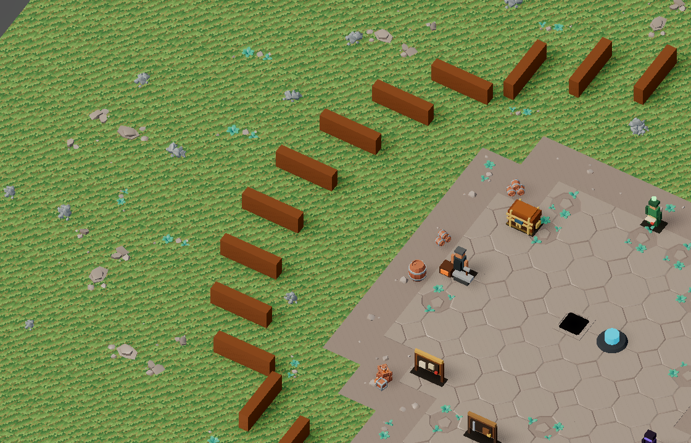
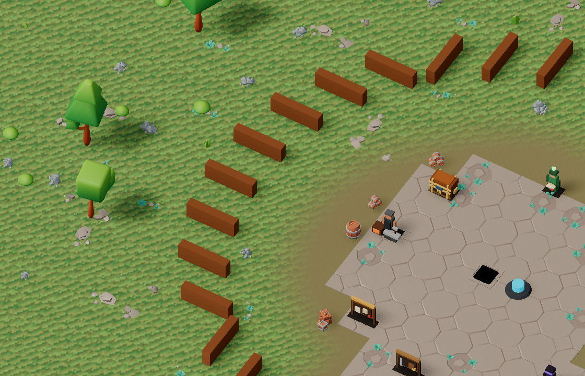
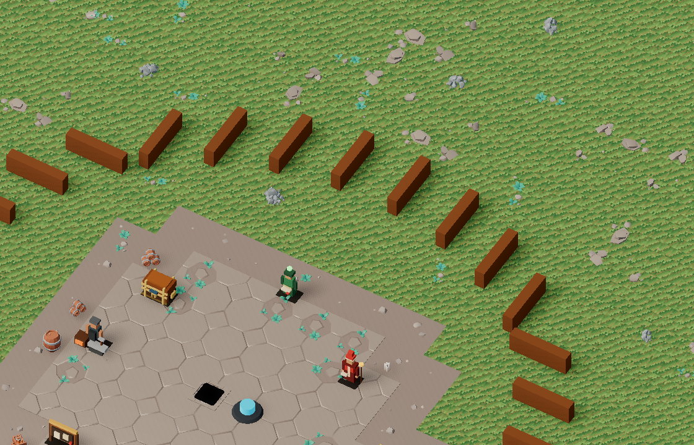
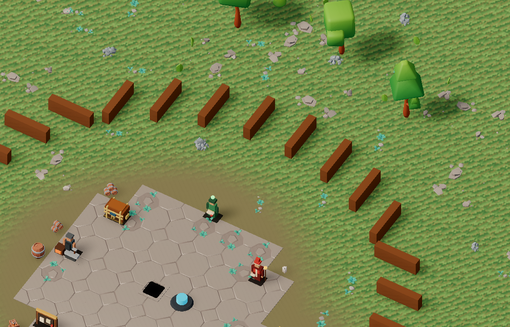

# v500 As-Built — Town terrain and nature landmarks

- **Date:** 2026-09-30
- **Spec:** [`v500_spec-town-terrain-landmarks.md`](../specs/v500_spec-town-terrain-landmarks.md) · **Plan:** [`v500_2026-09-30-town-terrain-landmarks.md`](../plans/v500_2026-09-30-town-terrain-landmarks.md)
- **Status:** Complete; combined `make ci` passed in 10m33s.

## What changed

- Disabled v493's taupe `dressing.edge` band after a controlled on/off capture with the new shader: the enabled version still has a second hard polygonal outline. The flag still works; the existing ground-detail tests force it on independently. A town-only world-space shader now blends the grass material through a soil transition around the plaza, gate road, and configured service-path capsules. Blend width, noise, soil color, and plane extent are schema-backed in `town_presentation.v0.json`.
- Extended the town ground plane from 140 × 90 m to 160 × 110 m through data. The new capture uses the live plane size and position, not the smaller overview preview ground. No world-plane void is visible in the six captured normal/max-zoom play-camera positions; that is evidence for those views, not an exhaustive proof of every playable position.
- Added north canopy and west pine groups outside the palisade. Each group has explicit tree landmarks plus weighted, deterministic bush/grass scatter. Placement excludes the fence ring, gate approach, gameplay anchors, props, paved service paths, and overlap with other nature footprints. Rendering batches repeated assets into one MultiMesh per asset ID. Nature has no collision or server state.
- Vendored four selected KayKit Forest Nature Pack 1.0 FREE runtime GLBs (`Tree_2_A_Color1`, `Tree_4_A_Color1`, `Bush_3_A_Color1`, `Grass_1_A_Color1`) with the pack's CC0 license and Godot-generated import texture dependencies. The original owner-supplied archive SHA-256 is `2ee83e63bb7695f2d884ec27ddf6fce020789a452e7d5c5b0bbdfc4f6ea1fc8c`; per-GLB hashes and source filenames are in `assets/manifests/assets.v0.json`. The author's [pack page](https://kaylousberg.itch.io/kaykit-forest) also identifies the free tier and CC0 license.
- Added a dedicated real-renderer `town-play` capture using the game's isometric camera angle and data-backed 12/20 zoom sizes, actual world-preset palisade geometry, runtime lighting, and the live ground extent. It leaves the older town overview focus intact.

## Visual evidence

The pairs below use the same camera position, zoom, resolution, and Balanced tier before and after. The current ground transition removes the second hard taupe band; the stone mesh edge itself remains geometric. Forest silhouettes are strongest near the west and north boundary at maximum zoom, leaving the service area unobstructed.

| View | Before | After |
|---|---|---|
| Plaza, normal zoom |  |  |
| Vendor, normal zoom |  |  |
| Gate, maximum zoom |  |  |
| West palisade, maximum zoom |  |  |
| North palisade, maximum zoom |  |  |

The [Performance-tier north capture](assets/v500/town-play-north-max-performance-after.png), [gate capture](assets/v500/town-play-gate-max-performance-after.png), and [plaza capture](assets/v500/town-play-plaza-normal-performance-after.png) retain readable services, ground, and nature. Visual inspection cannot establish a frame-time pass.

With the shader held constant, [temporarily enabling the old dirt edge](assets/v500/town-play-gate-max-edge-on-review.png) recreates the hard taupe polygon. The shipped flag remains off.

## Focused verification

| Check | Result |
|---|---|
| `make validate-shared` | PASS: 2204 shared checks; CODEMAP index passes. |
| `make validate-assets` | PASS: 447 checks including the four new GLBs, hashes, and budgets. |
| `godot --headless --path client --script res://tests/test_town_nature_landmarks.gd` | PASS: 498 checks for deterministic placement, exclusion, batching, flags, plane and shader data. |
| `godot --headless --path client --script res://tests/test_factories.gd` | PASS: 152 checks after updating the prior town-material assumption. |
| `.venv/bin/pytest -q tools/test_town_dressing.py tools/test_regen_screenshots.py tools/test_showme.py` | PASS: 23 tests. |
| `make regen-screenshots SUITE="scenes"` | PASS: 15/15 real-renderer captures; six new town-play views inspected. |
| `make bot-client SCENARIO=15_town_vendor_shop_panel HEADLESS=1` | PASS: 1/1. |
| `make bot-client SCENARIO=23_account_stash_panel HEADLESS=1` | PASS: 1/1. |
| `make bot-client SCENARIO=07_town_teleporter_auto_approach HEADLESS=1` | PASS: 1/1. |
| `make maintainability` | PASS: file-size and extraction-coupling ratchets. |
| `make client-unit` | PASS on the final run after all implementation changes. The first run exposed one factory-test assumption about StandardMaterial; the updated focused test and full reruns pass. |

## Integrated moving-camera frame comparison

The `v500_town_render_route` fixture uses a town level-0 seed, 30-tick settle, and six repetitions of the same three player positions with the actual isometric camera following. For the control, the catalog temporarily disables the v500 terrain blend and nature groups, restores the v493 dirt edge, and uses the old 140×90 ground extent; the candidate uses the shipped v500 catalog. No implementation code or other slice setting changes between sides. Three interleaved passing runs per side/tier used Godot 4.7.2, Forward+ Metal, Apple M4 Pro, windowed 1280×720, vsync on, and the same bot input pace. Each run had 22–23 steady one-second samples and at least 1,320 frame intervals after tick 40. Values are medians of each run's p95 or steady median.

| Tier / metric | v493-style control | v500 candidate | Result |
|---|---:|---:|---|
| Balanced frame interval p95 | 20.81 ms | 20.74 ms | no regression |
| Balanced process p95 | 21.62 ms | 21.56 ms | no regression |
| Balanced draw calls | 402 | 402 | unchanged |
| Balanced primitives | 59,716 | 60,796 | +1.8% |
| Performance frame interval p95 | 20.74 ms | 20.81 ms | +0.07 ms |
| Performance process p95 | 21.69 ms | 20.98 ms | no regression |
| Performance draw calls | 203 | 202 | −1 |
| Performance primitives | 34,631 | 34,873 | +0.7% |

Both tiers meet the previously set v498-style allowed deltas of at most `max(0.5 ms, 5%)` on frame/process p95 and `max(10 calls, 5%)` on draw calls. This is a **matched town** control/candidate comparison; the dungeon v497 absolute values use a different scene and resolution and are not an absolute town target. Raw allowlisted frame batches, client counters, and PASS status are under `.artifacts/v500-perf/{balanced,performance}-{before,after}{1,2,3}/`. The retained logs omit account and session identifiers. Vsync caps the median frame interval; these p95 and process readings show the cost on this host, not a low-end GPU guarantee.

## Startup and process memory

A separate, opt-in first-spawn trace timed the `TownDressing` build before the initial snapshot, while an external sampler followed only the newly launched Godot game process (excluding asset-import and preflight processes) and read macOS RSS every 0.2 seconds. Two matched pairs per tier passed the same route. Each process supplied 113–114 RSS samples; the table uses the median of the **last half** of samples in each run, then the median of two runs. This is resident process memory, including renderer resources; it is not a direct GPU allocation breakdown.

| Tier / measure | v493-style control | v500 candidate | Difference |
|---|---:|---:|---:|
| Balanced late-run RSS | 534.6 MiB | 538.4 MiB | +3.8 MiB |
| Balanced town dressing build | 63.86 ms | 61.05 ms | within run variation |
| Performance late-run RSS | 522.8 MiB | 526.6 MiB | +3.9 MiB |
| Performance town dressing build | 62.36 ms | 60.69 ms | within run variation |

Raw startup lines, RSS samples, and per-run summaries are under `.artifacts/v500-perf/memory-{balanced,performance}-{before,after}{5,6}/`. Earlier exploratory memory runs were discarded from this table after identifying the runner's short-lived preflight Godot process; the accepted probe excludes it and pins one new game PID. The small added residency is consistent with the four imported nature models and their textures. Startup timing is bounded to dressing construction; it does not include external account/network setup or shader cache warm-up. A lower-end machine remains unmeasured.

## Remaining limits

- The moving-camera route proves the measured frame/draw budget on the combined v497/v498 client. The startup/RSS probe above measures a separate process lifetime and does not prove memory behavior across an hour-long session.
- The play-camera captures cover fixed plaza, vendor, gate, west, and north positions. A final integrated gameplay pass should inspect crowns over moving characters and targets and any extreme corner view for ground-plane exposure.
- The tree groups are intentionally beyond the palisade and mostly appear in maximum-zoom boundary views; normal plaza views emphasize the unobstructed service area. This is a visual tradeoff to reassess in the integrated review if the town needs stronger nature presence from the center.

Buildings, plugin adoption, server collision, protocol, and world-preset gameplay changes remain outside v500.
