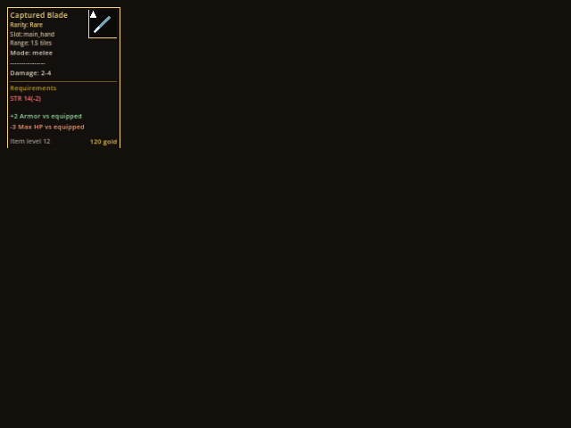
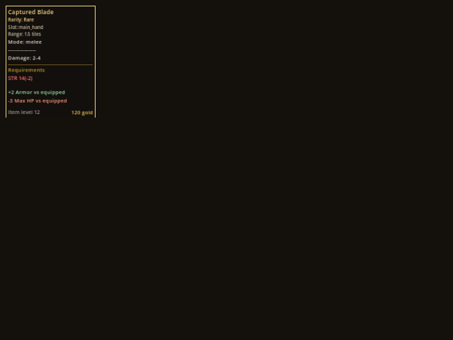

# v532 As-built — Item tooltip without icon preview

- **Status:** Complete — focused slice verification plus the combined `make ci` on the integrated v532–v537 state (CI OK, 11 stages, 20m36s, 2026-10-03). `make ci-full` was not run.
- **Date:** 2026-10-02
- **Spec:** [`v532_spec-tooltip-no-icon.md`](../specs/v532_spec-tooltip-no-icon.md) · **Plan:** [`v532_2026-10-02-tooltip-no-icon.md`](../plans/v532_2026-10-02-tooltip-no-icon.md)
- **Base:** `dab60eb5` (`main`). Standalone run; no branch or worktree.
- **Scope:** Godot client presentation and showme tooling only. No protocol, server, shared rules, golden or asset-manifest change.

## What changed

- `client/scripts/item_tooltip_panel.gd` (391 → 326 lines): removed the `ItemPreview` inner class, its instantiation, the `top_row` wrapper, `PREVIEW_SIZE`, `PREVIEW_GAP`, `MAIN_STAT_WIDTH`, `ICON_FONT_SIZE`, and the `ItemIconDrawer` and `RarityCuePresenter` imports. Main lines are `CONTENT_WIDTH` wide in every case.
- `setup(...)` keeps its signature. Pruning `item_presentations` and `fallback_label` would have shifted positional arguments at 11 production call sites plus tests (above the spec's 12-edit threshold), so both parameters are renamed `_item_presentations` and `_fallback_label` with a comment. **Follow-up:** prune them with a full call-site sweep.
- New `item-tooltip` showme focus and suite (five rarities): `client/scripts/showme/showme_item_tooltip_capture.gd`, `skills/showme/scripts/render_focus.py`, `tools/showme/screenshot_catalog.py`, `tools/test_regen_screenshots.py`, `skills/showme/SKILL.md`.
- `client/tests/test_inventory_tooltip_content.gd`: new `_test_tooltip_is_text_only` (no icon-preview node, every text label spans `CONTENT_WIDTH`, empty tooltip unchanged). It failed on the old panel and passes now.

## Verification

| Command | Result |
|---|---|
| `godot --headless --path client --script res://tests/test_inventory_tooltip_content.gd` | PASS, 70 passed (59 before, +11 new) |
| Same for `test_shop_panel`, `test_shop_tooltip_stability`, `test_stash_panel`, `test_character_stats_panel`, `test_look_and_feel_polish` | PASS, 206 / 6 / 121 / 54 / 10 (identical to the pre-change run) |
| `.venv/bin/pytest tools/test_regen_screenshots.py tools/test_showme.py -q` | PASS |
| `make maintainability`, `git diff --check` | PASS; no grandfathered file grew |
| `make regen-screenshots-list` | lists `item-tooltip` with 5 captures |

`make ci` and `make ci-full` were **not** run (no shared contract, protocol, golden or server change).

## Visual evidence

Real-renderer captures at 640×480, before (`dab60eb5`) and after, for all five rarities: [`assets/v532/`](assets/v532/) (`before-<rarity>.png`, `after-<rarity>.png`). Rare, before vs after:

| Before | After |
|---|---|
|  |  |

The icon box is gone; the text, rarity line, rule, requirement, comparison and footer lines are unchanged. Tooltip height did not change, because the 96 px preview was shorter than the text column beside it, so the saving is horizontal only. The capture window is small relative to the 360 px tooltip, so text is dense; the images prove layout, not typography.

## Limits and recorded decisions

- **Non-hue rarity cue:** the preview also drew the v508 slot shape-and-letter cue. The tooltip no longer carries it. The `Rarity: X` text line, rarity-colored name, and rarity-weighted border and rule remain, and the hovered slot still shows the cue.
- **Leak warnings:** the Godot headless runs of `test_shop_tooltip_stability`, `test_stash_panel` and `test_look_and_feel_polish` print `CanvasItem` RID and ObjectDB leak warnings at exit. They are identical (same counts) on the unmodified panel, so they predate this slice.
- Only the shared `ItemTooltipPanel` was visually captured, with one fixture item. The per-panel wrappers (stash, shop, market, wallet) are covered by their existing tests, not by new captures.
- Raw captures also remain under ignored `.artifacts/v532/`; the committed copies are the ones in `assets/v532/`.
