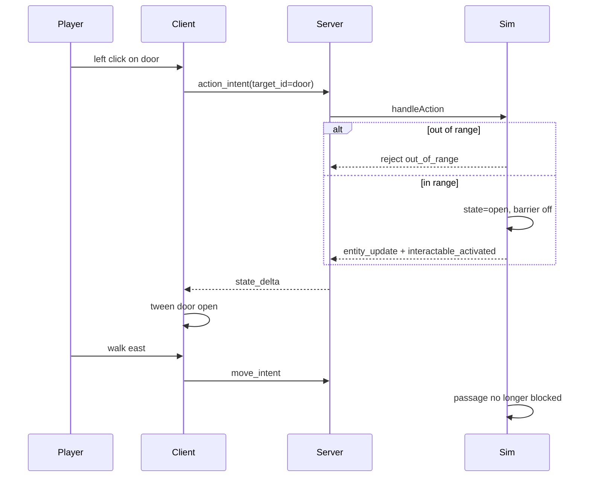

# Spec: `click-action-and-melee-range`

Status: Draft
Branch: `feature/click-action-and-melee-range`
Slice: v10 — unified left-click action, authoritative melee reach, door interactable proof
Baseline: slice v9 `solid-collision-and-obstacles` (complete, `make ci` green)
Related:

- [`v9_spec-solid-collision-and-obstacles.md`](v9_spec-solid-collision-and-obstacles.md) — wall collision; door barrier reuses AABB checks
- [`v8_spec-equipped-weapon-damage.md`](v8_spec-equipped-weapon-damage.md) — equipped weapon `reach` follows same item-rules pattern as `damage`
- [`../PROGRESS.md`](../PROGRESS.md)
- [`../godot-plugins-and-shortcuts.md`](../godot-plugins-and-shortcuts.md)
- ADR-0001 (authoritative server, shared rules-as-data, golden fixtures)
- ADR-0007 (client-only presentation; door swing animation is client-side)

## 1. Purpose

Replace separate attack / pickup inputs with one **Action** verb on **left click**, enforce **melee reach** on the server, and prove **activatable world objects** with a door that visibly opens and clears a movement barrier.

After this slice:

- **Left click** ray-picks a target entity and sends `action_intent { target_id }`.
- The server resolves the action by target type:
  - live **monster** → attack (existing combat path + reach gate)
  - **loot** → pickup (existing inventory path + reach gate)
  - **interactable** (closed door) → activate → `open` state, barrier removed, `interactable_activated` event
- **Melee reach** comes from shared rules: equipped weapon `reach`, else `combat.unarmed_reach`.
- Out-of-range intents reject with reason `out_of_range` (not `invalid_target`).
- **E** no longer picks up loot; **Q** still equips first inventory item (unchanged).
- A new `door_lab` world places a closed door blocking passage; the bot opens it and walks through; Godot plays a simple door-swing animation when state becomes `open`.
- `attack_intent` and `pick_up_intent` are removed from the active protocol path (bot, smoke, replay, client all migrate to `action_intent` in the same slice).

The proof is **rules data → unified intent → reach math → interactable state → golden fixtures → bot scenario → visible door**, not polished UI or pathfinding.

## 2. Current Problems

### 2.1 Split verbs for the same player gesture

`client/scripts/main.gd` binds left click to aim-cone attack selection and **E** to `loot_ids[0]`. There is no click-to-target for loot, and no shared “use” path for doors or future activatables.

### 2.2 No authoritative range gate

`handleAttack` and `handlePickUp` accept any distance. PROGRESS and v0/v7/v8 specs explicitly deferred pickup and attack range. Combat feel and bot scenarios do not require walking into melee range.

### 2.3 No interactable entity model

Entity kinds are `player`, `monster`, `loot`. Static `wall` presets block movement but cannot be opened or clicked. Doors need mutable session state (closed/open) reconstructible from replayed inputs.

## 3. Non-goals

- **No click-to-move or pathfinding.**
- **No ranged weapons** or per-action-type reach (all melee for v10).
- **No miss tuning, armor, healing, respawn.**
- **No equip on click** — equip stays on **Q** / bot `equip_intent`.
- **No inventory UI** or floating “out of range” text (reject reason is enough for agents; client may noop silently).
- **No two-way doors** (close again), key/lock puzzles, or animated server-side geometry — toggle closed→open once.
- **No protocol version bump** beyond adding `action_intent` and extending entity/event shapes in v0 schemas (coordinated client+server update).
- **No production door art** — simple box panel + rotation tween like v9 wall primitives.
- **No monster attack animation** on retaliation (unchanged from v4).

## 4. Required Design

### 4.1 Protocol: `action_intent`

Add client message:

```json
{
  "type": "action_intent",
  "payload": { "target_id": "1002" }
}
```

Remove from active use (same slice, coordinated):

- `attack_intent`
- `pick_up_intent`

Server `handleAction`:

1. Resolve `target_id` to entity; reject `invalid_target` if missing or not actionable.
2. Compute `playerReach()` from equipped weapon rules or `combat.unarmed_reach`.
3. If `distance(player, target) > playerReach + targetInteractionRadius(target)` → reject `out_of_range`.
4. Dispatch:
   - `monster` (hp > 0) → existing attack logic
   - `loot` → existing pickup logic
   - `interactable` (state `closed`) → open door logic (§4.5)
   - `interactable` (state `open`) → reject `invalid_target` (already used)

Reject reasons (stable strings for bot assertions):

| Reason | When |
|--------|------|
| `out_of_range` | Target exists but beyond melee reach |
| `invalid_target` | Unknown id, wrong type, dead monster, open door, etc. |
| `invalid_payload` | Missing `target_id` |
| `player_dead` | Unchanged |

### 4.2 Melee reach (shared rules)

**`shared/rules/combat.v0.json`**

```json
{
  "version": 0,
  "base_hit_chance": 1.0,
  "player_damage": { "min": 2, "max": 4 },
  "unarmed_reach": 1.0
}
```

**`shared/rules/items.v0.json`** — extend `rusty_sword`:

```json
"rusty_sword": {
  "name": "Rusty Sword",
  "slot": "weapon",
  "equippable": true,
  "damage": { "min": 3, "max": 5 },
  "reach": 1.5
}
```

**Reach resolution (server, at action time):**

```text
if weapon slot equipped and item.reach defined → use item.reach
else → combat.unarmed_reach
```

**Distance check (2D world units, same space as movement):**

```text
dist = hypot(player.x - target.x, player.y - target.y)
maxDist = playerReach + targetInteractionRadius(target)
in range iff dist <= maxDist + epsilon
```

**Interaction radii (constants in sim, documented in golden):**

```text
monster:      0.45  (matches monsterRadius)
loot:         0.35
interactable: 0.50
```

Golden fixture `shared/golden/melee_reach.v0.json` — cross-language cases for distance + reach + radius → `in_range` boolean. Go `game_test` and GDScript `test_golden.gd` consume it.

### 4.3 Client: click-to-target Action

Replace `_try_attack_toward_mouse` aim-cone selection with **raycast picking**:

1. Project camera ray from mouse into the 3D scene.
2. Entity nodes (monster, loot, interactable/door) expose a pick collider (`Area3D` or `StaticBody3D`) with metadata `entity_id`.
3. On left click: resolve topmost hit → `action_intent { target_id }`.
4. Face target on click. Play attack one-shot only for monster and closed-door targets
   (presentation feedback even if server rejects range); loot clicks do not play attack.
5. Remove **E** pickup binding and autoplay/smoke `pick_up_intent` / `attack_intent` usage.

Optional fallback (implement only if raycast misses thin door panel in practice): ground-point pick within small radius at click — defer unless needed during implementation.

### 4.4 Interactable rules catalog

New file **`shared/rules/interactables.v0.json`** + schema:

```json
{
  "version": 0,
  "interactables": {
    "wooden_door": {
      "name": "Wooden Door",
      "initial_state": "closed",
      "barrier_when_closed": {
        "size": { "x": 1.0, "y": 0.25 }
      }
    }
  }
}
```

- `barrier_when_closed` — axis-aligned rectangle centered on entity position; blocks player movement while `state == closed` (same AABB math as v9 walls).
- `initial_state` — always `closed` in v10.

### 4.5 Door state and collision

**World preset entry:**

```json
{
  "type": "interactable",
  "interactable_def_id": "wooden_door",
  "position": { "x": 4, "y": 5 }
}
```

**Sim entity fields:**

```text
kind: interactable
interactableDefID: wooden_door
state: closed | open
```

**On successful `action_intent` targeting closed interactable:**

1. Set `state = open`.
2. Emit `entity_update` with `state: "open"`.
3. Emit event `{ event_type: "interactable_activated", entity_id, correlation_id }`.
4. Closed-door barrier no longer checked in `playerPositionBlocked`.

**Replay/resume:** door state is derived only from recorded `action_intent` inputs — no separate persistence field.

### 4.6 Wire shape extensions

**`state_delta` / `session_snapshot` entity enum** — add `interactable`:

```json
{
  "id": "1005",
  "type": "interactable",
  "position": { "x": 4, "y": 5 },
  "interactable_def_id": "wooden_door",
  "state": "closed"
}
```

**Event** — add `interactable_activated` (requires `entity_id`; no extra payload in v10).

### 4.7 `door_lab` world

New preset in `shared/rules/worlds.v0.json`:

```text
door_lab
  player at (0, 5)
  wooden_door interactable at (4, 5) — blocks east-west passage
  static wall segments flanking the doorway (type wall) so routing is impossible until door opens
  loot at (8, 5) beyond the door — proves passage after open
```

Layout sketch (top-down, y = north):

```text
  wall   [DOOR]   wall
  ----   closed   ----
  P @0,5          loot @8,5
```

Bot must: reject action on door from far → walk into reach → `action_intent` on door → `interactable_activated` → walk through → `action_intent` on loot → inventory add.

### 4.8 Client door presentation (ADR-0007)

- Spawn interactable nodes from `entity_spawn` / `entity_update` like monsters and loot.
- Closed: upright box panel (distinct color from static walls).
- On `state == open` (from `entity_update` or after `interactable_activated` event): tween rotation ~90° around hinge edge (client-only; server sends state only).
- Pick collider stays on door node for the closed state; open door does not block movement visually or logically.

Plugin adoption: **reject** — same rationale as v9 walls; simple in-repo mesh + tween.

## 5. Architecture and flow

```text
left click
  → client raycast → target_id
  → action_intent
  → server: reach check
  → dispatch attack | pickup | open door
  → state_delta (entity_update / inventory / events)
  → client: reconcile + door swing animation on open
```



## 6. Bot and scenario migration

**New:** `tools/bot/scenarios/04_door_lab.json`

Steps (illustrative):

1. `action_entity` on door → expect reject `out_of_range`
2. `move_until_in_range` of door (new bot helper)
3. `action_entity` on door → wait `interactable_activated`
4. `move_until_player_position` east of door
5. `action_entity` on loot → wait `item_picked_up`

Assertions: `door_open`, `loot_picked_up` (or inventory contains item beyond door).

**Migrate existing scenarios** (`01`, `02`, `03`) to use `action_intent` via new bot actions:

- `action_until_event` (replaces `attack_until_event` + loot pickups)
- `action_entity` with optional `expect_reject: out_of_range`

Remove bot sends of `attack_intent` / `pick_up_intent`.

**Protocol example cleanup:** delete `shared/protocol/examples/attack_intent.json` and
`shared/protocol/examples/pick_up_intent.json` in the same schema migration. `make validate-shared`
validates every file under `shared/protocol/examples/`, so stale examples must not remain after the
message enum drops those types.

## 7. Acceptance criteria

1. `action_intent` is in protocol schema with example; `attack_intent` / `pick_up_intent` removed from schema enum (coordinated migration).
2. Server rejects attack/pickup/door activation beyond melee reach with `out_of_range`.
3. Equipped `rusty_sword` uses `reach: 1.5`; unarmed uses `unarmed_reach: 1.0`.
4. Go and GDScript golden tests pass for `melee_reach.v0.json`.
5. Closed `wooden_door` blocks movement; open door does not; static flanking walls still block.
6. `door_lab` proves passage gating: the player cannot reach the beyond-door loot while the door is
   closed, then can open the door, move through the doorway, and pick up the loot.
7. `door_lab` bot scenario passes including replay and reconnect resume.
8. Existing scenarios `01_vertical_slice`, `02_gear_before_combat`, `03_collision_lab` pass using `action_intent`.
9. Godot client: left click on monster/loot/door sends `action_intent`; door visibly swings open on activation.
10. Godot smoke migrates to `action_intent` and stays green.
11. `make ci` green.

## 8. Testing plan

### Shared validation

```bash
make validate-shared
```

Must validate: `combat.unarmed_reach`, item `reach`, interactables catalog, world `interactable` entries, protocol `action_intent`, removed stale attack/pickup examples, entity `interactable` type, and `interactable_activated` event shape. The event schema must require `entity_id` for `interactable_activated` in both `state_delta.events` and `session_snapshot.recent_events`.

### Go tests

```bash
cd server && go test ./internal/game/... -run 'Melee|Action|Door|Reach|Interactable'
```

Required coverage:

- `TestMeleeReachGolden` — cases from `melee_reach.v0.json`
- `TestActionRejectsOutOfRange` — monster, loot, door
- `TestActionAttackAndPickupInRange` — parity with pre-v10 outcomes when adjacent
- `TestDoorOpensAndClearsBarrier` — cannot pass at x=6 when closed; can after action
- `TestDoorLabClosedDoorPreventsPassageUntilActivated` — cannot reach/pick beyond-door loot before
  opening; can reach and pick it up after activation
- `TestScriptedSliceMatchesGolden` — still passes (walk into range in bot; golden slice inputs may need reach-adjusted positions)

Also migrate replay and WebSocket integration tests away from stored/sent `attack_intent` and
`pick_up_intent` payloads:

- `server/internal/replay/replay_test.go`
- `server/internal/http/ws_test.go`

### Python / bot

```bash
make bot
.venv/bin/python -m pytest tools/bot/test_protocol.py -q -k 'door|action'
```

### Client

```bash
make client-smoke
make bot-visual   # optional: watch door_lab door swing in replay playlist
```

### Full gate

```bash
make ci
```

## 9. Open questions

| # | Question | Proposed answer |
|---|----------|-----------------|
| 1 | Keep `attack_intent` as server alias? | **No** — single `action_intent`; cleaner replay and bot. |
| 2 | Door barrier size? | **`1.0 × 0.25`** — narrow panel at entity center; tune in `door_lab` if bot cannot reproduce block. |
| 3 | Attack anim on door click? | **Yes** — same one-shot as today; cheap feedback before server ack/reject. |
| 4 | Pick priority if ray hits multiple colliders? | **Closest hit along ray** (Godot default raycast sort). |
| 5 | Golden slice outcome unchanged? | **Yes** if bot walks into range before first kill; update scenario steps, not `slice_outcome.json` combat math. |

## 10. Risks and mitigations

| Risk | Mitigation |
|------|------------|
| Existing scenarios fail range gates | Update bot to `move_until_in_range` before each action; positions unchanged in world presets. |
| Replay breaks on intent type rename | Migrate stored examples and bot in same PR; replay decodes `action_intent` via `inputdecode`. |
| Door raycast misses thin panel | Widen pick collider vs visual mesh; optional ground fallback. |
| RNG stream shift | Attack/pickup logic unchanged after range gate; door has no RNG. |
| Resume door state wrong | Reconstruct from inputs only; add reconnect assertion in `04_door_lab`. |
