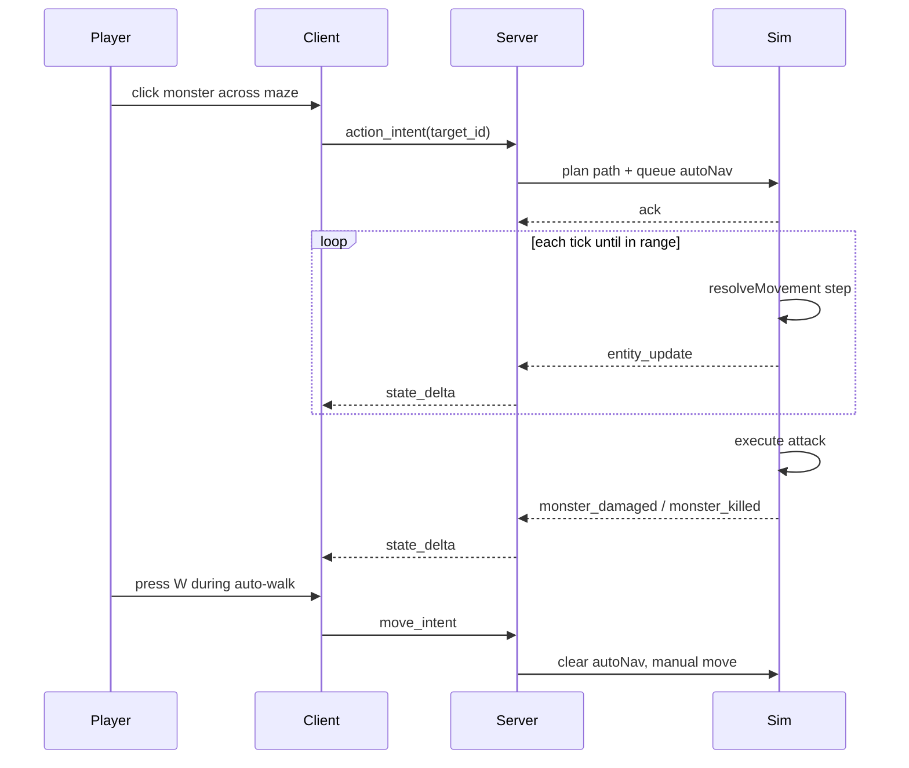

# Spec: `click-to-move-and-auto-path`

Status: Complete (2026-06-05)
Branch: `feature/click-to-move-and-auto-path`
Slice: v11 — server-authoritative click-to-move and auto-approach before action
Baseline: slice v10 `click-action-and-melee-range` (complete, `make ci` green on 2026-06-05)
Related:

- [`v10_spec-click-action-and-melee-range.md`](v10_spec-click-action-and-melee-range.md) — `action_intent`, melee reach, interactables
- [`v9_spec-solid-collision-and-obstacles.md`](v9_spec-solid-collision-and-obstacles.md) — wall/monster collision reused by pathfinder
- [`../PROGRESS.md`](../PROGRESS.md)
- [`../godot-plugins-and-shortcuts.md`](../godot-plugins-and-shortcuts.md)
- ADR-0001 (authoritative server, shared rules-as-data, golden fixtures, replay determinism)
- ADR-0007 (client-only presentation; path preview optional)

## 1. Purpose

When the player **left-clicks** the floor or an actionable entity (monster, loot, closed door),
the **server** plans a collision-aware path, walks the player along it, and — for entity clicks —
executes the action **only when** a valid path exists and the step budget allows it.

After this slice:

- **Floor click** → `move_to_intent { position }` → server queues auto-move to that point.
- **Entity click** → `action_intent { target_id }` → if already in melee reach, execute immediately
  (v10 behavior); if out of range, server plans approach path then executes action on arrival.
- If **no path** exists → reject `no_path` (no movement, no action).
- If path **exceeds** shared step limit → reject `path_too_long` (no movement, no action).
- **WASD** `move_intent` **cancels** any queued auto-navigation immediately and resumes manual control (Diablo-style).
- A new **`path_maze`** world and bot scenario **`05_path_maze.json`** prove a **single**
  `action_intent` on a far monster routes through a wall maze and kills it — no scripted waypoints.
- Grid path results are covered by **`shared/golden/auto_path.json`**: Go asserts exact
  authoritative planner output; GDScript validates the same fixture/rules contract unless optional
  client prediction is implemented, in which case it must assert the same path output too.

The proof is **shared navigation rules → deterministic grid A\* → server auto-nav queue →
`move_to_intent` / auto-approach `action_intent` → maze bot scenario → replay/resume parity**,
not NavMesh polish or monster AI.

## 2. Current Problems

### 2.1 Click does nothing useful on open ground

`client/scripts/main.gd` `_try_action_at_mouse()` returns early when raycast misses an entity.
Players cannot click-to-move.

### 2.2 Out-of-range actions fail instead of approaching

v10 `handleAction` rejects `out_of_range` immediately. Bots and humans must manually walk into
melee range (`move_until_in_range`, WASD) before every action. This does not scale to maze layouts.

### 2.3 No authoritative pathfinding

v9/v10 explicitly deferred pathfinding. Bot `walk_toward` uses greedy axis-aligned steps and fails
on non-trivial mazes. `03_collision_lab.json` hardcodes two `move_until_player_position` steps
through a single wall gap — the opposite of “one click, find the route.”

### 2.4 No enforceable auto-path budget

Without a server-owned step limit, clients could spam long auto-walk sequences; agents cannot assert
fair bounds on navigation cost.

## 3. Non-goals

- **No NavMesh / Godot NavigationServer as authority** — world stays data-driven from shared rules.
- **No client-only pathfinding as source of truth** — client may predict; server owns outcomes.
- **No monster AI or monster pathfinding.**
- **No partial auto-walk** — if an action click cannot complete (no path / over budget), reject
  upfront with **zero** movement.
- **No line-of-sight gate** for melee — reach remains distance-based (v10).
- **No ranged weapons**, miss tuning, healing, respawn.
- **No path preview UI requirement** — optional client debug line; not an acceptance gate.
- **No equip on click** — equip stays on **Q** / bot `equip_intent`.
- **No protocol version bump** beyond adding `move_to_intent` and new reject reasons in v0 schemas.
- **No floating “no path” UI** — reject reason is enough for agents; client may noop silently.

## 4. Required Design

### 4.1 Shared navigation rules

New file **`shared/rules/navigation.v0.json`** + schema:

```json
{
  "version": 0,
  "cell_size": 1.0,
  "max_auto_steps": 100,
  "grid_bounds": {
    "min_x": -2,
    "min_y": -2,
    "max_x": 16,
    "max_y": 12
  },
  "stop_distance": 0.25
}
```

| Field | Meaning |
|-------|---------|
| `cell_size` | World units per grid cell for obstacle rasterization and A\*. In v11 this must equal authoritative `moveSpeed` (`1.0`) so one planned grid edge consumes exactly one movement tick. |
| `max_auto_steps` | Maximum planned steps per auto-nav intent; reject `path_too_long` if exceeded |
| `grid_bounds` | Axis-aligned world rectangle searched by pathfinder (inclusive) |
| `stop_distance` | Floor-click arrival tolerance (`hypot` to goal ≤ this value) |

Go sim and GDScript golden evaluator load the same file. Constants `playerRadius`, wall AABB math,
and interactable closed barriers match v9/v10 sim code. The Go rules loader rejects
`navigation.cell_size != moveSpeed` in v11; supporting finer grids later requires emitting scaled
movement deltas instead of unit directions.

### 4.2 Protocol: `move_to_intent`

Add client message:

```json
{
  "type": "move_to_intent",
  "payload": { "position": { "x": 5.0, "y": 7.0 } }
}
```

Server `handleMoveTo`:

1. Validate payload; clamp/reject `invalid_payload` if `position` missing or non-finite.
2. If player already within `stop_distance` of goal → ack immediately (no movement).
3. Plan path from current player position to goal using §4.4.
4. If no path → reject `no_path`.
5. If `len(path) > max_auto_steps` → reject `path_too_long`.
6. Else queue auto-nav (no pending action); ack intent.

Add to `messages.v0.schema.json` enum and `$defs/move_to_intent`. Add
`shared/protocol/examples/move_to_intent.json`.

### 4.3 Protocol: `action_intent` auto-approach

Payload unchanged:

```json
{
  "type": "action_intent",
  "payload": { "target_id": "1002" }
}
```

Server `handleAction` (replaces immediate `out_of_range` reject):

1. Resolve `target_id`; reject `invalid_target` if missing or not actionable (v10 rules).
2. If `inMeleeRange(target)` → dispatch attack / pickup / door activation immediately; ack.
3. Else compute **approach goal**: nearest reachable, unblocked grid cell where `inMeleeRange`
   would be true for this target (search concentric rings around target center in stable cell
   order). Candidate cells must be within navigation bounds, must not be blocked for the player,
   and must have a valid path from the current player position.
4. Plan path from player to approach goal (§4.4).
5. If no path → reject `no_path`.
6. If `len(path) > max_auto_steps` → reject `path_too_long`.
7. Else queue auto-nav with **pending action** `{ target_id, source message_id }`; ack once at
   queue time.

On arrival at approach goal, execute the same dispatch as step 2 (attack / pickup / open door).
If target became non-actionable during walk (e.g. monster died, loot picked up by another session
rule — N/A in solo, but monster hp==0) → clear queue silently; **do not** emit a second reject.
Pending-action dispatch must also **not** emit a second `intent_accepted` for the source
`message_id`; implementation should use an internal no-ack dispatch helper instead of directly
calling helpers that already ack immediate actions.

**Removed reject reason for action approach:** `out_of_range` no longer emitted for
`action_intent`. Bots asserting `expect_reject: out_of_range` must migrate (see §6).

New reject reasons (stable strings):

| Reason | When |
|--------|------|
| `no_path` | No collision-free route to floor goal or melee approach cell |
| `path_too_long` | Route exists but exceeds `navigation.max_auto_steps` |
| `invalid_target` | Unchanged |
| `invalid_payload` | Unchanged |
| `player_dead` | Unchanged |

### 4.4 Pathfinding (server, deterministic)

Implement grid **A\*** in `server/internal/game/pathfind.go` (name illustrative):

**Obstacle rasterization (per planning call, from current sim state):**

- Static `wall` AABBs from world preset → blocked cells.
- Live monsters (`hp > 0`) → circle rasterized to blocked cells.
- Closed interactables → `barrier_when_closed` AABB rasterized to blocked cells.
- Dead monsters and open doors → non-blocking (v9/v10).

**Search:**

- 8-connected grid (diagonal steps allowed); step cost 1 per cell transition.
- Heuristic: octile distance (consistent with 8-way movement).
- Tie-breaking: prefer lower `y`, then lower `x` node coordinates (stable ordering for replay).

**Output:**

- Sequence of **unit direction vectors** `{x, y} ∈ {-1,0,1}`, one per tick. Because
  `navigation.cell_size == moveSpeed == 1.0` in v11, each planned grid edge maps to exactly one
  call through existing `resolveMovement` (preserves v9 axis slide). Diagonal vectors are normalized
  by the same `normalize` function used for manual movement before multiplying by `moveSpeed`.

**Consumption:**

- Sim holds optional `autoNav` state:
  ```text
  steps: []Vec2          // remaining unit directions
  pendingAction: *Action // nil for move_to_intent; already acked at queue time
  ```
- Each tick in `applyMovement`: if `autoNav` active and no manual move override, pop next direction,
  apply one step via `resolveMovement`, emit `entity_update` on change.
- When steps exhausted:
  - `move_to_intent`: clear `autoNav`.
  - `action_intent`: if target is still actionable and `inMeleeRange`, run no-ack action dispatch;
    else clear queue without action (should not happen if planning correct — covered by tests).

**Manual override (decision A — approved):**

- Any accepted `move_intent` **clears** `autoNav` (including pending action) before applying manual
  direction. Player control takes precedence immediately.

**New navigation intent while auto-nav active:**

- Latest `move_to_intent` or `action_intent` **replaces** the queue (re-plan from current position).

### 4.5 Golden fixture: `shared/golden/auto_path.json`

Cross-language contract for path planner outputs on **pinned** layouts (no live sim RNG):

```json
{
  "version": 0,
  "navigation": { "cell_size": 1.0, "max_auto_steps": 100, "...": "..." },
  "cases": [
    {
      "name": "path_maze_start_to_monster_approach",
      "world_id": "path_maze",
      "start": { "x": 0, "y": 5 },
      "goal": { "x": 10, "y": 5 },
      "goal_mode": "melee_approach",
      "target_kind": "monster",
      "unarmed_reach": 1.0,
      "expected_step_count": 24,
      "expected_end": { "x": 9.0, "y": 5.0 }
    }
  ]
}
```

Exact `expected_step_count` and `expected_end` are finalized during implementation when
`path_maze` geometry is tuned. Go `game_test` asserts equality against authoritative planner
output. GDScript `test_golden.gd` must at minimum validate that the fixture references existing
rules/worlds and that `navigation.cell_size` matches the expected client movement scale; if client
path prediction is added in v11, GDScript must also assert exact planner equality.

### 4.6 Client: click routing

Update `_try_action_at_mouse()` (or split helpers):

1. Raycast entities (unchanged pick colliders).
2. If entity hit → `action_intent { target_id }` (face target; attack one-shot for monster/closed
   door as v10).
3. Else → project mouse to ground (`_mouse_ground_point`) → `move_to_intent { position: {x, y} }`
   using world X/Z as sim X/Y.

**Local prediction (optional, same slice if low cost):**

- If client-side prediction is implemented, mirror grid A\* in GDScript and assert it against
  `auto_path.json`; otherwise do not duplicate the planner just for presentation.
- On intent send, start client-side predicted walk along path; reconcile to server `entity_update`
  as today. If server rejects (`no_path`), snap back — no persistent ghost movement.

**WASD:** unchanged binding; each `move_intent` send cancels server auto-nav per §4.4.

**Autoplay / visual replay:** unchanged unless extended later; not an acceptance gate.

### 4.7 `path_maze` world

New preset in `shared/rules/worlds.v0.json`:

```text
path_maze
  player at (0, 5)
  training_dummy_reward at (10, 5)
  wall segments forming a corridor maze — no straight line from player to monster;
  requires at least two turns (unlike collision_lab single gap)
```

Layout sketch (top-down, `#` = wall centerlines, `P` player, `M` monster):

```text
y=8   . # # # # # # .
y=7   . # . . . . # .
y=6   . # . # # # # .
y=5   P . . . . . # M
y=4   # # # # # . # .
y=3   . . . . . . . .
```

Exact wall `position` / `size` entries are tuned so:

- Greedy `walk_toward` **fails** or stalls against walls.
- A\* path exists within `max_auto_steps`.
- Monster is **not** in melee reach from player start.

Godot renders walls from shared rules (same as v9/v10).

### 4.8 Architecture and flow

```text
left click (entity)
  → action_intent
  → server: in range? execute : plan path
  → no path / too long? reject
  → else queue autoNav + pendingAction
  → each tick: step via resolveMovement
  → on arrival: attack | pickup | open door

left click (floor)
  → move_to_intent
  → server: plan path → queue autoNav (no pending action)

WASD move_intent
  → clear autoNav
  → manual move (v9 collision)
```



## 5. Bot and scenario changes

### 5.1 New: `tools/bot/scenarios/05_path_maze.json`

```json
{
  "id": "path_maze",
  "world_id": "path_maze",
  "title": "Path maze",
  "description": "Single action_intent on a far monster routes through the maze and kills it.",
  "steps": [
    {
      "action": "action_once_until_event",
      "monster_def_id": "training_dummy_reward",
      "event_type": "monster_killed"
    }
  ],
  "assertions": [
    { "type": "monster_dead", "monster_def_id": "training_dummy_reward" }
  ]
}
```

No `move_until_*` steps. `action_once_until_event` sends exactly one `action_intent`, waits through
auto-navigation ticks, and fails if that one message is rejected. This avoids repeatedly replacing
the active auto-nav queue while waiting for the final event. Scenario must pass `/state`, reconnect
resume, and replay like existing catalog entries.

Optional bot helper `click_action` alias → same as `action_entity` / `action_once_until_event`
(no new protocol).

### 5.2 Migrate `04_door_lab.json`

Replace far-click `expect_reject: out_of_range` + manual `move_until_in_range` with:

1. Single `action_entity` on door → wait `interactable_activated` (auto-walk opens door).
2. `move_to_intent` or second `action_entity` on beyond-door loot (implementation choice — prefer
   one `action_entity` on loot after door opens if auto-path reaches it).

Document final steps in plan; goal is fewer scripted waypoints, not more.

### 5.3 Existing scenarios

`01`, `02`, `03` remain green. `03_collision_lab` may keep scripted waypoints (still valid for
collision proof) or simplify later — **not required** for v11 acceptance.

Remove bot reliance on `expect_reject: out_of_range` for `action_intent`.

## 6. Acceptance criteria

1. `move_to_intent` in protocol schema with example; envelope enum updated.
2. Server queues deterministic auto-nav; consumes one planned step per tick through `resolveMovement`.
3. `action_intent` auto-approaches when out of range; executes action on arrival; `out_of_range`
   no longer emitted for `action_intent`.
4. `no_path` and `path_too_long` rejects emit with **no** player movement.
5. `move_intent` (WASD) clears queued auto-nav and pending action immediately.
6. New `navigation.v0.json` loaded by sim; `max_auto_steps` enforced.
7. Go golden tests pass for exact `auto_path.json` path output; GDScript golden tests pass for
   `auto_path.json` fixture/rules consistency, and exact output too if client prediction is added.
8. `path_maze` bot scenario passes with **one** action step that sends exactly one
   `action_intent` — no `move_until_*`, no repeated action loop.
9. `04_door_lab` updated; replay and reconnect resume green.
10. Scenarios `01`–`04` and new `05` pass; `make ci` green.
11. Godot: floor click sends `move_to_intent`; entity click sends `action_intent`.
12. Godot smoke updated if it assumes immediate `out_of_range` behavior.

## 7. Testing plan

### Shared validation

```bash
make validate-shared
```

Must validate: `navigation.v0.json`, `auto_path.json`, `path_maze` world walls, `move_to_intent`
schema, protocol example.

### Go tests

```bash
cd server && go test ./internal/game/... -run 'Path|AutoNav|MoveTo|NoPath|Maze'
```

Required coverage:

- `TestAutoPathGolden` — cases from `auto_path.json`
- `TestMoveToIntentRejectsNoPath` — sealed goal
- `TestMoveToIntentRejectsPathTooLong` — goal beyond step budget ( synthetic narrow corridor )
- `TestActionIntentAutoApproachAndAttack` — path_maze layout in unit test
- `TestManualMoveCancelsAutoNav` — queue cleared on `move_intent`
- `TestNewClickReplacesAutoNav` — second intent re-plans
- `TestPendingActionDoesNotDoubleAck` — queued action acks once at queue time and not again on arrival
- `TestPathMazeBotScenarioDeterministic` — end position + monster dead after recorded inputs

### Python / bot

```bash
make bot
.venv/bin/python -m pytest tools/bot/test_protocol.py -q -k 'path_maze|door'
```

### Client

```bash
make client-smoke
make bot-visual   # optional: watch path_maze walk in replay playlist
```

### Full gate

```bash
make ci
```

## 8. Open questions

| # | Question | Proposed answer |
|---|----------|-----------------|
| 1 | WASD during auto-path? | **A — cancel immediately** (user confirmed). |
| 2 | Default step budget? | **`max_auto_steps: 100`** (~5 s at 20 Hz). Tune in `path_maze` if needed. |
| 3 | Keep `out_of_range` for anything? | **No** for `action_intent` / `move_to_intent`; use `no_path` / `path_too_long`. |
| 4 | 4-way vs 8-way paths? | **8-way** with octile heuristic; matches diagonal `move_intent` normalization. |
| 5 | Client path preview? | **Optional**; golden + server authority sufficient for v11. |
| 6 | Plugin adoption? | **Reject** NavMesh plugins — grid A\* in-repo mirrors collision rules. |

## 9. Risks and mitigations

| Risk | Mitigation |
|------|------------|
| Replay drift from non-deterministic open-set ordering | Stable A\* tie-break; golden pins expected paths. |
| `door_lab` behavior change | Update scenario to test auto-approach; drop `out_of_range` step. |
| Path planner / slide mismatch | Each step goes through `resolveMovement`, not teleport. |
| Step budget too low for maze | Tune `path_maze` geometry or raise `max_auto_steps` in rules + golden. |
| Client prediction desync | Reconcile to server position each delta; reject clears prediction. |
| RNG stream shift | Auto-nav does not roll RNG; combat only on action dispatch (unchanged). |
