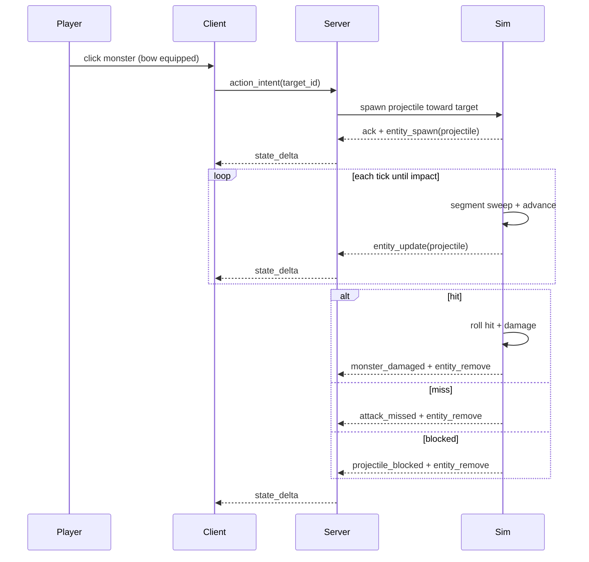

# Spec: `ranged-projectile-combat`

Status: Complete
Branch: `feature/ranged-projectile-combat`
Slice: v12 — server-authoritative ranged weapons with traveling projectiles and impact-time hit resolution
Baseline: slice v11 `click-to-move-and-auto-path` (complete on `feature/solid-collision-and-obstacles`, `make ci` green on 2026-06-05)
Related:

- [`v11_spec-click-to-move-and-auto-path.md`](v11_spec-click-to-move-and-auto-path.md) — auto-approach before action; generalize reach for ranged standoff
- [`v10_spec-click-action-and-melee-range.md`](v10_spec-click-action-and-melee-range.md) — unified `action_intent`, weapon `reach`, interaction radii
- [`v9_spec-solid-collision-and-obstacles.md`](v9_spec-solid-collision-and-obstacles.md) — wall AABB and monster circle collision reused by projectile sweep
- [`v8_spec-equipped-weapon-damage.md`](v8_spec-equipped-weapon-damage.md) — weapon `damage` resolution at hit time
- [`v4_spec-take-a-hit.md`](v4_spec-take-a-hit.md) — `attack_missed`, retaliation only on successful hits
- [`../../PROGRESS.md`](../../PROGRESS.md)
- [`../godot-plugins-and-shortcuts.md`](../godot-plugins-and-shortcuts.md)
- ADR-0001 (authoritative server, shared rules-as-data, golden fixtures, replay determinism)
- ADR-0007 (client-only presentation; projectile mesh/tween is client-side)

## 1. Purpose

When the player equips a **ranged weapon** and **left-clicks** a monster, the server spawns an
authoritative **projectile** that travels in a straight line at weapon-defined speed, respects
**walls and live monster bodies**, and resolves **hit chance and damage at impact** — not at fire
time.

After this slice:

- Weapons may declare **`attack_mode: "ranged"`** plus **`projectile_speed`** in
  `shared/rules/items.v0.json`. Melee weapons (default) keep today's instant attack path unchanged.
- **`action_intent { target_id }`** on a live monster with a ranged weapon equipped:
  - If already within **ranged reach** and the straight shot line is clear → spawn projectile
    immediately; ack intent.
  - If out of range or the straight shot line is blocked → v11 auto-approach to a **ranged
    standoff cell with clear line of fire**, then spawn on arrival (same ack-on-queue semantics as
    melee auto-approach).
- Each sim tick advances in-flight projectiles; collision uses a **segment sweep** from previous
  position to new position against v9 wall AABBs, closed interactable barriers, and live monster
  circles with deterministic nearest-hit selection and stable tie-breaks.
- On monster impact: roll **`combat.base_hit_chance`** at impact tick; on hit roll damage from
  equipped weapon (v8 path) and apply retaliation rules (v4); on miss emit `attack_missed` with
  the original action's `correlation_id`.
- On wall/barrier impact or max travel distance: remove projectile; emit `projectile_blocked` or
  `projectile_expired` (no damage).
- **`projectile`** is a wire-visible ephemeral entity (`entity_spawn` / `entity_update` /
  `entity_remove`) so replay, resume, and Godot can render flight without client-side physics
  authority.
- New **`ranged_lab`** world and bot scenario **`06_ranged_lab.json`** prove: kill beyond melee
  range through a wall gap; blocked straight-line clicks auto-move until the shot is clear; replay
  and resume parity.
- Golden fixture **`shared/golden/ranged_projectile.json`** pins flight ticks, collision outcomes,
  and impact-time hit/miss for Go and GDScript.

The proof is **weapon rules → projectile sim → segment collision → impact combat → golden fixtures
→ bot scenario → replay/resume parity**, not spell systems, piercing, or production bow art.

**Inventory UI is out of scope.** Bot and **Q** equip remain the equip path. A simple placeholder
projectile mesh on the client is sufficient (ADR-0007).

## 2. Current Problems

### 2.1 All combat is instant melee

`dispatchAction` on a monster always calls `attackTarget`, which resolves hit and damage on the
same tick as the accepted `action_intent`. There is no travel time, no line-of-sight, and no way to
prove collision-aware ranged combat.

### 2.2 Weapon `reach` only models melee touch distance

v10 uses `reach` as melee standoff. PROGRESS and v10/v11 non-goals explicitly deferred ranged
weapons. A bow cannot meaningfully use the same instant-resolution path without faking range as
"long melee," which skips collision and projectile presentation.

### 2.3 Hit chance exists but only applies at fire time for melee

`attackTarget` rolls hit and damage when the action executes. For ranged combat, rolling at fire
time would ignore target movement and cover during flight. The sim already emits `attack_missed`
and skips retaliation on miss (v4); the hook exists but timing is wrong for projectiles.

### 2.4 No projectile entity on the wire

Entity kinds are `player`, `monster`, `loot`, `interactable`, `wall` (static preset only). Clients
cannot render an authoritative in-flight shot without inventing local-only physics.

### 2.5 Auto-approach always plans for melee cells

v11 `findMeleeApproachGoal` searches cells where `inMeleeRange` is true. A ranged weapon needs
approach goals where **`inActionRange`** (ranged reach) holds instead, while loot and door actions
stay melee-only.

## 3. Non-goals

- **No spell / cast-bar system** — reuse projectile machinery later; v12 is weapon-driven only.
- **No piercing**, multi-target shots, AoE, or homing projectiles.
- **No monster ranged AI** or monster-fired projectiles.
- **No predictive leading** — aim at target position at fire tick only.
- **No changing melee hit timing** — melee keeps instant resolution; `combat.base_hit_chance` stays
  `1.0` in committed rules so existing bot scenarios do not start missing.
- **No ranged pickup or ranged door activation** — loot and interactables remain melee `action_intent`.
- **No line-of-sight reject** — if the player clicks a ranged target while the straight shot is
  blocked, the server queues auto-navigation to a reachable clear-line standoff instead of
  rejecting. A projectile only spawns from a position where the initial shot sweep to the target is
  clear.
- **No sub-tick physics** beyond one segment sweep per tick per projectile.
- **No multiple simultaneous player projectiles** — at most one in-flight player projectile; a
  second ranged fire while one is active rejects `projectile_busy`.
- **No `training_bow` visual mapping requirement** — item rules + placeholder projectile mesh only.
- **No armor, stat modifiers, healing, respawn.**
- **No protocol version bump** beyond extending entity enum and event types in v0 schemas
  (coordinated client+server update).
- **No production bow art or VFX plugins** — simple in-repo capsule/arrow mesh + position reconcile.

## 4. Required Design

### 4.1 Item rules: ranged weapons

Extend **`shared/rules/items.v0.json`** and **`items.v0.schema.json`**:

```json
"training_bow": {
  "name": "Training Bow",
  "slot": "weapon",
  "equippable": true,
  "attack_mode": "ranged",
  "damage": { "min": 2, "max": 4 },
  "reach": 16.0,
  "projectile_speed": 50.0
}
```

| Field | Meaning |
|-------|---------|
| `attack_mode` | Optional. `"melee"` (default) or `"ranged"`. |
| `reach` | **Melee:** max touch distance (v10). **Ranged:** max **fire distance** and projectile **max flight distance** from spawn point along aim direction. |
| `projectile_speed` | Required when `attack_mode == "ranged"`. World units per second. |
| `damage` | Same as v8; rolled at impact on successful hit. |

Schema conditionals:

- If `attack_mode == "ranged"` → require `projectile_speed`, `damage`, `reach`, `slot`, `equippable: true`.
- If `attack_mode` omitted or `"melee"` → `projectile_speed` forbidden; existing v8/v10 item rules unchanged.
- `rusty_sword` stays melee; no `attack_mode` field.

Add initial loot spawn of `training_bow` in **`ranged_lab`** world (see §4.8); other worlds unchanged.

### 4.2 Combat reach resolution

Add sim helpers (names illustrative):

```text
playerAttackMode() → "melee" | "ranged"   // from equipped weapon; default melee
playerActionReach() → float64             // weapon reach or unarmed_reach
inActionRange(target) → bool              // dist <= playerActionReach() + targetInteractionRadius(target) + epsilon
```

**Dispatch rules for `action_intent`:**

| Target kind | Equipped mode | Behavior |
|-------------|---------------|----------|
| `monster` | melee | Instant `attackTarget` (unchanged) |
| `monster` | ranged | Spawn projectile if in range; else auto-approach for ranged standoff |
| `loot` | any | Melee reach + instant pickup (unchanged) |
| `interactable` | any | Melee reach + instant activate (unchanged) |

Replace `inMeleeRange` checks in `handleAction` / `finishAutoNav` with **`inActionRange`** for
monster targets only. Loot and door pending actions still require **`inMeleeRange`**.

**Auto-approach goal search (v11 generalization):**

- For monster + ranged weapon: find the nearest reachable cell from the player's current position
  where **`inActionRange(monster)`** is true and **`hasClearRangedShot(cell, monster)`** is true
  (not necessarily adjacent).
- For monster + melee, loot, door: keep **`inMeleeRange`** goal search (existing v11 behavior).

**Clear-line requirement for ranged dispatch:**

- The same obstacle categories used by projectile sweep block a shot line: static walls, closed
  interactable barriers, and live monsters.
- The intended target monster does **not** count as a blocker for the clear-line pre-check; other
  live monsters do.
- If the player is already in ranged reach but the shot line is blocked, `action_intent` queues
  auto-navigation instead of spawning a projectile that would immediately hit cover.
- If no reachable in-range clear-line standoff exists, reject with `no_path` (or `path_too_long`
  when the found path exceeds `navigation.max_auto_steps`).
- `finishAutoNav` re-checks both range and clear line before dispatching the pending ranged action.

### 4.3 Projectile sim (server, deterministic)

**Constants (sim, documented in golden):**

```text
projectileRadius = 0.10
tickDuration     = 0.05   // 20 Hz; same as existing sim tick rate
maxPlayerProjectilesInFlight = 1
```

**Internal projectile state** (not all fields required on wire):

```text
id            uint64
ownerID       uint64          // player entity id
targetID      uint64          // intended monster at fire time (for events/correlation)
pos           Vec2
prevPos       Vec2            // segment sweep start each tick
dir           Vec2            // unit vector, fixed at spawn
speed         float64         // from weapon projectile_speed
traveled      float64         // accumulated distance from spawn
maxDistance   float64         // weapon reach at spawn time
damageRange   DamageRange     // snapshot from equipped weapon at spawn
sourceMsgID   string
sourceCorrID  string
```

**Spawn (on accepted ranged monster action):**

1. Reject `projectile_busy` if player already has an in-flight projectile.
2. Compute `dir = normalize(target.pos - player.pos)`. If `dir` is zero (coincident), use `{x: 1, y: 0}`.
3. Spawn at `player.pos` (no muzzle offset in v12).
4. Emit `entity_spawn` with type `projectile` (§4.6).
5. Ack intent if not already acked (auto-approach arrival uses no-ack dispatch like v11).

**Per-tick integration** (after movement, before `tick++`; order: process all projectiles in
**ascending projectile id** for stable replay):

```text
delta = speed * tickDuration
candidate = pos + dir * delta
sweep segment from pos → candidate against obstacles (§4.4)
if hit:
  resolve impact (§4.5)
  entity_remove projectile
  continue
if traveled + segmentLength >= maxDistance:
  emit projectile_expired
  entity_remove projectile
  continue
prevPos = pos
pos = candidate
traveled += segmentLength
entity_update projectile
```

**RNG:** projectile motion is deterministic (no RNG). Combat RNG runs only in impact resolver
(§4.5). Projectile spawn does **not** consume hit/damage draws.

### 4.4 Segment collision sweep

Each tick, test the line segment `[prevPos, candidate]` (at spawn tick, `prevPos = spawn pos`).

The sweep treats the projectile as a circle, not a dimensionless point:

- Segment-vs-AABB tests inflate wall / barrier AABBs by `projectileRadius`.
- Segment-vs-monster tests use `monsterRadius + projectileRadius`.

**Hit selection:**

1. Compute the earliest segment intersection parameter `t` in `[0, 1]` for every blocking wall,
   closed interactable barrier, and live monster.
2. Pick the smallest `t`.
3. If multiple objects share the same `t` within epsilon, tie-break by category order
   `wall` → `closed interactable` → `monster`, then by ascending entity id for entity categories.

This preserves physical "nearest impact wins" behavior while keeping deterministic ties stable.

**Obstacle categories:**

1. Static **`wall`** AABBs from world preset — `circleIntersectsAABB` equivalent for moving point
   along segment; use segment-vs-inflated-AABB intersection. Emit **`projectile_blocked`**; no
   damage.
2. **Closed interactables** — same inflated-AABB math as v9 `barrier_when_closed`. Open doors are
   non-solid.
3. **Live monsters** (`hp > 0`) — segment vs expanded circle intersection. Dead monsters are
   non-solid (v9).

**No hit on segment:** advance projectile to `candidate`.

Reuse existing collision constants: `monsterRadius`, wall sizes from world rules, interactable
barrier sizes from `interactables.v0.json`.

### 4.5 Impact resolution

**Monster impact:**

1. `hitDraw := rng.Next()`
2. `hit := base_hit_chance >= 1.0 || float64(hitDraw%10000)/10000.0 < base_hit_chance`
3. If miss → emit `attack_missed` with `entity_id = monster id`, `correlation_id = sourceCorrID`.
   **No retaliation** (v4).
4. If hit:
   - `dmgDraw` via `rollRange(damageRange)` (same span formula as v8)
   - Apply HP, `monster_damaged`, kill/loot/retaliation — same as `attackTarget` post-hit path
   - Always consume damage roll on hit branch; on miss branch consume only hit draw (mirror melee
     two-draw independence if damage roll is eagerly computed — prefer: roll damage only when hit,
     but document RNG stream shift vs melee in tests; golden pins ranged seeds separately)

**Recommended RNG discipline (match melee intent):**

```text
hitDraw := rng.Next()
if hit:
  dmg := rollRange(damageRange)  // uses rng.IntN internally
else:
  // do not roll damage
```

Golden fixtures must pin outcomes for pinned seeds; unit tests that compare cross-intent RNG streams
are not required for v12 acceptance.

**Wall / barrier impact:** `projectile_blocked` event with `entity_id` omitted or set to blocking
wall index if useful for debug — v12 event requires no extra payload; optional `entity_id` on
blocked events is **not** added unless needed for client (client can play generic hit VFX).

**Max range:** `projectile_expired` with `correlation_id = sourceCorrID`.

### 4.6 Wire shape extensions

**`state_delta` / `session_snapshot` entity enum** — add `projectile`:

```json
{
  "id": "1010",
  "type": "projectile",
  "position": { "x": 3.5, "y": 5.0 },
  "owner_id": "1001",
  "target_id": "1002",
  "projectile_def_id": "training_arrow"
}
```

| Field | Required | Notes |
|-------|----------|-------|
| `id`, `type`, `position` | yes | Standard entity shape |
| `owner_id` | yes | Attacker entity id (player) |
| `target_id` | yes | Original monster target at fire time |
| `projectile_def_id` | yes | Visual key for client; v12 constant `"training_arrow"` |

Direction/speed need not appear on wire if client interpolates between tick positions; optional
`velocity` field is **deferred** — client uses position deltas.

**Events** (extend `state_delta` event schema where applicable):

| Event | When | Required fields |
|-------|------|-----------------|
| `attack_missed` | Ranged impact miss | `entity_id`, `correlation_id` |
| `projectile_blocked` | Wall/barrier hit | `correlation_id` |
| `projectile_expired` | Max range without hit | `correlation_id` |
| `monster_damaged` / `monster_killed` | Unchanged | existing shape |

**Reject reasons:**

| Reason | When |
|--------|------|
| `projectile_busy` | Ranged fire while player projectile already in flight |
| `no_path` / `path_too_long` | Unchanged (v11 auto-approach) |
| `invalid_target` / `invalid_payload` / `player_dead` | Unchanged |

### 4.7 Golden fixture: `shared/golden/ranged_projectile.json`

Cross-language contract with **pinned** seeds and layouts (no live session RNG except where
declared):

```json
{
  "version": 0,
  "constants": {
    "projectile_radius": 0.10,
    "tick_duration": 0.05,
    "monster_radius": 0.45
  },
  "cases": [
    {
      "name": "ranged_lab_gap_kill",
      "world_id": "ranged_lab",
      "seed": "cafebabecafebabe",
      "player_position": { "x": 0, "y": 5 },
      "equipped_weapon": "training_bow",
      "target_monster_def_id": "training_dummy_ranged",
      "fire_tick": 0,
      "expected_impact_tick": 8,
      "expected_hit": true,
      "expected_damage_min": 2,
      "expected_damage_max": 4,
      "expected_monster_dead": true
    },
    {
      "name": "wall_blocks_direct_shot",
      "world_id": "ranged_lab",
      "seed": "deadbeefdeadbeef",
      "player_position": { "x": 0, "y": 3 },
      "equipped_weapon": "training_bow",
      "target_monster_def_id": "training_dummy_ranged",
      "fire_tick": 0,
      "expected_event": "projectile_blocked",
      "expected_monster_hp_unchanged": true
    },
    {
      "name": "impact_miss_no_retaliation",
      "world_id": "ranged_lab",
      "seed": "0123456789abcdef",
      "base_hit_chance": 0.0,
      "player_position": { "x": 2, "y": 5 },
      "equipped_weapon": "training_bow",
      "target_monster_def_id": "training_dummy_ranged",
      "expected_event": "attack_missed",
      "expected_player_hp": 10
    }
  ]
}
```

Exact tick counts and positions are finalized during implementation when `ranged_lab` geometry is
tuned. Go `game_test` asserts authoritative sim outcomes. GDScript `test_golden.gd` validates fixture
schema, rules references, and optionally replays cases if a lightweight GDScript projectile evaluator
is added; minimum bar: fixture/rules consistency like v11 `auto_path` optional path.

Add **`shared/golden/ranged_projectile.v0.schema.json`**; register in `tools/validate_shared.py`.

### 4.8 `ranged_lab` world

New preset in **`shared/rules/worlds.v0.json`**:

```text
ranged_lab
  player at (0, 5)
  loot: training_bow at (1, 5)          — pick up + equip before shot in bot
  monster: training_dummy_ranged at (14, 5)
  center wall segments above and below y=5, leaving a clear horizontal gap at y=5
  optional side wall segments so shots from y=3 hit wall before reaching the monster
```

Layout sketch (top-down):

```text
y=6   . . . . # . . . . .
y=5   P B . . G . . . . . . . . M
y=4   . . . . # . . . . .
      0 1     5             14

P = player start
B = training_bow loot
# = wall (center column above/below y=5 only — tune exact size entries)
G = gap cell (no wall)
M = training_dummy_ranged
```

Geometry constraints:

- Distance P→M **>** melee reach (`1.5`) and **≤** bow reach (`16.0`).
- Shot from `(0,5)` through gap **hits** monster.
- Shot from `(0,3)` (or similar) **hits wall** before monster.
- Auto-approach from far click still works if bot clicks from start without moving (already in range
  for bow after minimal equip walk).

Add **`training_dummy_ranged`** to **`shared/rules/monsters.v0.json`** — clone `training_dummy_reward`
stats unless tuning requires otherwise (hp low enough for one bow hit in bot).

### 4.9 Client presentation (ADR-0007)

- On `entity_spawn` with `type == "projectile"`: spawn placeholder mesh (thin box or arrow primitive)
  at authoritative position; store in entity map like monsters/loot.
- Each `entity_update`: snap or lerp to new position (client-only interpolation allowed).
- On `entity_remove`: despawn mesh.
- On `monster_damaged` / `attack_missed` with matching `correlation_id`: play existing hit/miss
  feedback on target.
- Player attack one-shot on ranged click (same as melee click presentation).
- **Reject plugin adoption** for projectile VFX — in-repo placeholder sufficient.

No client-side collision or hit prediction.

### 4.10 Architecture and flow

```text
left click monster + training_bow equipped
  → action_intent
  → server: inActionRange? spawn projectile : plan ranged approach path
  → ack (once)
  → each tick: advance projectile, segment sweep
  → monster hit: roll hit → damage / miss / retaliation
  → wall hit: projectile_blocked
  → max range: projectile_expired
  → entity_remove projectile
```



## 5. Bot and scenario changes

### 5.1 New: `tools/bot/scenarios/06_ranged_lab.json`

Illustrative structure:

```json
{
  "id": "ranged_lab",
  "world_id": "ranged_lab",
  "title": "Ranged lab",
  "description": "Equip training bow and kill monster through wall gap without entering melee range.",
  "steps": [
    { "action": "action_entity", "item_def_id": "training_bow", "event_type": "item_picked_up" },
    { "action": "equip_inventory_item", "item_def_id": "training_bow", "slot": "weapon" },
    {
      "action": "action_once_until_event",
      "monster_def_id": "training_dummy_ranged",
      "event_type": "monster_killed"
    }
  ],
  "assertions": [
    { "type": "monster_dead", "monster_def_id": "training_dummy_ranged" },
    { "type": "player_never_in_melee_range_of", "monster_def_id": "training_dummy_ranged" }
  ]
}
```

`player_never_in_melee_range_of` is a new bot assertion (or inline check in scenario runner) proving
the kill happened at range. Scenario must pass `/state`, reconnect resume, and replay.

Optional second scenario file or steps for wall-block case — can be Go-test-only via golden if bot
timing is awkward; prefer at least one bot happy path.

### 5.2 Existing scenarios

`01`–`05` remain green unchanged (melee sword path, no bow). No change to `combat.base_hit_chance`
in committed rules.

## 6. Acceptance criteria

1. `training_bow` in items rules with schema conditionals; `attack_mode`, `projectile_speed` validated.
2. Ranged monster `action_intent` spawns authoritative projectile; melee monster path unchanged.
3. Projectile advances at `projectile_speed * tickDuration` per tick with segment collision sweep.
4. Wall and closed-door barriers block projectiles; live monsters block; dead monsters do not.
5. Hit and damage roll at **impact** for ranged; miss emits `attack_missed` without retaliation.
6. `projectile_busy` reject when firing again before prior projectile resolves.
7. Auto-approach uses ranged standoff for bow + monster; loot/door stay melee approach.
8. `projectile` entity type on wire; spawn/update/remove in `state_delta`.
9. Events `projectile_blocked` and `projectile_expired` emitted with `correlation_id`.
10. Go golden tests pass for `ranged_projectile.json` cases.
11. GDScript golden tests validate fixture/rules consistency (and sim outcomes if evaluator added).
12. `06_ranged_lab.json` bot scenario passes including replay and reconnect resume.
13. Scenarios `01`–`05` and new `06` pass; `make ci` green.
14. Godot renders placeholder projectile during flight; no client authority over hit outcome.

## 7. Testing plan

### Shared validation

```bash
make validate-shared
```

Must validate: item `attack_mode` / `projectile_speed`, `ranged_lab` world, `training_dummy_ranged`,
`ranged_projectile.json` + schema, projectile entity type, new event types.

### Go tests

```bash
cd server && go test ./internal/game/... -run 'Ranged|Projectile|Bow'
```

Required coverage:

- `TestRangedProjectileGolden` — cases from `ranged_projectile.json`
- `TestRangedKillBeyondMeleeRange` — monster dies without player entering melee radius
- `TestProjectileBlockedByWall` — `projectile_blocked`, monster hp unchanged
- `TestRangedImpactMissNoRetaliation` — `attack_missed`, player hp unchanged
- `TestProjectileBusyRejectsSecondFire` — second ranged intent rejected
- `TestMeleeUnchangedWithRustySword` — instant attack path parity
- `TestRangedAutoApproachThenFire` — out-of-range click queues nav then spawns projectile
- `TestRangedReplayDeterministic` — recorded inputs reproduce projectile ticks and outcome

### Python / bot

```bash
make bot
.venv/bin/python -m pytest tools/bot/test_protocol.py -q -k 'ranged'
```

### Client

```bash
make client-smoke
make bot-visual   # optional: watch ranged_lab shot in replay playlist
```

### Full gate

```bash
make ci
```

## 8. Open questions

| # | Question | Proposed answer |
|---|----------|-----------------|
| 1 | Muzzle offset from player center? | **No** — spawn at player position in v12. |
| 2 | Roll damage on miss for RNG stream parity with melee? | **No** — roll damage only on hit; golden pins ranged seeds independently. |
| 3 | Ranged click on loot/door with bow equipped? | **Melee rules** — pickup/door still require `inMeleeRange`. |
| 4 | `projectile_def_id` catalog file? | **Inline constant** `"training_arrow"` in v12; optional `projectiles.v0.json` deferred. |
| 5 | Lower global `base_hit_chance` for gameplay? | **No** — keep `1.0` in rules; golden miss case overrides in test harness only. |
| 6 | Client lerp vs snap for projectile? | **Lerp optional**; server positions authoritative each tick. |
| 7 | Plugin adoption for bow/projectile art? | **Reject** — placeholder mesh in-repo. |

## 9. Risks and mitigations

| Risk | Mitigation |
|------|------------|
| Segment tunneling through thin walls | Segment sweep entire `[prevPos, candidate]` each tick; tune wall thickness in `ranged_lab`. |
| Replay drift from projectile tick ordering | Process projectiles in sorted id order; golden pins tick outcomes. |
| RNG stream shift for existing tests | Do not change `combat.v0.json` hit chance; ranged tests use dedicated seeds. |
| Auto-approach plans melee cell with bow equipped | Separate goal predicate for ranged vs melee in approach search. |
| Resume mid-flight projectile | Projectile in sim state + wire entity; reconstructs from tick stream on replay. |
| `06_ranged_lab` flaky range assertion | Assert minimum observed player–monster distance stays greater than melee reach threshold throughout run. |
| v11 pending action fires melee dispatch with bow | `finishAutoNav` branches on target kind + equipped mode before dispatch. |
