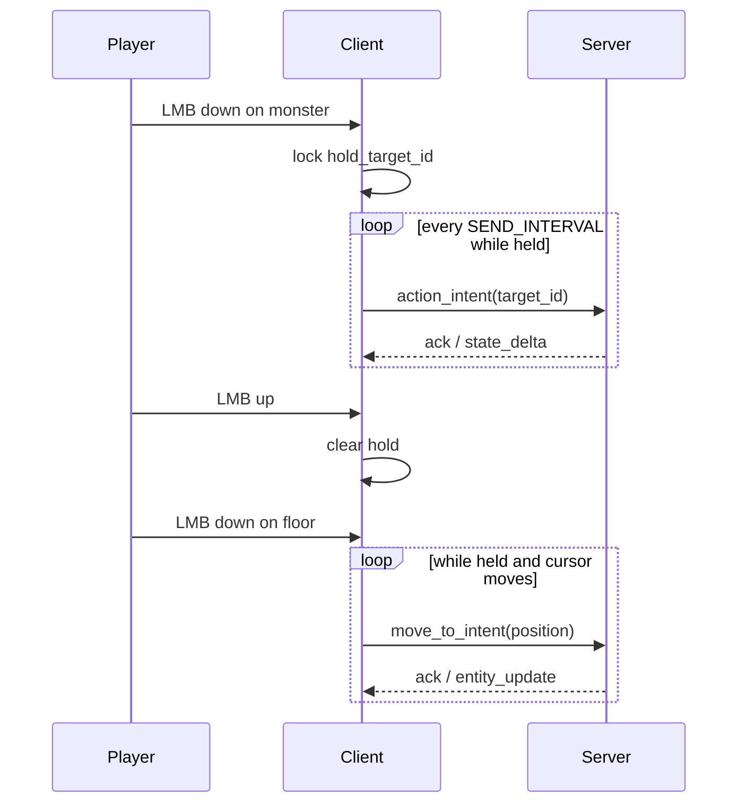

# Spec: `hold-click-controls`

Status: Complete (`make ci` green on 2026-06-07)
Branch: `feature/hold-click-controls`
Slice: v27 — sustained left-click attack and floor follow-move
Baseline: v25 `treasure-classes-and-guarded-chests` (complete, `make ci` green on 2026-06-07)

**Slice numbering note:** v26 is reserved for in-flight `character-stats-and-leveling`; this slice
takes the next execution slot as **v27**.

Related:

- [`v10_spec-click-action-and-melee-range.md`](v10_spec-click-action-and-melee-range.md) — `action_intent`, melee reach, interactables
- [`v11_spec-click-to-move-and-auto-path.md`](v11_spec-click-to-move-and-auto-path.md) — `move_to_intent`, auto-approach, WASD cancel
- [`v24_spec-main-menu-and-character-start.md`](v24_spec-main-menu-and-character-start.md) — gameplay input lock during pause/menu
- [`../adr/0001-technology-stack.md`](../adr/0001-technology-stack.md) — thin client; server owns outcomes
- [`../adr/0007-animation-state-model.md`](../adr/0007-animation-state-model.md) — client-only attack/locomotion presentation
- [`../researchs/godot-plugins-and-shortcuts.md`](../researchs/godot-plugins-and-shortcuts.md) — adoption checklist (expected: reject plugins)
- [`../../PROGRESS.md`](../../PROGRESS.md)

## 1. Purpose

Today the Godot client treats **left click as edge-triggered only**: `_unhandled_input` fires on
`InputEventMouseButton.pressed`, and `_attack_cooldown` (`SEND_INTERVAL` = 0.1 s) throttles sends.
WASD already repeats `move_intent` while keys are held; mouse movement does not.

This slice adds **sustained left-click input** so combat and navigation feel closer to Diablo-style
hold-to-fight / hold-to-run, without changing protocol, shared rules, server sim, or golden
fixtures.

After this slice:

- **Hold LMB on a monster** (initial press ray-picks a live monster) repeats the existing click-action
  path at `SEND_INTERVAL` until the sticky target dies or disappears, the player dies, or LMB is
  released. Out-of-range repeats keep sending `action_intent`; v11 auto-approach continues to chase
  and attack on arrival.
- **Hold LMB on floor** (initial press misses actionable entity and nearest loot) repeats
  `move_to_intent` to the current mouse ground point at `SEND_INTERVAL` while held, but only when
  the ground point moved at least a small epsilon since the last send.
- **Release LMB** stops the hold session immediately; no further intents are sent from that session.

The proof is **client input state → repeated existing intents → manual `make play` feel + Godot unit
test for repeat/stop logic**, not new server mechanics or bot drag scenarios.

## 2. Current problems

### 2.1 Single click per press

`client/scripts/main.gd` handles `MOUSE_BUTTON_LEFT` only on `event.pressed`. Holding the button after
the first action does nothing until the player releases and clicks again.

### 2.2 Asymmetric repeat between keyboard and mouse

`_handle_input()` sends `move_intent` every `SEND_INTERVAL` while WASD is held. Floor clicks send a
single `move_to_intent` per press even if the player keeps the button down and drags the cursor.

### 2.3 Hold-to-kill requires click spam

The server accepts repeated in-range `action_intent` messages with no player swing cooldown; the
client `_attack_cooldown` already limits send rate to ~10 Hz. Hold-attack should reuse that throttle
instead of forcing manual click spam.

## 3. Non-goals

- **No controls remapping / Settings UI** — deferred from v24.
- **No server-side player attack-speed or swing cooldown** — throttling stays client-side via
  `SEND_INTERVAL`; server behavior unchanged.
- **No hold-repeat on loot pickup, doors, stairs, teleporters, or chest open** — initial press on
  those targets keeps today's single-click / approach behavior; sustained repeat applies only to
  **monster hold-attack** and **floor hold-move** modes.
- **No shift-modifier “force move while hovering enemy”.**
- **No protocol or shared schema changes.**
- **No new pathfinding or navigation rules.**
- **No walk locomotion animation while auto-navigating from hold-move** — `set_locomotion` remains
  WASD-driven only (deferred polish).
- **No dedicated Godot visual-bot hold+drag scenario** — headless synthetic mouse drag is flaky
  (see v14 notes); proof is unit test + manual play.
- **No production animation polish** beyond current per-send `play_one_shot("attack")`.

## 4. Required design

### 4.1 Hold session model (client-only)

Introduce explicit hold state in `main.gd` (names illustrative):

| Field | Meaning |
|-------|---------|
| `_hold_active` | LMB currently held after a gameplay press |
| `_hold_mode` | `"attack"` \| `"move"` \| `""` |
| `_hold_target_id` | Sticky entity id when mode is `"attack"` |
| `_hold_last_ground` | Last `move_to_intent` ground point sent (Vector2 xz) |

**Press (unchanged entry):** on `InputEventMouseButton.pressed` + `MOUSE_BUTTON_LEFT`, run the
existing resolution once and **start** a hold session:

1. Ray-pick entity at mouse (same as `_pick_entity_at_mouse()`).
2. If pick is a **live monster** (`type == "monster"`, present in `entities`, hp > 0 from client
   mirror) → `_hold_mode = "attack"`, `_hold_target_id = target_id`.
3. Else if resolution would send **`move_to_intent`** (empty pick, no nearest loot) →
   `_hold_mode = "move"`, record initial ground point.
4. Else (loot, closed interactable, stairs, teleporter, chest, etc.) → **do not start hold-repeat**
   — execute today's one-shot click path only (`_try_action_at_mouse()` behavior).

**Release:** on `InputEventMouseButton` with `not event.pressed` + `MOUSE_BUTTON_LEFT`, clear hold
state (`_hold_active = false`, mode/target/ground reset).

**Repeat tick:** in `_process` / `_handle_input` (after cooldown decrement), while `_hold_active`
and not `_user_input_blocked()` / not `_input_locked()` and `player_hp > 0`:

- If `_attack_cooldown > 0` → wait.
- If mode `"attack"` → call a extracted repeat helper (see §4.2).
- If mode `"move"` → call a extracted repeat helper (see §4.3).

Reuse `SEND_INTERVAL` and `_attack_cooldown` for repeat cadence (same as today’s click throttle).

### 4.2 Hold-attack (sticky target)

**Q-1 decision: sticky target on press.**

Each repeat:

1. Re-resolve `_hold_target_id` in `entities`. Stop hold if missing.
2. Stop hold if target is no longer actionable for attack:
   - not `type == "monster"`, or monster hp <= 0, or entity removed.
3. **Open chest / open door / non-monster sticky id:** if state changed so the entity is no longer
   actionable (e.g. chest `state == "open"`), **stop hold** and do not send further intents. This
   matches server `invalid_target` without client spam (Q-3).
4. Face target, `play_one_shot("attack")` when typ is monster (same as single click).
5. Send `action_intent { target_id: _hold_target_id }`.
6. Set `_attack_cooldown = SEND_INTERVAL`.

**Q-4 decision: chase while holding.**

No client-side range gate before send. Out-of-range repeats rely on existing v11 server behavior
(plan approach path, execute on arrival). Player keeps moving and attacking until stop conditions.

Ranged weapons: same repeat path (existing `action_intent` dispatch).

### 4.3 Hold-move (floor follow)

**Q-2 decision: epsilon repath.**

Each repeat while mode `"move"`:

1. Compute `ground := _mouse_ground_point()` (same helper as today).
2. If `ground` distance to `_hold_last_ground` < **`HOLD_MOVE_EPSILON`** (default **0.25** world
   units on xz plane) → skip send (still consume no cooldown, or advance nothing — do not spam
   identical paths).
3. Else send `move_to_intent { position: { x: ground.x, y: ground.z } }`, update
   `_hold_last_ground`, set `_attack_cooldown = SEND_INTERVAL`.

**WASD interaction (v11 preserved):** while hold-move is active, WASD `move_intent` still clears
server auto-nav. Hold-move may resume repathing on the next repeat tick if LMB still held; WASD manual
move takes precedence on the server each tick as today.

### 4.4 Input lock and menu parity

Hold state must respect existing guards:

- Pause menu, main menu, inventory panel, bot input lock → no repeat sends; clear or pause hold while
  blocked (release on menu open is acceptable; spec requires **no intents while blocked**).
- `player_hp <= 0` → stop hold.
- Bot mode without synthetic hold → unchanged unless bot explicitly simulates hold (out of scope).

### 4.5 Architecture

```text
LMB press
  → resolve target (existing raycast)
  → monster? start hold-attack (sticky id)
  → floor?   start hold-move
  → else     one-shot _try_action_at_mouse (no hold)

each frame (gameplay active, cooldown ready)
  → hold-attack: action_intent(sticky_id) @ SEND_INTERVAL
  → hold-move:   move_to_intent(mouse ground) @ SEND_INTERVAL if moved >= epsilon

LMB release
  → clear hold state

WASD (unchanged)
  → move_intent clears autoNav on server
```



### 4.6 Refactor guidance (implementation hint, not API)

Extract from `_try_action_at_mouse()`:

- `_begin_click_at_mouse()` — press handler + hold mode selection
- `_repeat_hold_attack()` — sticky target validation + send
- `_repeat_hold_move()` — epsilon check + send

Keep single-click behavior identical for non-hold targets.

## 5. Files to create or modify

```text
docs/specs/v27_spec-hold-click-controls.md              - this slice contract
docs/plans/v27_2026-06-07-hold-click-controls.md        - implementation plan
client/scripts/main.gd                                  - hold session state + repeat ticks
client/tests/test_sustained_input.gd                    - unit tests for hold start/stop/cadence
PROGRESS.md                                        - lifecycle update when v27 ships
```

**Unchanged:** `shared/`, `server/`, `tools/bot/scenarios/`, golden fixtures (unless plan finds an
 incidental client-only test harness change).

## 6. Verification

### 6.1 Manual (`make play`)

1. Hold LMB on a dungeon monster until it dies — player should not need repeated clicks.
2. Hold LMB on floor and drag cursor through a corner — character keeps pathing toward cursor.
3. Release LMB — movement/attack repeats stop immediately.
4. Open a treasure chest with a single click — further hold on the same spot sends nothing (open chest
   not actionable).
5. Press WASD during hold-move — manual movement still works; auto-nav cancel unchanged.
6. Open pause menu — no intents fire while paused.

### 6.2 Automated

- `make client-unit` — new `test_sustained_input.gd` covers:
  - hold-attack starts on monster press
  - hold stops on release
  - hold-attack stops when sticky target removed from `entities`
  - hold-move sends only when ground epsilon exceeded (mock `_mouse_ground_point` or injected coords)
- `make ci` — full suite green with **no** shared/server diffs

### 6.3 Bot / replay

- **Deferred:** no new visual-bot hold+drag scenario in v27.
- Existing bot scenarios remain green (no protocol change).

## 7. Acceptance criteria

1. Initial LMB press on a live monster starts hold-attack; repeats at ~10 Hz until monster dead/gone,
   player dead, release, or sticky target becomes invalid.
2. Initial LMB press on floor starts hold-move; repeats `move_to_intent` when cursor ground point
   moves ≥ `HOLD_MOVE_EPSILON` (0.25) while held.
3. LMB release immediately stops hold-repeat.
4. Loot, doors, stairs, teleporters, and chest **initial** clicks behave as today; they do **not**
   enter hold-repeat mode.
5. After a chest opens, holding LMB where the chest was produces **no** further intents (invalid /
   non-actionable target — hold stops client-side).
6. Out-of-range hold-attack continues to chase via v11 auto-approach until stop conditions.
7. WASD during hold-move preserves v11 auto-nav cancel behavior.
8. Pause/menu/inventory input lock prevents hold-repeat sends.
9. Godot unit test proves start/stop/cadence logic.
10. `make ci` green without protocol, shared rules, or server changes.

## 8. Resolved decisions

| # | Question | Decision |
|---|----------|----------|
| Q-1 | Sticky target vs cursor tracking | **Sticky** — lock `target_id` on press; re-validate each repeat |
| Q-2 | Repath every tick vs epsilon | **Epsilon** — 0.25 world units on xz before resending `move_to_intent` |
| Q-3 | Hold on chest | **No hold on chest**; open chest is non-actionable → hold stops, no spam |
| Q-4 | Chase while holding | **Yes** — repeat `action_intent`, v11 auto-approach unchanged |
| Q-5 | Walk anim during hold-move | **Deferred** — locomotion anim WASD-only for v27 |

## 9. Godot plugin adoption

Run checklist from [`../researchs/godot-plugins-and-shortcuts.md`](../researchs/godot-plugins-and-shortcuts.md).

**Expected outcome:** **Reject** — input timing belongs in existing `main.gd`; no inventory/UI/camera
plugin adds value.

## 10. Open questions

None — all design questions resolved in §8. Plan may tune `HOLD_MOVE_EPSILON` if 0.25 feels too
coarse in playtest; document final value in plan as-built notes.
