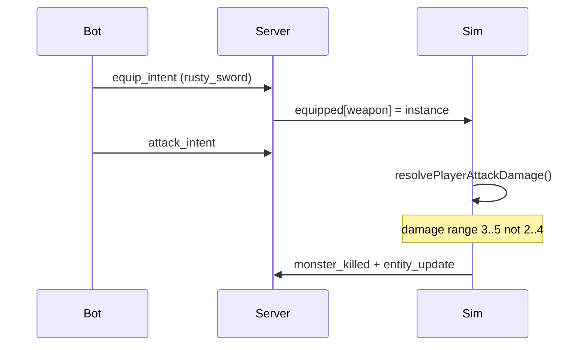

# Spec: `equipped-weapon-damage`

Status: Draft
Branch: `feature/equipped-weapon-damage`
Slice: v8 — equipped weapons modify authoritative player attack damage
Baseline: slice v7 `gear-before-combat-scenario` (complete on `main`, `make ci` green)
Related:

- [`v7_spec-gear-before-combat-scenario.md`](v7_spec-gear-before-combat-scenario.md) — deferred combat math; gear loop proves equip-before-attack ordering
- [`v4_spec-take-a-hit.md`](v4_spec-take-a-hit.md) — damage roll + retaliation golden pattern
- [`../../PROGRESS.md`](../../PROGRESS.md)
- ADR-0001 (authoritative server, shared rules-as-data, golden fixtures)

## 1. Purpose

Close the loop opened by v2 (equip) and v7 (gear-before-combat): **an equipped weapon must change how hard the player hits**, with the server as the sole source of truth.

After this slice:

- Equippable weapons may declare an optional **`damage`** range in `shared/rules/items.v0.json`.
- When the player lands a successful `attack_intent` and the **weapon slot is equipped**, the server rolls damage from the equipped item's `damage` range instead of `combat.player_damage`.
- When no weapon is equipped (or the equipped item has no `damage`), behavior stays **identical to today** (`combat.player_damage`).
- The existing vertical-slice flow still passes unchanged golden fixtures because its first kill happens **before** equip.
- The `gear_before_combat` bot scenario proves the equipped path: player equips `rusty_sword`, then kills `training_dummy_reward` using weapon damage.
- Replay, resume, `/state`, and replay timeline remain consistent — damage depends only on equipped state at attack time, which is already persisted and reconstructed.

The proof is **rules data → sim math → golden fixtures → bot scenario**, not UI polish or new protocol fields.

## 2. Current Problems

### 2.1 Equip is cosmetic for combat

`server/internal/game/sim.go` always rolls player attack damage from `combat.player_damage`:

```go
func (s *Sim) rollDamage() int {
    return s.rollRange(s.rules.Combat.PlayerDamage)
}
```

Equipping `rusty_sword` updates inventory and `equipped_update` snapshots but does not affect `handleAttack`.

### 2.2 v7 explicitly deferred weapon math

The gear-before-combat scenario only asserts ordering and inventory state. A player who walks to the sword, equips it, and attacks does the same damage as an unarmed player — undermining the ARPG progression story.

### 2.3 Item rules have no combat stats

`items.v0.json` / schema describe name, slot, and equippable flag only. There is no shared place to declare per-weapon damage that both Go and GDScript can evaluate against golden fixtures.

## 3. Non-goals

- **No additive stat system** (STR/DEX, % bonuses, sockets, enchantments). One optional `damage` range per weapon item only.
- **No damage on non-equippable items** (`training_badge` stays statless).
- **No attack range gate, miss tuning, armor, healing, or respawn.**
- **No new attack intents, events, or protocol schema bump.** Damage changes are invisible on the wire except via HP deltas already present in `entity_update`.
- **No client-side damage preview or floating combat numbers.**
- **No new bot scenario file** — extend assertions on existing `02_gear_before_combat.json` and keep `01_vertical_slice.json` as the unarmed baseline.
- **No pickup range gate** (still deferred).
- **No `world_id` on WebSocket snapshots** (still deferred).

## 4. Required Design

### 4.1 Item rules extension

Add optional `damage: { min, max }` on equippable weapon items.

Proposed `shared/rules/items.v0.json`:

```json
{
  "version": 0,
  "items": {
    "rusty_sword": {
      "name": "Rusty Sword",
      "slot": "weapon",
      "equippable": true,
      "damage": { "min": 3, "max": 5 }
    },
    "training_badge": {
      "name": "Training Badge",
      "equippable": false
    }
  }
}
```

Schema (`items.v0.schema.json`):

- Add optional `damage` object with required integer `min` / `max` where `max >= min >= 0`.
- `damage` is allowed **only** when `equippable: true` and `slot: "weapon"` (use `allOf` conditional, same style as existing slot rules).
- Non-equippable items must not declare `damage`.

**Tuning rationale:** `training_dummy` and `training_dummy_reward` both have `max_hp: 3`. Base unarmed damage is `{2, 4}` (may require two hits). Equipped `rusty_sword` at `{3, 5}` always one-shots on a successful hit, making the v7 gear loop materially different from the v0 vertical slice without changing monster HP tables.

### 4.2 Authoritative damage resolution

Add a resolver used by `handleAttack` before rolling damage:

```text
resolvePlayerAttackDamage(sim):
  if weapon slot not equipped → combat.player_damage
  else lookup equipped instance → item_def_id
  if item def has damage → item.damage
  else → combat.player_damage
```

`rollDamage()` becomes a thin wrapper over `rollRange(resolvePlayerAttackDamage())`.

**RNG draw order inside `handleAttack` (unchanged):**

1. `hitDraw := rng.Next()` — hit branch (still always hits at `base_hit_chance: 1.0`)
2. `dmg := rollDamage()` — uses equipped weapon range when applicable
3. Apply damage, events, retaliation — unchanged from v4

Equipping mid-session immediately affects the **next** attack. Unequipping (future) would fall back to base damage; no unequip intent exists today.

### 4.3 Golden fixtures

| Fixture | Role |
|---------|------|
| `damage_formula.json` | **Unchanged** — still pins base `combat.player_damage` formula |
| `slice_outcome.json` | **Unchanged** — vertical slice kills unarmed before equip; `final_player_hp: 9` preserved |
| `equipped_weapon_damage.json` (new) | Cross-language fixture for `rusty_sword.damage` roll cases |
| `equipped_weapon_damage.v0.schema.json` (new) | Schema for the new golden |

Proposed `equipped_weapon_damage.json`:

```json
{
  "description": "Cross-language damage formula when rusty_sword is equipped: damage = min + (draw mod (max - min + 1)).",
  "item_def_id": "rusty_sword",
  "damage": { "min": 3, "max": 5 },
  "cases": [
    { "draw": 0, "expected_damage": 3 },
    { "draw": 1, "expected_damage": 4 },
    { "draw": 2, "expected_damage": 5 },
    { "draw": 3, "expected_damage": 3 }
  ]
}
```

### 4.4 Bot / scenario assertions

**`01_vertical_slice.json`:** no step changes. Existing assertions remain valid (unarmed kill path).

**`02_gear_before_combat.json`:** add assertion that the reward dummy dies in a single successful attack while the sword is equipped:

```json
{ "type": "monster_killed_in_attacks", "monster_def_id": "training_dummy_reward", "max_attacks": 1 }
```

The bot runner must count `attack_intent` messages sent between equip and `monster_killed` (or infer from tick replay). Reject ambiguous counting — document the counting rule in the implementation plan.

### 4.5 Replay / resume parity

No new persisted fields. Verification:

- Replaying a `gear_before_combat` session reproduces the same monster HP timeline.
- Resuming mid-scenario after equip still applies weapon damage on subsequent attacks.
- `/state` and replay timeline match WebSocket-driven runs.

## 5. Files to create or modify

| Action | Path | Responsibility |
|--------|------|----------------|
| Modify | `shared/rules/items.v0.schema.json` | Optional `damage` on equippable weapons |
| Modify | `shared/rules/items.v0.json` | `rusty_sword.damage` |
| Create | `shared/golden/equipped_weapon_damage.v0.schema.json` | Golden schema |
| Create | `shared/golden/equipped_weapon_damage.json` | Cross-language weapon damage cases |
| Modify | `server/internal/game/rules.go` | `ItemDef.Damage *DamageRange`; validate on load |
| Modify | `server/internal/game/sim.go` | `resolvePlayerAttackDamage`; wire into `rollDamage` |
| Modify | `server/internal/game/game_test.go` | Golden tests; equipped vs unarmed kill tests; slice golden unchanged |
| Modify | `tools/validate_shared.py` | Validate new golden + item damage schema rules |
| Modify | `client/tests/test_golden.gd` | Consume `equipped_weapon_damage.json` |
| Modify | `tools/bot/scenarios/02_gear_before_combat.json` | `monster_killed_in_attacks` assertion |
| Modify | `tools/bot/run.py` (or scenario runner module) | Implement `monster_killed_in_attacks` assertion |
| Modify | `tools/bot/test_protocol.py` | Unit test for new assertion type |
| Modify | `PROGRESS.md` | v8 row + summary when complete |

**Out of scope for file changes:** protocol schemas, Godot `main.gd`, inventory UI / `client/addons/`, animation, asset manifests, new worlds.

## 6. Architecture and flow

```text
attack_intent
    │
    ▼
handleAttack ──► hit roll (unchanged)
    │
    ▼
resolvePlayerAttackDamage()
    │   ├─ no weapon equipped → combat.player_damage
    │   └─ rusty_sword equipped → items.rusty_sword.damage
    ▼
rollRange(damage) ──► monster HP ──► events (unchanged)
    │
    ▼
retaliate (unchanged, uses monster def — not player weapon)
```



## 7. Acceptance criteria

1. `rusty_sword` declares `damage: {min: 3, max: 5}` in shared rules; schema validation passes.
2. Unarmed player attacks use `combat.player_damage` exactly as today.
3. Equipped `rusty_sword` attacks use `rusty_sword.damage` for the damage roll.
4. `shared/golden/slice_outcome.json` and `damage_formula.json` remain valid without modification; `TestScriptedSliceMatchesGolden` still passes.
5. Go and GDScript golden tests pass for `equipped_weapon_damage.json`.
6. `make bot` passes both scenarios; `gear_before_combat` asserts one-attack kill with sword equipped.
7. Replay verification succeeds for both scenarios after the damage change.
8. Resume mid-`gear_before_combat` (post-equip) still kills in one attack when resumed bot continues.
9. `make ci` green.

## 8. Testing plan

### Shared validation

```bash
make validate-shared
```

Must validate item `damage` conditionals, new golden schema, and existing fixtures.

### Go tests

```bash
cd server && go test ./internal/game/... -run 'Golden|Slice|Equipped|Weapon'
```

Required coverage:

- `TestEquippedWeaponDamageGolden` — roll cases from `equipped_weapon_damage.json`
- `TestScriptedSliceMatchesGolden` — unchanged outcome (unarmed kill)
- `TestEquippedWeaponOneShotsRewardDummy` — `NewSimWithWorld("gear_before_combat")`, pickup, equip, single attack → `monster_killed`
- `TestUnarmedWeaponDoesNotOneShotEveryTime` — optional table test: base damage min 2 vs 3 HP (document that two hits are possible on bad rolls without asserting RNG)

### Python tests

```bash
.venv/bin/python -m pytest tools/bot/test_protocol.py -q -k gear
```

Required coverage:

- `monster_killed_in_attacks` assertion parser and failure messages
- Scenario loader still accepts updated `02_gear_before_combat.json`

### End-to-end

```bash
make ci
```

Optional manual check:

```bash
make bot-visual   # gear scenario should show faster kill after equip
```

## 9. Open questions

| # | Question | Proposed answer |
|---|----------|-----------------|
| 1 | Replace base damage vs additive bonus? | **Replace** when item has `damage`; keeps v0 unarmed path stable and rules simple. |
| 2 | Should `rusty_sword` use `{3,5}` or `{4,4}` guaranteed one-shot? | **`{3,5}`** — uses existing `rollRange` span logic; min 3 still one-shots 3 HP. |
| 3 | Expose damage range on inventory snapshots? | **No** — client can read rules files for tooltips later; no protocol change in v8. |
| 4 | Count attacks including misses? | **N/A** — `base_hit_chance` is 1.0; count `attack_intent` acks that precede `monster_killed`. |
| 5 | New dedicated golden for full gear scenario outcome? | **No** — bot assertion + focused Go sim test are enough; avoid duplicating `slice_outcome` pattern. |

## 10. Risks and mitigations

| Risk | Mitigation |
|------|------------|
| Vertical slice golden breaks because damage math changed globally | Resolver keys off **equipped weapon at attack time**; slice kills before equip. |
| Replay drift | No new fields; equipped state already replayed from inputs + snapshot. |
| RNG stream shift breaks unrelated tests | Damage roll still one `IntN` call per hit; only the span changes when equipped. |
| Bot assertion flaky on multi-hit | `max_attacks: 1` only after equip step; monster HP 3 with min damage 3. |
| GDScript / Go formula drift | New shared golden + both test suites consume it. |
